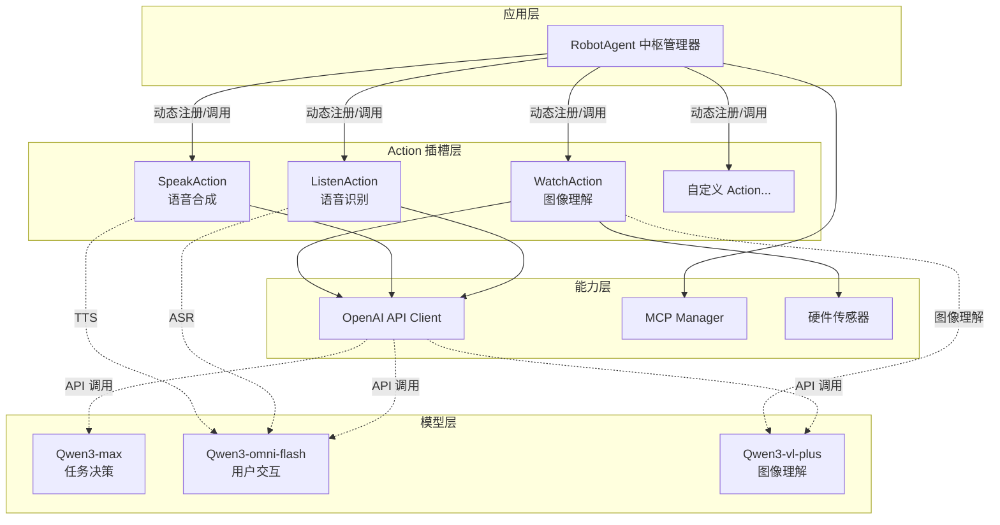
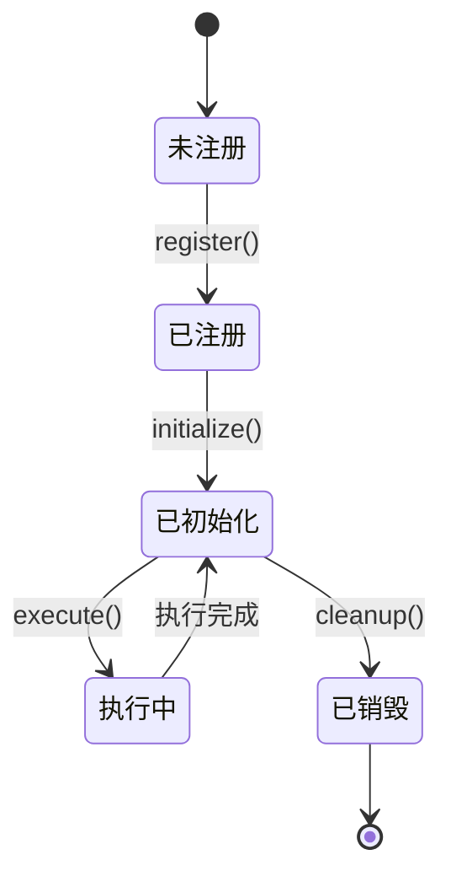
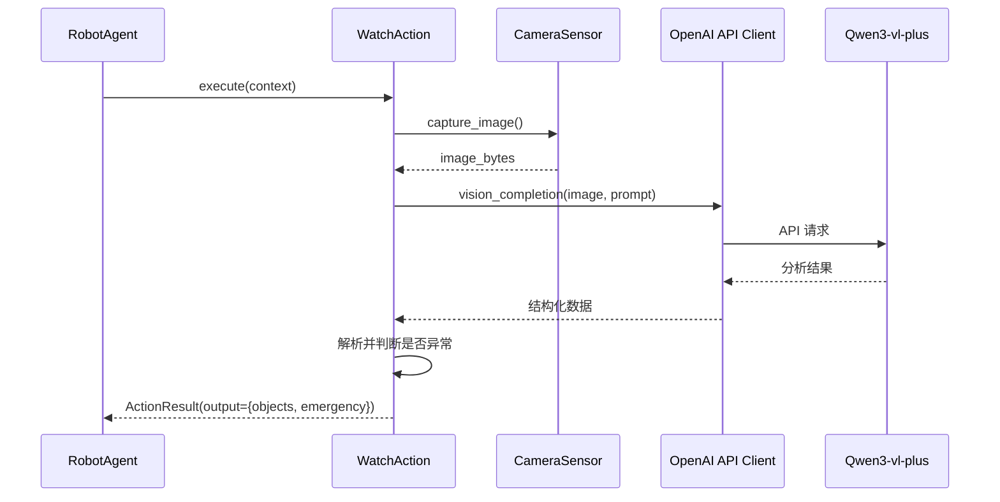
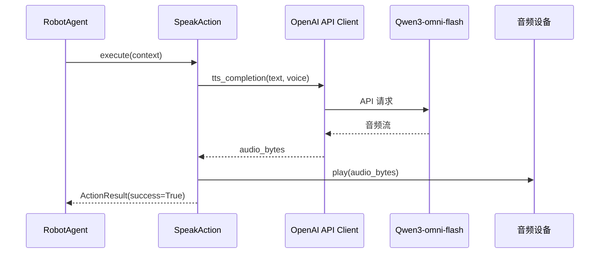
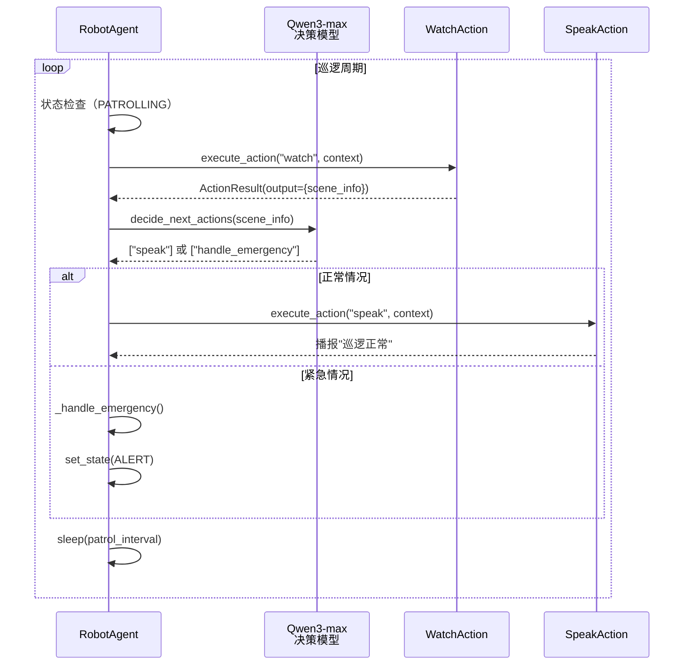
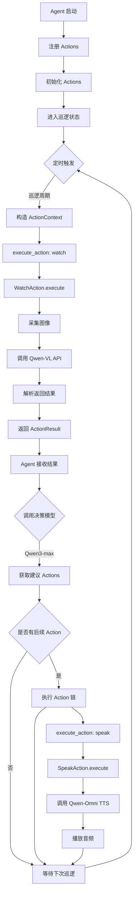
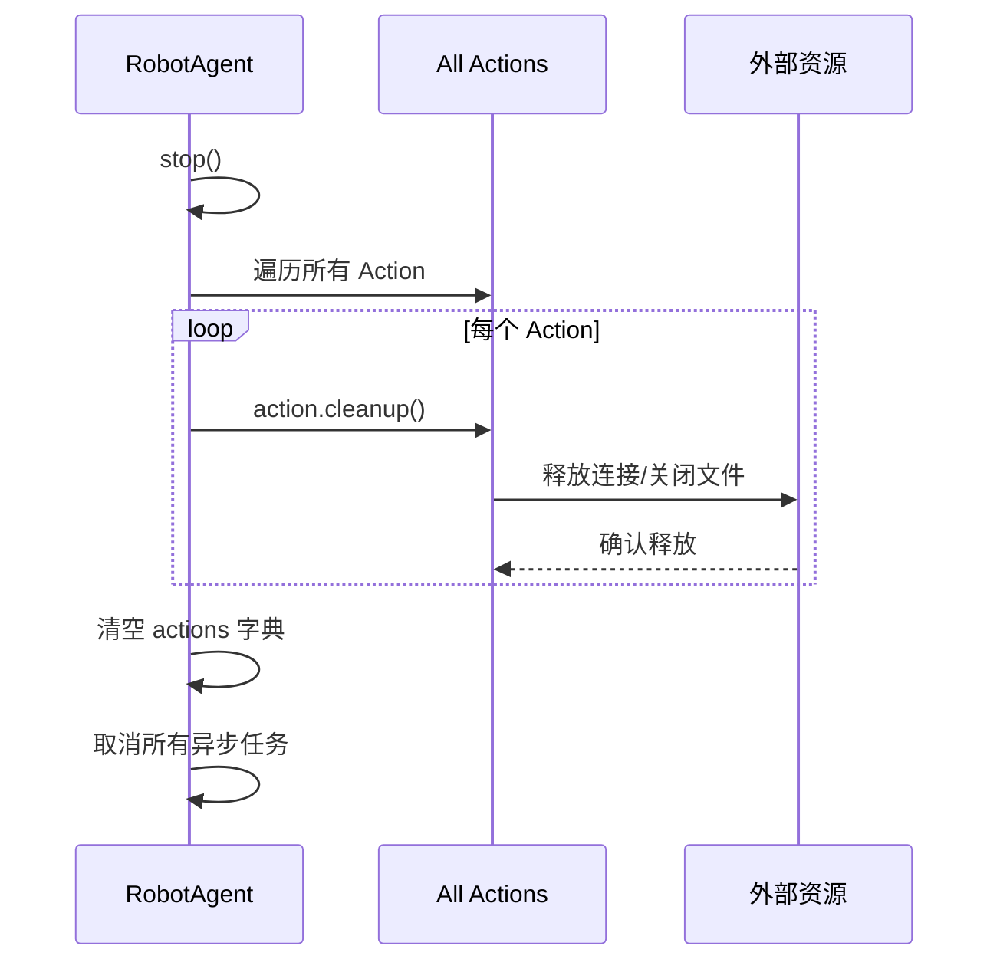

# Agent 中枢管理器重构设计

## 一、设计目标

将 `RobotAgent` 从单体结构重构为插件化的中枢管理器，实现：
- 将各类功能封装为独立的 Action 组件（图像理解、语音合成等）
- 通过 Actions 插槽机制实现能力的灵活扩展和组合
- 保持现有状态机和任务队列的核心逻辑不变
- 支持 OpenAI API 接入多个大模型（Qwen3-max、Qwen3-omni-flash、Qwen3-vl-plus）
- 保留 MCP 服务扩展能力

## 二、整体架构

### 2.1 架构分层



### 2.2 核心设计原则

| 原则 | 说明 | 收益 |
|------|------|------|
| 单一职责 | 每个 Action 只负责一个具体功能领域 | 代码清晰，易于维护 |
| 开放封闭 | Agent 对扩展开放，对修改封闭 | 新增能力无需修改核心代码 |
| 依赖倒置 | Agent 依赖抽象 Action 接口，而非具体实现 | 解耦合，便于测试和替换 |
| 组合优于继承 | 通过组合 Action 扩展能力 | 灵活动态调整能力集合 |

## 三、核心组件设计

### 3.1 Action 抽象基类

所有 Action 必须实现统一的接口协议，确保 Agent 能够以一致的方式调用。

**Action 生命周期：**


**Action 接口定义：**

| 方法 | 参数 | 返回值 | 职责 |
|------|------|--------|------|
| `initialize` | `config: Dict[str, Any]` | `None` | 初始化 Action 所需资源（如模型客户端、硬件连接） |
| `execute` | `context: ActionContext` | `ActionResult` | 执行核心业务逻辑 |
| `cleanup` | 无 | `None` | 释放资源，清理状态 |
| `get_metadata` | 无 | `ActionMetadata` | 返回 Action 的元信息（名称、版本、依赖等） |

**ActionContext 数据结构：**

| 字段 | 类型 | 说明 |
|------|------|------|
| `agent_state` | `AgentState` | 当前 Agent 状态 |
| `input_data` | `Any` | 输入数据（可为图像字节流、文本等） |
| `shared_data` | `Dict[str, Any]` | Action 间共享的上下文数据 |
| `config` | `Dict[str, Any]` | 动态配置参数 |

**ActionResult 数据结构：**

| 字段 | 类型 | 说明 |
|------|------|------|
| `success` | `bool` | 执行是否成功 |
| `output` | `Any` | 输出结果（如分析报告、音频数据） |
| `metadata` | `Dict[str, Any]` | 执行元数据（耗时、置信度等） |
| `next_actions` | `List[str]` | 建议后续执行的 Action 名称列表（可选） |
| `error` | `Optional[Exception]` | 错误信息（失败时） |

### 3.2 WatchAction - 图像理解

负责巡检期间的环境理解，替代原有的 `CameraSensor` + `McpManager.analyze_image`。

**核心职责：**
- 从摄像头捕获图像
- 调用 Qwen3-vl-plus 模型进行视觉理解
- 返回环境分析结果（物体检测、异常识别等）

**执行流程：**


**输入与输出：**

| 方向 | 字段 | 类型 | 说明 |
|------|------|------|------|
| 输入 | `context.input_data` | 无（直接从摄像头采集） | - |
| 输入 | `context.config.prompt` | `str` | 图像理解的提示词模板 |
| 输出 | `result.output.objects_detected` | `List[str]` | 检测到的物体列表 |
| 输出 | `result.output.emergency` | `bool` | 是否存在紧急情况 |
| 输出 | `result.output.confidence` | `float` | 分析置信度 |
| 输出 | `result.output.description` | `str` | 场景描述文本 |

**配置参数：**

| 参数名 | 类型 | 默认值 | 说明 |
|--------|------|--------|------|
| `model_name` | `str` | `"qwen-vl-plus"` | 使用的视觉模型 |
| `max_tokens` | `int` | `500` | 最大生成 token 数 |
| `temperature` | `float` | `0.7` | 生成温度 |
| `prompt_template` | `str` | 见下方 | 提示词模板 |

**默认提示词模板：**
```
分析这张巡检图像，识别以下内容：
1. 场景中的物体和人员
2. 是否存在异常情况（火灾、烟雾、未授权人员等）
3. 环境状态评估

以 JSON 格式返回结果，包含字段：objects_detected, emergency, confidence, description
```

### 3.3 SpeakAction - 语音合成

负责将文本转换为语音输出，用于机器人与用户的语音交互。

**核心职责：**
- 接收文本内容
- 调用 Qwen3-omni-flash 模型生成语音
- 通过音频设备播放或返回音频流

**执行流程：**


**输入与输出：**

| 方向 | 字段 | 类型 | 说明 |
|------|------|------|------|
| 输入 | `context.input_data` | `str` | 要转换为语音的文本 |
| 输入 | `context.config.voice` | `str` | 音色选择 |
| 输出 | `result.output.audio_bytes` | `bytes` | 生成的音频数据 |
| 输出 | `result.output.duration` | `float` | 音频时长（秒） |

**配置参数：**

| 参数名 | 类型 | 默认值 | 说明 |
|--------|------|--------|------|
| `model_name` | `str` | `"qwen-omni-flash"` | 使用的语音模型 |
| `voice` | `str` | `"default"` | 音色类型 |
| `speed` | `float` | `1.0` | 语速倍率 |
| `auto_play` | `bool` | `True` | 是否自动播放 |

### 3.4 ListenAction - 语音识别（扩展）

负责语音到文本的转换，支持用户语音指令输入。

**核心职责：**
- 从麦克风采集音频
- 调用 Qwen3-omni-flash 模型进行语音识别
- 返回识别的文本内容

**输入与输出：**

| 方向 | 字段 | 类型 | 说明 |
|------|------|------|------|
| 输入 | `context.input_data` | `bytes` 或 `None` | 音频数据（为 None 时从麦克风采集） |
| 输出 | `result.output.text` | `str` | 识别的文本 |
| 输出 | `result.output.confidence` | `float` | 识别置信度 |

### 3.5 RobotAgent 中枢管理器

重构后的 `RobotAgent` 作为中枢协调者，不再直接实现具体功能，而是管理和调度 Action。

**新增职责：**
- Action 注册与生命周期管理
- Action 执行的统一调度
- Action 间上下文传递
- 决策模型（Qwen3-max）调用，判断何时执行哪些 Action

**保留职责：**
- 状态机管理（IDLE/PATROLLING/RESPONDING/ALERT）
- 任务队列调度
- 巡逻循环协调

**Actions 插槽设计：**

| 属性 | 类型 | 说明 |
|------|------|------|
| `actions` | `Dict[str, BaseAction]` | 已注册的 Action 实例，键为 Action 名称 |
| `action_metadata` | `Dict[str, ActionMetadata]` | Action 的元信息缓存 |

**新增方法：**

| 方法 | 参数 | 返回值 | 职责 |
|------|------|--------|------|
| `register_action` | `name: str, action: BaseAction, config: Dict` | `None` | 注册并初始化一个 Action |
| `unregister_action` | `name: str` | `None` | 注销 Action 并清理资源 |
| `execute_action` | `name: str, context: ActionContext` | `ActionResult` | 执行指定的 Action |
| `execute_action_chain` | `action_names: List[str], context: ActionContext` | `List[ActionResult]` | 按顺序执行多个 Action |
| `decide_next_actions` | `current_state: Dict[str, Any]` | `List[str]` | 调用决策模型，返回需要执行的 Action 列表 |

**改造后的巡逻流程：**


## 四、OpenAI API 集成设计

### 4.1 统一客户端封装

创建 `OpenAIClient` 类，统一管理多个模型的 API 调用。

**支持的模型类型：**

| 模型名称 | 用途 | API 端点类型 |
|----------|------|--------------|
| `qwen-max` | 任务决策推理 | Chat Completion |
| `qwen-omni-flash` | 用户交互（TTS/ASR） | Audio API |
| `qwen-vl-plus` | 图像理解 | Vision Completion |

**客户端配置：**

| 配置项 | 类型 | 说明 |
|--------|------|------|
| `api_key` | `str` | OpenAI API 密钥 |
| `base_url` | `str` | API 基础 URL（兼容 OpenAI 协议的服务） |
| `timeout` | `int` | 请求超时时间（秒） |
| `max_retries` | `int` | 失败重试次数 |

**关键方法：**

| 方法 | 参数 | 返回值 | 用途 |
|------|------|--------|------|
| `chat_completion` | `model: str, messages: List[Dict]` | `str` | 文本对话/推理 |
| `vision_completion` | `model: str, image: bytes, prompt: str` | `Dict` | 图像理解 |
| `tts_completion` | `model: str, text: str, voice: str` | `bytes` | 文本转语音 |
| `asr_completion` | `model: str, audio: bytes` | `str` | 语音转文本 |

### 4.2 决策模型调用流程

`RobotAgent.decide_next_actions()` 使用 Qwen3-max 模型分析当前状态并返回建议的 Action 序列。

**输入提示词结构：**
```
你是一个巡检机器人的决策中枢。根据当前状态和传感器数据，决定接下来要执行的动作。

当前状态：{agent_state}
最近一次图像理解结果：{watch_result}
可用的动作列表：{available_actions}

请以 JSON 格式返回需要执行的动作序列：
{
  "actions": ["action_name1", "action_name2"],
  "reason": "决策理由"
}
```

**决策逻辑示例：**

| 场景 | 输入条件 | 输出 Actions | 理由 |
|------|----------|--------------|------|
| 正常巡逻 | `emergency=False` | `["watch"]` | 继续监控环境 |
| 检测到异常 | `emergency=True` | `["speak", "alert_service"]` | 语音提示 + 调用应急服务 |
| 用户呼叫 | `user_call=True` | `["listen", "interact"]` | 启动交互模式 |

## 五、文件结构调整

### 5.1 新增文件

```
core/
├── action/
│   ├── __init__.py               # 导出所有 Action 和基类
│   ├── base.py                   # BaseAction 抽象基类
│   ├── watch_action.py           # WatchAction 图像理解
│   ├── speak_action.py           # SpeakAction 语音合成
│   ├── listen_action.py          # ListenAction 语音识别
│   └── alert_action.py           # AlertAction 应急调用（重构自 mcp_manager）
├── client/
│   ├── __init__.py
│   └── openai_client.py          # OpenAI API 统一客户端
├── agent.py                      # 重构后的 RobotAgent
├── camera.py                     # 保留（作为 WatchAction 的依赖）
└── mcp_manager.py                # 保留（可能转换为 MCP Action）
```

### 5.2 配置文件扩展

在 `config.py` 中新增 OpenAI 配置：

| 配置项 | 类型 | 说明 |
|--------|------|------|
| `OPENAI_API_KEY` | `str` | API 密钥 |
| `OPENAI_BASE_URL` | `str` | API 端点 URL |
| `QWEN_MAX_MODEL` | `str` | 决策模型名称 |
| `QWEN_VL_MODEL` | `str` | 视觉模型名称 |
| `QWEN_OMNI_MODEL` | `str` | 多模态交互模型名称 |

## 六、数据流设计

### 6.1 Action 执行的完整数据流



### 6.2 共享上下文传递机制

多个 Action 之间可以通过 `ActionContext.shared_data` 共享数据。

**典型场景：**
1. `WatchAction` 分析图像后，将检测结果写入 `shared_data["last_vision_result"]`
2. 决策模型读取该结果，决定调用 `SpeakAction`
3. `SpeakAction` 从 `shared_data` 读取场景描述，生成播报文本

**数据字段约定：**

| 字段名 | 类型 | 写入者 | 读取者 |
|--------|------|--------|--------|
| `last_vision_result` | `Dict` | WatchAction | 决策模型、SpeakAction |
| `user_command` | `str` | ListenAction | 决策模型 |
| `emergency_level` | `int` | WatchAction | AlertAction |

## 七、扩展性设计

### 7.1 如何添加新 Action

**步骤：**
1. 在 `core/action/` 创建新文件，继承 `BaseAction`
2. 实现 `initialize`、`execute`、`cleanup`、`get_metadata` 方法
3. 在 `core/action/__init__.py` 中导出新类
4. 在 `RobotAgent` 初始化时注册：
   ```
   agent.register_action("new_action", NewAction(), config={...})
   ```

**示例：添加巡逻路径规划 Action**

| Action 名称 | 输入 | 输出 | 模型依赖 |
|-------------|------|------|----------|
| `PathPlanAction` | 当前位置、目标点 | 导航路径 | Qwen3-max（推理最优路径） |

### 7.2 MCP 服务集成

保留现有的 `McpManager`，并将其封装为 `McpAction`，支持动态加载 MCP 服务。

**设计思路：**
- `McpAction` 作为特殊 Action，内部管理多个 MCP 服务连接
- 通过配置文件定义可用的 MCP 服务列表
- Action 执行时，根据 `context.config.mcp_service_name` 调用指定服务

**配置示例：**

| 配置项 | 类型 | 说明 |
|--------|------|------|
| `mcp_services` | `List[Dict]` | MCP 服务列表 |
| `mcp_services[i].name` | `str` | 服务名称 |
| `mcp_services[i].url` | `str` | 服务端点 |
| `mcp_services[i].capabilities` | `List[str]` | 服务提供的能力标签 |

## 八、性能与资源管理

### 8.1 Action 初始化策略

| 策略 | 适用场景 | 优缺点 |
|------|----------|--------|
| 懒加载 | 低频使用的 Action | 节省启动时间，首次调用较慢 |
| 预加载 | 高频使用的 Action（如 watch） | 启动慢，运行时响应快 |

**建议配置：**
- `WatchAction`：预加载（巡逻必用）
- `SpeakAction`：预加载（交互频繁）
- `ListenAction`：懒加载（按需激活）

### 8.2 资源清理机制

**Agent 停止时的清理流程：**


### 8.3 并发控制

**Action 执行的并发策略：**

| 执行模式 | 说明 | 使用场景 |
|----------|------|----------|
| 串行执行 | 按顺序逐个执行 Action | 存在依赖关系的 Action 链 |
| 并行执行 | 同时执行多个独立 Action | 无依赖的 Action（如同时采集多个传感器数据） |
| 优先级队列 | 高优先级 Action 优先执行 | 紧急响应需要插队 |

**建议实现：**
- 在 `ActionContext` 中添加 `priority` 字段
- 巡逻时串行执行，应急时允许并行

## 九、向后兼容性

### 9.1 迁移策略

为保证平滑过渡，提供兼容层：

**临时兼容方法（可在后续版本移除）：**

| 原方法 | 新方法 | 兼容实现 |
|--------|--------|----------|
| `_patrol_loop()` 中直接调用 `camera.capture_image()` | `execute_action("watch")` | 内部自动调用 WatchAction |
| `mcp_tool.analyze_image()` | `execute_action("watch")` | WatchAction 内部调用 OpenAI API |
| `mcp_tool.call_emergency_service()` | `execute_action("alert")` | 创建 AlertAction 封装原逻辑 |

### 9.2 配置迁移

**旧配置兼容：**
- 如果未配置 `OPENAI_API_KEY`，Action 自动降级为原有的 MCP 实现
- 保留 `VIDEO_DEV` 等硬件配置，确保 `CameraSensor` 正常工作

## 十、测试策略

### 10.1 单元测试

**测试覆盖：**

| 测试对象 | 测试内容 | 测试工具 |
|----------|----------|----------|
| `BaseAction` | 抽象方法定义的正确性 | pytest |
| `WatchAction` | 图像采集 + API 调用的 Mock 测试 | pytest + unittest.mock |
| `SpeakAction` | TTS 调用和音频播放的 Mock 测试 | pytest + pytest-asyncio |
| `RobotAgent` | Action 注册、执行、清理流程 | pytest |
| `OpenAIClient` | API 请求和响应解析 | pytest + responses |

### 10.2 集成测试

**测试场景：**

| 场景 | 验证点 | 环境依赖 |
|------|--------|----------|
| 完整巡逻流程 | watch → 决策 → speak 链路 | OpenAI API（或 Mock） |
| 紧急响应 | 检测异常 → Alert Action 触发 | 模拟异常图像 |
| Action 动态注册 | 运行时添加/移除 Action | 无 |

### 10.3 性能测试

**关键指标：**

| 指标 | 目标值 | 测量方法 |
|------|--------|----------|
| Action 执行延迟 | WatchAction < 2s | 时间戳差值 |
| 巡逻周期准确性 | 误差 < 1s | 多周期平均 |
| 内存占用 | < 500MB | psutil 监控 |

## 十一、安全性考虑

### 11.1 API 密钥管理

- 通过环境变量读取 `OPENAI_API_KEY`，禁止硬编码
- 使用配置加密存储敏感信息
- 限制 API 调用频率，防止滥用

### 11.2 Action 权限控制（可选）

为高风险 Action 添加权限验证：

| Action 类型 | 风险等级 | 控制措施 |
|-------------|----------|----------|
| `WatchAction` | 低 | 无限制 |
| `SpeakAction` | 中 | 限制音量和内容过滤 |
| `AlertAction` | 高 | 需要管理员授权或二次确认 |

## 十二、实施路线图

### 阶段一：基础框架（1 周）
- 实现 `BaseAction` 抽象类
- 重构 `RobotAgent` 添加 Actions 插槽
- 创建 `OpenAIClient` 统一客户端

### 阶段二：核心 Action（2 周）
- 实现 `WatchAction`（图像理解）
- 实现 `SpeakAction`（语音合成）
- 改造巡逻流程，使用 Action 机制

### 阶段三：决策模型集成（1 周）
- 实现 `decide_next_actions()` 方法
- 集成 Qwen3-max 模型
- 测试决策逻辑准确性

### 阶段四：扩展与优化（1 周）
- 实现 `ListenAction`（语音识别）
- 优化 Action 执行性能
- 完善测试覆盖

### 阶段五：MCP 集成与兼容（1 周）
- 封装 `McpAction`
- 验证向后兼容性
- 文档和示例补充

## 十三、风险评估

| 风险 | 影响 | 概率 | 缓解措施 |
|------|------|------|----------|
| OpenAI API 不稳定 | 功能失效 | 中 | 实现降级机制，回退到本地模型或 MCP |
| Action 执行超时 | 巡逻周期延长 | 中 | 设置合理的超时时间，异步执行非关键 Action |
| 内存泄漏 | 长时间运行崩溃 | 低 | 严格的资源清理和定期重启策略 |
| 配置复杂度增加 | 上手难度提升 | 中 | 提供默认配置和配置向导工具 |

## 十四、附录

### 附录 A：ActionMetadata 数据结构

| 字段 | 类型 | 说明 |
|------|------|------|
| `name` | `str` | Action 名称 |
| `version` | `str` | 版本号 |
| `description` | `str` | 功能描述 |
| `dependencies` | `List[str]` | 依赖的硬件或服务 |
| `capabilities` | `List[str]` | 提供的能力标签 |
| `author` | `str` | 开发者 |

### 附录 B：配置文件示例

配置文件 `config.py` 扩展后的完整示例：

| 配置项 | 值 | 说明 |
|--------|-------|------|
| `VIDEO_DEV` | `"/dev/video0"` | 摄像头设备路径 |
| `OPENAI_API_KEY` | `"sk-xxx"` | OpenAI API 密钥 |
| `OPENAI_BASE_URL` | `"https://dashscope.aliyuncs.com/compatible-mode/v1"` | API 端点 |
| `QWEN_MAX_MODEL` | `"qwen-max"` | 决策模型 |
| `QWEN_VL_MODEL` | `"qwen-vl-plus"` | 视觉模型 |
| `QWEN_OMNI_MODEL` | `"qwen-omni-flash"` | 多模态模型 |
| `PATROL_INTERVAL` | `30.0` | 巡逻间隔（秒） |
| `ACTION_TIMEOUT` | `10.0` | Action 默认超时（秒） |

### 附录 C：决策模型提示词完整模板

决策模型输入的完整提示词结构（用于 `decide_next_actions()` 方法）：

```
系统角色：你是一个巡检机器人的智能决策中枢，负责分析传感器数据并决定下一步行动。

当前状态信息：
- Agent 状态：{agent_state}
- 最近一次图像理解结果：
  - 检测物体：{objects_detected}
  - 紧急情况：{emergency}
  - 置信度：{confidence}
  - 场景描述：{description}

可用的 Action 列表：
- watch: 图像理解（巡检环境）
- speak: 语音播报
- listen: 语音识别
- alert: 调用应急服务
- patrol: 移动巡逻（如有导航能力）

决策规则：
1. 如果检测到紧急情况（emergency=true），优先执行 alert 和 speak
2. 如果环境正常，继续 watch 或进入待机
3. 如果用户有交互需求，执行 listen 和 speak

请以 JSON 格式返回决策结果：
{
  "actions": ["action_name1", "action_name2"],
  "reason": "决策理由的简短说明",
  "priority": "high/medium/low"
}
```
