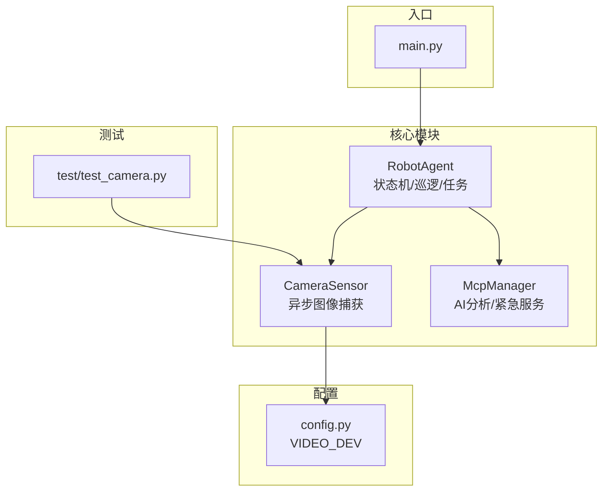
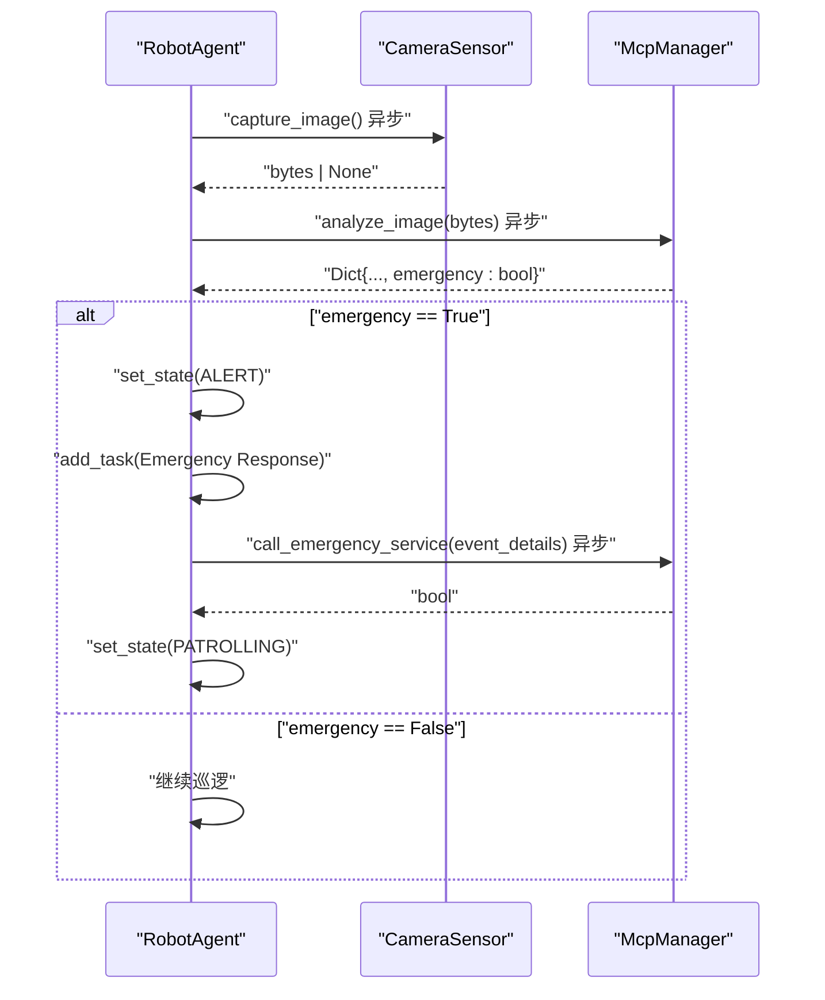
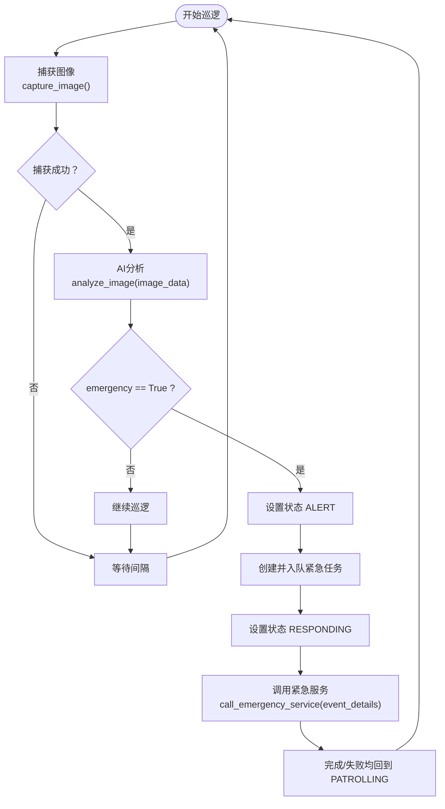
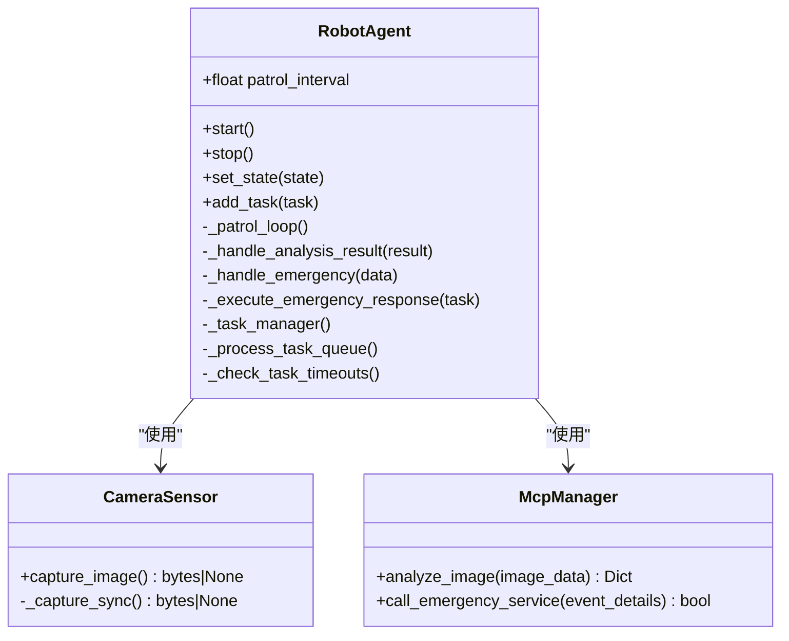
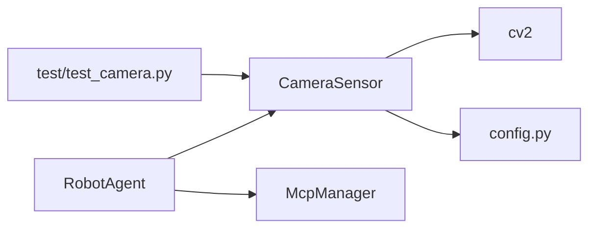

# API参考

<cite>
**本文引用的文件**
- [core/agent.py](file://core/agent.py)
- [core/camera.py](file://core/camera.py)
- [core/mcp_manager.py](file://core/mcp_manager.py)
- [config.py](file://config.py)
- [test/test_camera.py](file://test/test_camera.py)
- [main.py](file://main.py)
</cite>

## 目录
1. [简介](#简介)
2. [项目结构](#项目结构)
3. [核心组件](#核心组件)
4. [架构总览](#架构总览)
5. [详细组件分析](#详细组件分析)
6. [依赖关系分析](#依赖关系分析)
7. [性能考量](#性能考量)
8. [故障排查指南](#故障排查指南)
9. [结论](#结论)

## 简介
本文件为 robot-agent 项目的 API 参考文档，聚焦以下三个核心模块：
- core/agent.py 中的 RobotAgent 类：包含状态机、巡逻循环、任务管理与紧急响应流程。
- core/camera.py 中的 CameraSensor 类：提供异步图像捕获能力，返回 JPEG 字节流或在失败时返回 None。
- core/mcp_manager.py 中的 McpManager 类：提供图像分析与紧急服务调用的异步接口。

文档将按“参数与初始化”“方法签名与行为”“异步特性”“调用示例路径”“错误与边界条件”等维度进行说明，并给出关键流程的时序图与类图，帮助开发者快速理解与正确使用这些 API。

## 项目结构
项目采用分层设计，核心逻辑集中在 core 目录：
- core/agent.py：机器人代理主体，负责状态管理、巡逻循环、任务调度与紧急响应。
- core/camera.py：摄像头传感器封装，提供异步图像捕获。
- core/mcp_manager.py：MCP 工具调用器，提供图像分析与紧急服务调用。
- config.py：全局配置（如视频设备标识）。
- test/test_camera.py：摄像头相关测试，验证初始化与捕获成功/失败场景。
- main.py：入口示例（注意：当前示例参数命名与实际构造函数不一致，见“故障排查指南”）。

图表来源
- [core/agent.py](file://core/agent.py#L1-L278)
- [core/camera.py](file://core/camera.py#L1-L57)
- [core/mcp_manager.py](file://core/mcp_manager.py#L1-L28)
- [config.py](file://config.py#L1-L1)
- [test/test_camera.py](file://test/test_camera.py#L1-L43)
- [main.py](file://main.py#L1-L7)

章节来源
- [core/agent.py](file://core/agent.py#L1-L278)
- [core/camera.py](file://core/camera.py#L1-L57)
- [core/mcp_manager.py](file://core/mcp_manager.py#L1-L28)
- [config.py](file://config.py#L1-L1)
- [test/test_camera.py](file://test/test_camera.py#L1-L43)
- [main.py](file://main.py#L1-L7)

## 核心组件
本节概述三个核心类及其职责：
- RobotAgent：机器人代理，维护 AgentState 状态机，驱动摄像头捕获与 MCP 分析，管理任务队列与超时，处理紧急事件并调用紧急服务。
- CameraSensor：摄像头封装，提供异步捕获接口，返回 JPEG 字节流，失败时返回 None。
- McpManager：MCP 工具调用器，提供图像分析与紧急服务调用的异步接口，返回分析结果字典与布尔调用结果。

章节来源
- [core/agent.py](file://core/agent.py#L1-L278)
- [core/camera.py](file://core/camera.py#L1-L57)
- [core/mcp_manager.py](file://core/mcp_manager.py#L1-L28)

## 架构总览
下图展示了 RobotAgent 如何协调 CameraSensor 与 McpManager，形成“捕获-分析-响应”的闭环。

图表来源
- [core/agent.py](file://core/agent.py#L108-L181)
- [core/camera.py](file://core/camera.py#L17-L29)
- [core/mcp_manager.py](file://core/mcp_manager.py#L10-L28)

## 详细组件分析

### RobotAgent 类 API 参考
- 初始化与状态
  - __init__(patrol_interval: float = 30.0)
    - 参数：patrol_interval 表示摄像头检查间隔（秒）。默认 30 秒。
    - 初始化行为：设置初始状态为 IDLE；创建 CameraSensor 与 McpManager 实例；准备任务队列与运行中任务映射；未启动任何后台任务。
    - 章节来源
      - [core/agent.py](file://core/agent.py#L31-L54)
  - start()
    - 功能：将状态切换至 PATROLLING，启动巡逻循环与任务管理器。
    - 章节来源
      - [core/agent.py](file://core/agent.py#L55-L64)
  - stop()
    - 功能：将状态切换至 IDLE，并取消所有运行中的任务（包括巡逻循环、任务管理器与队列中的任务）。
    - 章节来源
      - [core/agent.py](file://core/agent.py#L60-L75)
  - set_state(state: AgentState)
    - 内部逻辑：打印状态变更日志；当进入 PATROLLING 时启动巡逻循环与任务管理器；进入 IDLE 时停止两者。
    - 章节来源
      - [core/agent.py](file://core/agent.py#L76-L106)

- 巡逻与分析
  - _patrol_loop()
    - 异步主循环：在状态为 PATROLLING 时，周期性调用 CameraSensor.capture_image() 与 McpManager.analyze_image()，随后根据结果决定是否触发紧急响应。
    - 章节来源
      - [core/agent.py](file://core/agent.py#L108-L128)
  - _handle_analysis_result(result: Dict[str, Any])
    - 内部逻辑：若 result["emergency"] 为真，则调用 _handle_emergency()；否则继续巡逻。
    - 章节来源
      - [core/agent.py](file://core/agent.py#L129-L139)

- 紧急响应与任务管理
  - _handle_emergency(emergency_data: Dict[str, Any])
    - 内部逻辑：设置状态为 ALERT；创建 Task 并附加紧急数据；加入任务队列；切换状态为 RESPONDING。
    - 章节来源
      - [core/agent.py](file://core/agent.py#L140-L159)
  - _execute_emergency_response(task: Task)
    - 内部逻辑：调用 McpManager.call_emergency_service(task.data)，根据返回布尔值更新任务状态；完成后回到 PATROLLING。
    - 章节来源
      - [core/agent.py](file://core/agent.py#L161-L181)
  - _task_manager()
    - 内部逻辑：持续处理任务队列，启动待执行任务，检查运行中任务超时并清理完成/超时任务。
    - 章节来源
      - [core/agent.py](file://core/agent.py#L182-L200)
  - _process_task_queue()
    - 内部逻辑：遍历任务队列，对超时任务标记并移除；对待执行任务创建异步任务并加入运行中集合。
    - 章节来源
      - [core/agent.py](file://core/agent.py#L201-L232)
  - _check_task_timeouts()
    - 内部逻辑：检查运行中任务是否超时，取消并标记；清理已完成/超时任务。
    - 章节来源
      - [core/agent.py](file://core/agent.py#L233-L261)
  - add_task(task: Task)
    - 功能：向任务队列追加任务。
    - 章节来源
      - [core/agent.py](file://core/agent.py#L262-L266)

- 状态枚举与任务数据结构
  - AgentState：IDLE、PATROLLING、RESPONDING、ALERT。
  - Task：包含 id、name、callback、created_at、timeout、status 等字段。
  - 章节来源
    - [core/agent.py](file://core/agent.py#L11-L27)

- 关键流程图：巡逻与紧急响应

图表来源
- [core/agent.py](file://core/agent.py#L108-L181)
- [core/mcp_manager.py](file://core/mcp_manager.py#L10-L28)

- 类图：RobotAgent 与协作组件

图表来源
- [core/agent.py](file://core/agent.py#L1-L278)
- [core/camera.py](file://core/camera.py#L1-L57)
- [core/mcp_manager.py](file://core/mcp_manager.py#L1-L28)

- 调用示例路径（异步）
  - 启动代理与运行示例：参见 [main.py](file://main.py#L1-L7) 中的入口逻辑。
  - 状态切换与任务管理：参见 [core/agent.py](file://core/agent.py#L55-L106)。
  - 巡逻循环与分析：参见 [core/agent.py](file://core/agent.py#L108-L139)。
  - 紧急响应与服务调用：参见 [core/agent.py](file://core/agent.py#L140-L181) 与 [core/mcp_manager.py](file://core/mcp_manager.py#L24-L28)。

章节来源
- [core/agent.py](file://core/agent.py#L1-L278)
- [main.py](file://main.py#L1-L7)

### CameraSensor 类 API 参考
- capture_image() -> bytes | None
  - 功能：异步捕获摄像头图像，返回 JPEG 格式的字节流；若捕获失败则返回 None。
  - 异步特性：通过 asyncio.to_thread 在独立线程中执行同步捕获逻辑，避免阻塞事件循环。
  - 返回值语义：成功返回 bytes，失败返回 None。
  - 章节来源
    - [core/camera.py](file://core/camera.py#L17-L29)
  - 测试覆盖：参见 [test/test_camera.py](file://test/test_camera.py#L14-L43)。
- 内部实现要点
  - 设备打开与帧读取：首次调用时初始化 VideoCapture，读取帧并进行 JPEG 编码。
  - 错误处理：设备不可用、无法读取帧、编码异常等情况均会返回 None。
  - 章节来源
    - [core/camera.py](file://core/camera.py#L31-L57)
  - 配置来源：VIDEO_DEV 来自 [config.py](file://config.py#L1-L1)。

- 调用示例路径（异步）
  - 代理巡逻循环中的调用：参见 [core/agent.py](file://core/agent.py#L115-L116)。
  - 单独测试用例：参见 [test/test_camera.py](file://test/test_camera.py#L14-L43)。

章节来源
- [core/camera.py](file://core/camera.py#L1-L57)
- [config.py](file://config.py#L1-L1)
- [test/test_camera.py](file://test/test_camera.py#L1-L43)
- [core/agent.py](file://core/agent.py#L115-L116)

### McpManager 类 API 参考
- analyze_image(image_data: bytes) -> Dict[str, Any]
  - 输入：图像字节（由 CameraSensor.capture_image() 提供）。
  - 输出：分析结果字典，其中包含 emergency 布尔标志及其它字段（如 objects_detected、confidence 等）。
  - 异步特性：模拟 AI 分析耗时，返回前会短暂等待。
  - 章节来源
    - [core/mcp_manager.py](file://core/mcp_manager.py#L10-L23)
- call_emergency_service(event_details: Dict[str, Any]) -> bool
  - 输入：紧急事件详情（通常来自任务数据）。
  - 输出：布尔值，表示调用紧急服务是否成功。
  - 异步特性：模拟调用耗时，返回前会短暂等待。
  - 章节来源
    - [core/mcp_manager.py](file://core/mcp_manager.py#L24-L28)
- 调用示例路径（异步）
  - 代理分析与调用：参见 [core/agent.py](file://core/agent.py#L115-L116) 与 [core/agent.py](file://core/agent.py#L166-L169)。

章节来源
- [core/mcp_manager.py](file://core/mcp_manager.py#L1-L28)
- [core/agent.py](file://core/agent.py#L115-L116)
- [core/agent.py](file://core/agent.py#L166-L169)

## 依赖关系分析
- RobotAgent 依赖 CameraSensor 与 McpManager，分别用于图像采集与 AI 分析/紧急服务调用。
- CameraSensor 依赖 OpenCV（cv2）与配置 VIDEO_DEV。
- 测试模块对 CameraSensor 进行异步行为验证。

图表来源
- [core/agent.py](file://core/agent.py#L1-L278)
- [core/camera.py](file://core/camera.py#L1-L57)
- [core/mcp_manager.py](file://core/mcp_manager.py#L1-L28)
- [config.py](file://config.py#L1-L1)
- [test/test_camera.py](file://test/test_camera.py#L1-L43)

章节来源
- [core/agent.py](file://core/agent.py#L1-L278)
- [core/camera.py](file://core/camera.py#L1-L57)
- [core/mcp_manager.py](file://core/mcp_manager.py#L1-L28)
- [config.py](file://config.py#L1-L1)
- [test/test_camera.py](file://test/test_camera.py#L1-L43)

## 性能考量
- 异步 I/O：CameraSensor 使用 asyncio.to_thread 执行阻塞式摄像头操作，避免阻塞事件循环，提高并发吞吐。
- 任务管理：RobotAgent 的任务管理器定期检查队列与超时，避免长时间占用 CPU；巡逻循环通过 sleep 控制频率。
- 分析与调用：McpManager 的分析与调用过程包含短暂等待，模拟真实 AI 推理与外部服务调用延迟。
- 建议
  - 合理设置 patrol_interval，避免过于频繁导致资源紧张。
  - 对于高负载场景，可考虑引入限流与重试策略（当前实现未包含）。

[本节为通用建议，不直接分析具体文件]

## 故障排查指南
- 摄像头设备不可用
  - 现象：capture_image() 返回 None；日志提示无法打开设备或无法读取帧。
  - 排查：确认 VIDEO_DEV 配置与设备路径；检查设备权限与驱动。
  - 章节来源
    - [core/camera.py](file://core/camera.py#L31-L57)
    - [config.py](file://config.py#L1-L1)
- 代理启动参数不匹配
  - 现象：入口示例使用 wake_interval，但 RobotAgent.__init__ 接收的是 patrol_interval。
  - 建议：统一参数名称，保持与构造函数签名一致。
  - 章节来源
    - [main.py](file://main.py#L1-L7)
    - [core/agent.py](file://core/agent.py#L31-L54)
- 紧急服务调用失败
  - 现象：call_emergency_service 返回 False 或抛出异常。
  - 排查：检查外部服务可用性与网络连通性；查看代理日志定位异常。
  - 章节来源
    - [core/mcp_manager.py](file://core/mcp_manager.py#L24-L28)
    - [core/agent.py](file://core/agent.py#L166-L177)
- 任务超时
  - 现象：任务状态变为 timeout。
  - 排查：调整任务 timeout；优化回调执行耗时。
  - 章节来源
    - [core/agent.py](file://core/agent.py#L201-L261)

## 结论
本文档系统梳理了 RobotAgent、CameraSensor 与 McpManager 的公共接口与行为，明确了异步特性、返回值语义与关键流程。结合测试用例与配置文件，读者可据此正确集成与扩展该模块，确保在异步环境下稳定运行。