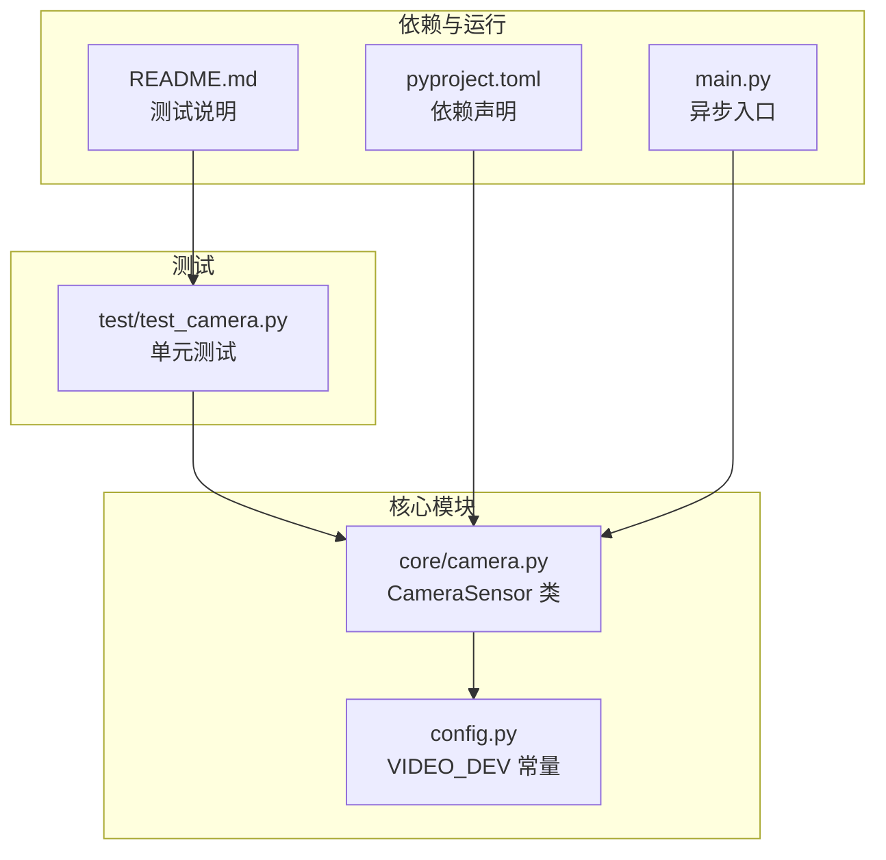
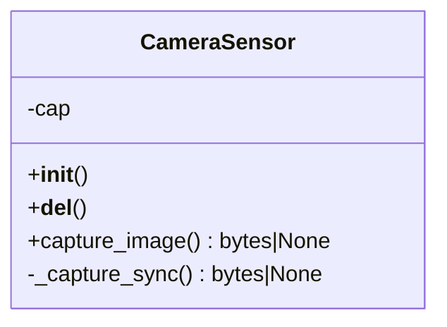
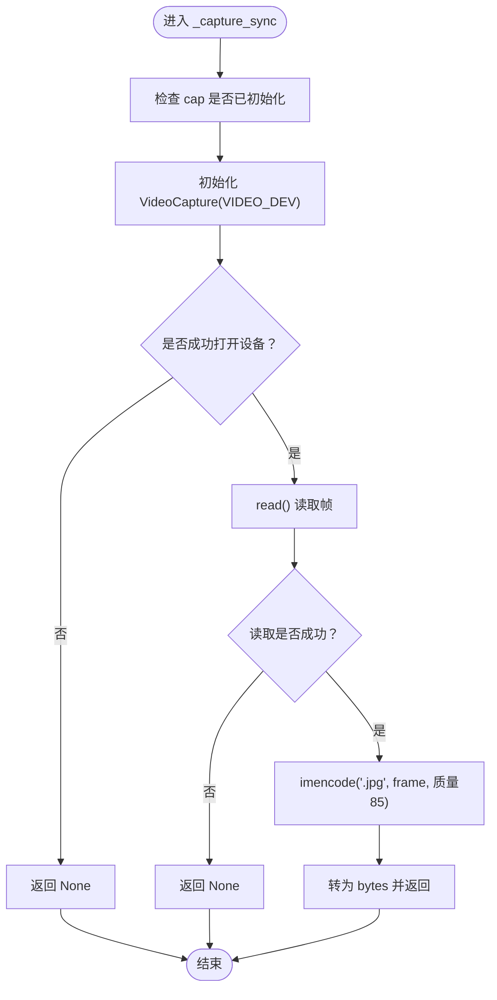
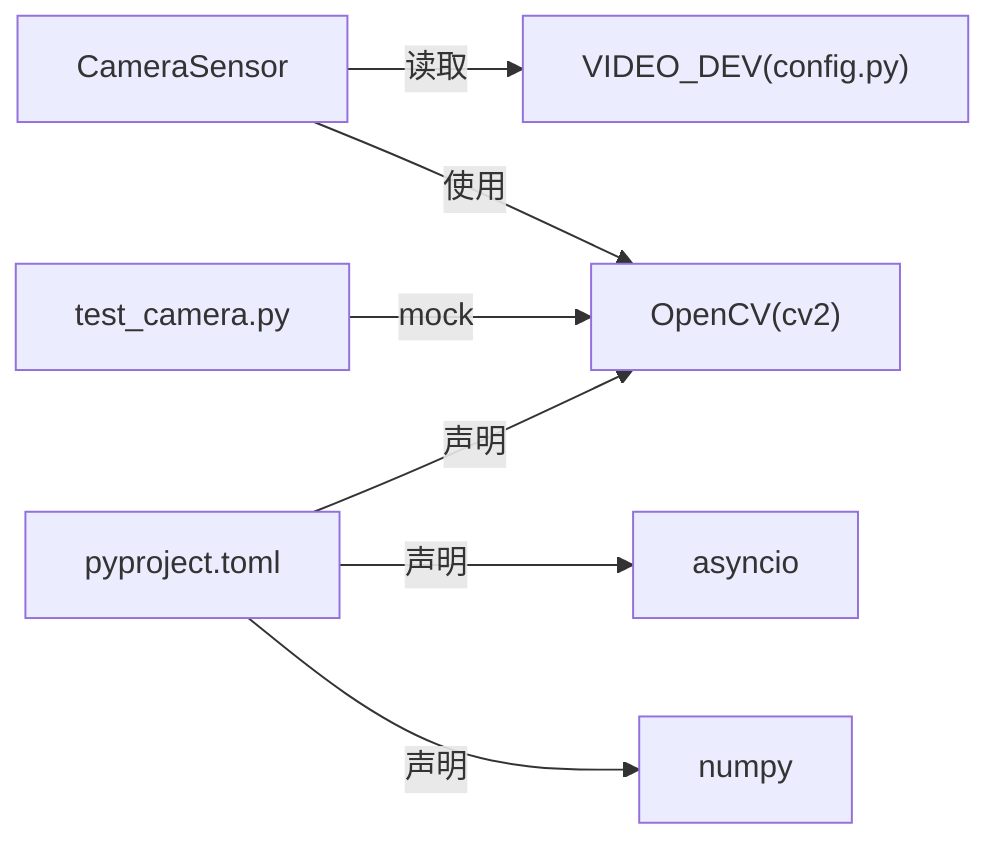

# CameraSensor API

<cite>
**本文引用的文件**
- [core/camera.py](file://core/camera.py)
- [test/test_camera.py](file://test/test_camera.py)
- [config.py](file://config.py)
- [pyproject.toml](file://pyproject.toml)
- [README.md](file://README.md)
- [main.py](file://main.py)
</cite>

## 目录
1. [简介](#简介)
2. [项目结构](#项目结构)
3. [核心组件](#核心组件)
4. [架构总览](#架构总览)
5. [详细组件分析](#详细组件分析)
6. [依赖关系分析](#依赖关系分析)
7. [性能与并发特性](#性能与并发特性)
8. [故障排查指南](#故障排查指南)
9. [结论](#结论)
10. [附录](#附录)

## 简介
本文件为 CameraSensor 类的 API 文档，聚焦于异步捕图接口 capture_image() 的工作流程与行为规范。该方法通过 asyncio.to_thread 在独立线程中执行同步的 _capture_sync 方法，避免阻塞事件循环；成功时返回 JPEG 格式的字节流（bytes 类型），失败时返回 None。文档还说明了 _capture_sync 内部如何使用 OpenCV 访问视频设备、捕获帧并编码为 JPEG（质量 85%），以及常见异常场景的处理建议与前置条件。

## 项目结构
- 核心摄像头实现位于 core/camera.py，定义了 CameraSensor 类及其异步捕图接口。
- 测试用例位于 test/test_camera.py，覆盖初始化、成功捕图与失败捕图的场景。
- 视频设备标识常量位于 config.py，当前默认值为 "video0"。
- 依赖声明位于 pyproject.toml，明确 OpenCV、NumPy、asyncio 等依赖版本要求。
- README.md 提供测试运行说明。
- main.py 展示了异步入口的基本结构，便于理解事件循环上下文。



图表来源
- [core/camera.py](file://core/camera.py#L1-L57)
- [config.py](file://config.py#L1-L1)
- [test/test_camera.py](file://test/test_camera.py#L1-L43)
- [pyproject.toml](file://pyproject.toml#L1-L14)
- [README.md](file://README.md#L1-L18)
- [main.py](file://main.py#L1-L7)

章节来源
- [core/camera.py](file://core/camera.py#L1-L57)
- [config.py](file://config.py#L1-L1)
- [test/test_camera.py](file://test/test_camera.py#L1-L43)
- [pyproject.toml](file://pyproject.toml#L1-L14)
- [README.md](file://README.md#L1-L18)
- [main.py](file://main.py#L1-L7)

## 核心组件
- CameraSensor 类
  - 职责：封装摄像头资源管理与异步捕图能力。
  - 关键字段：
    - cap：OpenCV VideoCapture 实例，用于访问视频设备。
  - 关键方法：
    - capture_image()：异步捕图入口，返回 bytes 或 None。
    - _capture_sync()：同步捕图实现，负责设备打开、帧读取与 JPEG 编码。
    - __del__()：析构时释放摄像头资源。

章节来源
- [core/camera.py](file://core/camera.py#L1-L57)

## 架构总览
下图展示了调用 capture_image() 的典型异步流程：事件循环通过 asyncio.to_thread 将 CPU 密集型的摄像头读取与编码任务调度到线程池执行，从而避免阻塞主线程。

```mermaid
sequenceDiagram
participant Caller as "调用方"
participant Sensor as "CameraSensor"
participant Loop as "事件循环"
participant Thread as "线程池"
participant CV as "OpenCV VideoCapture"
participant Enc as "JPEG 编码器"
Caller->>Sensor : "await capture_image()"
Sensor->>Loop : "to_thread(_capture_sync)"
Loop->>Thread : "调度到独立线程"
Thread->>CV : "VideoCapture(VIDEO_DEV)"
CV-->>Thread : "返回是否打开成功"
alt "打开失败"
Thread-->>Sensor : "返回 None"
Sensor-->>Caller : "返回 None"
else "打开成功"
Thread->>CV : "read()"
CV-->>Thread : "ret, frame"
alt "读取失败"
Thread-->>Sensor : "返回 None"
Sensor-->>Caller : "返回 None"
else "读取成功"
Thread->>Enc : "imencode('.jpg', frame, 质量85)"
Enc-->>Thread : "编码结果"
Thread-->>Sensor : "返回 JPEG 字节流"
Sensor-->>Caller : "返回 bytes"
end
end
```

图表来源
- [core/camera.py](file://core/camera.py#L17-L57)
- [config.py](file://config.py#L1-L1)

## 详细组件分析

### CameraSensor 类
- 设计要点
  - 使用 asyncio.to_thread 将耗时的摄像头 I/O 与图像编码放入线程池，避免阻塞事件循环。
  - 采用懒加载策略：首次调用时才创建 VideoCapture 实例，减少无用资源占用。
  - 返回值约定：成功返回 bytes（JPEG），失败返回 None；错误信息通过控制台打印辅助定位问题。
  - 资源释放：析构时主动 release VideoCapture，防止资源泄漏。



图表来源
- [core/camera.py](file://core/camera.py#L1-L57)

章节来源
- [core/camera.py](file://core/camera.py#L1-L57)

### 异步捕图流程 capture_image()
- 行为概述
  - 打印日志提示开始捕图。
  - 通过 asyncio.to_thread 在独立线程中执行 _capture_sync。
  - 若返回 None，打印失败日志并直接返回 None；否则打印成功日志并返回字节流。
- 返回值
  - 成功：bytes（JPEG 图像字节）。
  - 失败：None。
- 典型调用示例（路径参考）
  - 参考测试用例中的调用方式：[test/test_camera.py](file://test/test_camera.py#L24-L28)
  - 示例调用路径：await camera.capture_image()

章节来源
- [core/camera.py](file://core/camera.py#L17-L29)
- [test/test_camera.py](file://test/test_camera.py#L14-L28)

### 同步捕图实现 _capture_sync()
- 设备打开
  - 使用 VideoCapture 打开 VIDEO_DEV 对应的设备。
  - 若无法打开，打印错误信息并返回 None。
- 帧读取
  - 调用 read() 获取一帧，若返回 False，打印错误信息并返回 None。
- JPEG 编码
  - 使用 imencode 将帧编码为 JPEG，质量参数为 85。
  - 将编码缓冲区转换为 bytes 并返回。
- 错误兜底
  - 捕获任意异常并返回 None，同时打印错误信息。



图表来源
- [core/camera.py](file://core/camera.py#L31-L57)
- [config.py](file://config.py#L1-L1)

章节来源
- [core/camera.py](file://core/camera.py#L31-L57)
- [config.py](file://config.py#L1-L1)

### 设备与依赖
- 视频设备标识
  - 默认设备名为 "video0"，可在 config.py 中调整。
- 依赖要求
  - OpenCV（opencv-python）、NumPy、asyncio 等已在 pyproject.toml 中声明。
- 运行与测试
  - README.md 提供 pytest 运行方式；main.py 展示了异步入口的基本结构。

章节来源
- [config.py](file://config.py#L1-L1)
- [pyproject.toml](file://pyproject.toml#L1-L14)
- [README.md](file://README.md#L1-L18)
- [main.py](file://main.py#L1-L7)

## 依赖关系分析
- 组件耦合
  - CameraSensor 依赖 OpenCV（cv2）进行设备访问与图像编码。
  - 依赖配置常量 VIDEO_DEV 来确定设备名称。
- 外部依赖
  - asyncio.to_thread 用于线程调度。
  - numpy 用于数组/缓冲区处理（间接被 cv2 使用）。
- 测试依赖
  - 单元测试通过 patch 替换 cv2，验证捕图成功与失败分支。



图表来源
- [core/camera.py](file://core/camera.py#L1-L57)
- [config.py](file://config.py#L1-L1)
- [test/test_camera.py](file://test/test_camera.py#L1-L43)
- [pyproject.toml](file://pyproject.toml#L1-L14)

章节来源
- [core/camera.py](file://core/camera.py#L1-L57)
- [test/test_camera.py](file://test/test_camera.py#L1-L43)
- [pyproject.toml](file://pyproject.toml#L1-L14)

## 性能与并发特性
- 线程模型
  - 通过 asyncio.to_thread 将摄像头 I/O 与图像编码移出事件循环，降低主线程阻塞风险。
- 编码质量
  - JPEG 质量设置为 85，兼顾体积与画质；如需更高画质可调整质量参数。
- 资源复用
  - 首次调用时创建 VideoCapture，后续复用以减少重复初始化成本。
- 注意事项
  - 设备占用：若其他进程已打开该设备，打开会失败；请确保设备未被占用。
  - 读取超时：read() 失败通常表示设备不可用或无可用帧；可重试或检查设备状态。
  - 线程安全：cv2.VideoCapture 非线程安全，但此处通过 to_thread 保证同一时间仅有一个线程在使用，避免竞态。

章节来源
- [core/camera.py](file://core/camera.py#L17-L57)

## 故障排查指南
- 摄像头无法打开
  - 现象：打开设备失败，返回 None。
  - 排查：确认设备名称与系统实际一致；检查权限与驱动；确保设备未被其他应用占用。
  - 参考路径：[core/camera.py](file://core/camera.py#L35-L39)
- 读取帧失败
  - 现象：read() 返回 False，返回 None。
  - 排查：检查设备连接、分辨率设置、光照环境；尝试重启设备或更换端口。
  - 参考路径：[core/camera.py](file://core/camera.py#L46-L49)
- 编码异常
  - 现象：imencode 或 tobytes 抛出异常，返回 None。
  - 排查：确认 OpenCV 安装完整；检查帧数据有效性；查看控制台错误日志。
  - 参考路径：[core/camera.py](file://core/camera.py#L55-L57)
- 设备占用
  - 现象：打开失败或读取失败。
  - 排查：关闭其他占用该设备的应用；切换 VIDEO_DEV 名称；重启系统后重试。
  - 参考路径：[config.py](file://config.py#L1-L1)
- 依赖缺失
  - 现象：导入失败或运行时报错。
  - 排查：确认 pyproject.toml 中依赖已安装；OpenCV 版本满足要求。
  - 参考路径：[pyproject.toml](file://pyproject.toml#L1-L14)
- 测试与验证
  - 使用测试用例验证成功与失败分支，确保行为符合预期。
  - 参考路径：[test/test_camera.py](file://test/test_camera.py#L14-L43)

章节来源
- [core/camera.py](file://core/camera.py#L31-L57)
- [config.py](file://config.py#L1-L1)
- [pyproject.toml](file://pyproject.toml#L1-L14)
- [test/test_camera.py](file://test/test_camera.py#L14-L43)

## 结论
CameraSensor 提供了可靠的异步图像捕获能力：通过线程池隔离摄像头 I/O 与图像编码，避免阻塞事件循环；返回值约定清晰，便于上层逻辑处理。实现细节简洁可靠，具备良好的可测试性与可维护性。建议在生产环境中关注设备占用、依赖完整性与错误日志，以获得稳定表现。

## 附录
- 调用示例（路径参考）
  - 异步捕图调用：await camera.capture_image()
    - 参考路径：[test/test_camera.py](file://test/test_camera.py#L24-L28)
  - 判断返回值并处理：
    - 参考路径：[test/test_camera.py](file://test/test_camera.py#L24-L28)
- 相关文件索引
  - 类定义与实现：[core/camera.py](file://core/camera.py#L1-L57)
  - 设备常量：[config.py](file://config.py#L1-L1)
  - 依赖声明：[pyproject.toml](file://pyproject.toml#L1-L14)
  - 测试用例：[test/test_camera.py](file://test/test_camera.py#L1-L43)
  - 运行说明：[README.md](file://README.md#L1-L18)
  - 异步入口：[main.py](file://main.py#L1-L7)