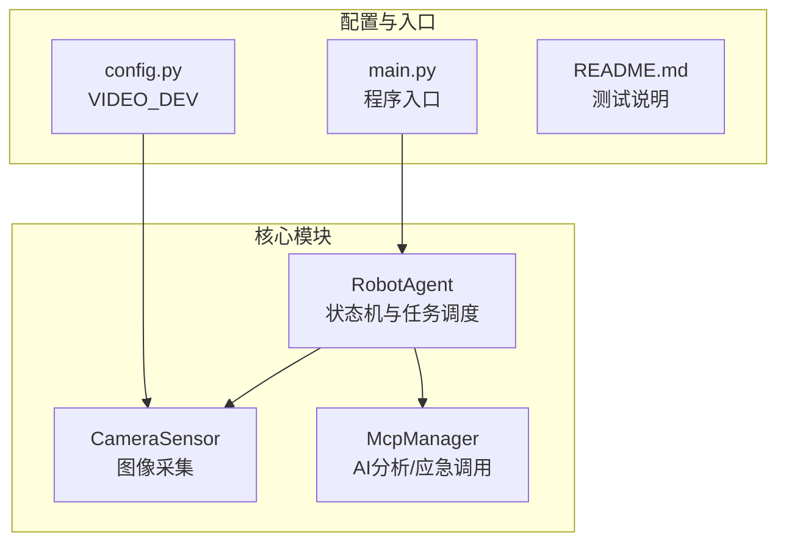
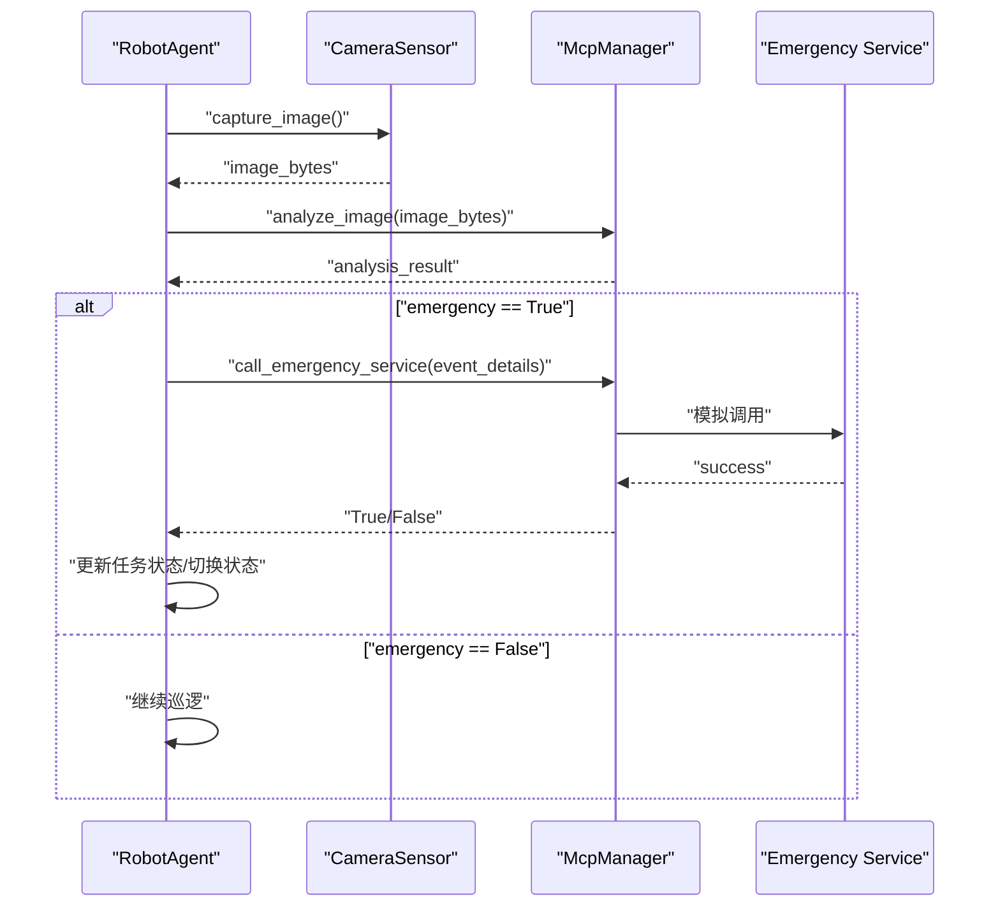
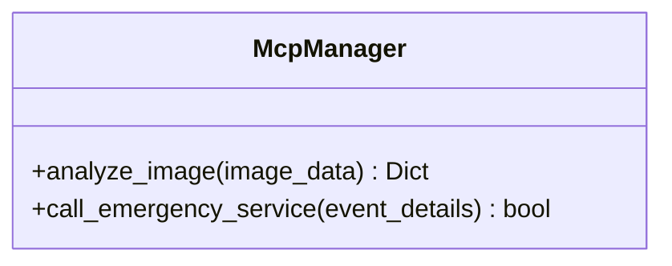
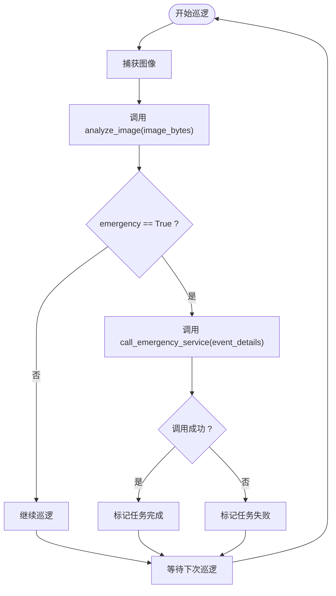
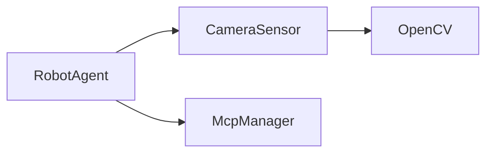

# McpManager API

<cite>
**本文引用的文件**
- [core/mcp_manager.py](file://core/mcp_manager.py)
- [core/agent.py](file://core/agent.py)
- [core/camera.py](file://core/camera.py)
- [config.py](file://config.py)
- [main.py](file://main.py)
- [README.md](file://README.md)
- [test/test_camera.py](file://test/test_camera.py)
</cite>

## 目录
1. [简介](#简介)
2. [项目结构](#项目结构)
3. [核心组件](#核心组件)
4. [架构总览](#架构总览)
5. [详细组件分析](#详细组件分析)
6. [依赖关系分析](#依赖关系分析)
7. [性能考量](#性能考量)
8. [故障排查指南](#故障排查指南)
9. [结论](#结论)
10. [附录](#附录)

## 简介
本文件为 McpManager 类的 API 参考文档，聚焦于两个关键异步方法：
- analyze_image(image_data): 接收图像字节数据，模拟调用 AI 模型进行分析，返回包含紧急标志、检测对象列表、置信度等字段的字典。
- call_emergency_service(event_details): 接收事件详情字典，模拟调用紧急服务，返回布尔值表示是否调用成功。

文档强调：
- 以上两个方法均为异步方法，必须使用 await 调用。
- 当前实现为模拟逻辑，实际部署时可替换为真实的 AI 分析服务与应急系统接口。
- 提供超时处理、网络异常、服务不可用等场景下的容错建议。

## 项目结构
该项目采用分层设计，核心模块包括：
- 机器人代理：负责状态机、巡逻循环、任务调度与紧急响应。
- 摄像头传感器：负责图像采集与编码。
- MCP 管理器：提供图像分析与紧急服务调用的抽象接口（当前为模拟实现）。
- 配置与入口：提供视频设备配置与程序入口。

图表来源
- [core/agent.py](file://core/agent.py#L28-L60)
- [core/camera.py](file://core/camera.py#L1-L30)
- [core/mcp_manager.py](file://core/mcp_manager.py#L7-L28)
- [config.py](file://config.py#L1-L1)
- [main.py](file://main.py#L1-L7)

章节来源
- [core/agent.py](file://core/agent.py#L28-L60)
- [core/camera.py](file://core/camera.py#L1-L30)
- [core/mcp_manager.py](file://core/mcp_manager.py#L7-L28)
- [config.py](file://config.py#L1-L1)
- [main.py](file://main.py#L1-L7)

## 核心组件
本节对 McpManager 类及其相关组件进行深入分析，重点说明其异步接口与在代理流程中的作用。

- McpManager 类
  - analyze_image(image_data: bytes) -> Dict[str, Any]: 异步方法，模拟 AI 分析，返回包含 action、objects_detected、emergency、confidence 等键的字典。
  - call_emergency_service(event_details: Dict[str, Any]) -> bool: 异步方法，模拟调用紧急服务，返回布尔值表示成功与否。

- RobotAgent 与 McpManager 的交互
  - 代理在巡逻循环中调用 McpManager.analyze_image 获取分析结果，并根据 emergency 字段决定是否进入紧急响应流程。
  - 在紧急响应中，代理调用 McpManager.call_emergency_service 并更新任务状态。

- CameraSensor 与图像数据流
  - CameraSensor.capture_image 返回图像字节数据，供 McpManager.analyze_image 使用。
  - 图像采集通过线程池避免阻塞事件循环。

章节来源
- [core/mcp_manager.py](file://core/mcp_manager.py#L10-L28)
- [core/agent.py](file://core/agent.py#L108-L179)
- [core/camera.py](file://core/camera.py#L17-L30)

## 架构总览
下图展示了从摄像头采集图像到 AI 分析再到紧急服务调用的整体流程。

图表来源
- [core/agent.py](file://core/agent.py#L108-L179)
- [core/mcp_manager.py](file://core/mcp_manager.py#L10-L28)
- [core/camera.py](file://core/camera.py#L17-L30)

## 详细组件分析

### McpManager 类
McpManager 是一个提供异步能力的工具类，封装了图像分析与紧急服务调用的接口。其方法签名与行为如下：
- analyze_image(image_data: bytes) -> Dict[str, Any]
  - 输入：图像字节数据
  - 行为：模拟 AI 分析过程，返回包含 action、objects_detected、emergency、confidence 等字段的字典
  - 返回：字典类型，包含上述字段
- call_emergency_service(event_details: Dict[str, Any]) -> bool
  - 输入：事件详情字典
  - 行为：模拟调用紧急服务
  - 返回：布尔值，表示调用是否成功

图表来源
- [core/mcp_manager.py](file://core/mcp_manager.py#L10-L28)

章节来源
- [core/mcp_manager.py](file://core/mcp_manager.py#L10-L28)

### RobotAgent 中的使用流程
- 巡逻循环中，Agent 会调用 McpManager.analyze_image，并依据返回字典中的 emergency 字段决定后续动作。
- 若检测到紧急情况，Agent 会将事件详情传递给 McpManager.call_emergency_service，并根据返回值更新任务状态。

图表来源
- [core/agent.py](file://core/agent.py#L108-L179)
- [core/mcp_manager.py](file://core/mcp_manager.py#L10-L28)

章节来源
- [core/agent.py](file://core/agent.py#L108-L179)

### CameraSensor 与图像数据流
- CameraSensor.capture_image 通过线程池执行同步摄像头操作，避免阻塞事件循环。
- 返回的图像字节数据被传递给 McpManager.analyze_image。

章节来源
- [core/camera.py](file://core/camera.py#L17-L30)
- [config.py](file://config.py#L1-L1)

## 依赖关系分析
- RobotAgent 依赖 McpManager 与 CameraSensor，分别用于分析与图像采集。
- McpManager 为纯异步工具类，不直接依赖外部服务，便于替换为真实实现。
- CameraSensor 依赖 OpenCV，负责图像采集与编码。

图表来源
- [core/agent.py](file://core/agent.py#L28-L60)
- [core/camera.py](file://core/camera.py#L1-L20)
- [core/mcp_manager.py](file://core/mcp_manager.py#L7-L10)

章节来源
- [core/agent.py](file://core/agent.py#L28-L60)
- [core/camera.py](file://core/camera.py#L1-L20)
- [core/mcp_manager.py](file://core/mcp_manager.py#L7-L10)

## 性能考量
- 异步非阻塞：McpManager 的两个方法均为异步，配合事件循环与线程池，避免阻塞主线程。
- 模拟延迟：当前实现包含短暂的异步延迟，用于模拟真实服务的响应时间，便于观察流程与进行压力测试。
- 资源释放：CameraSensor 在析构时释放摄像头资源，避免资源泄漏。

章节来源
- [core/mcp_manager.py](file://core/mcp_manager.py#L10-L28)
- [core/camera.py](file://core/camera.py#L12-L16)

## 故障排查指南
- 图像采集失败
  - 现象：capture_image 返回 None
  - 原因：摄像头设备未打开或无法读取帧
  - 排查：确认 VIDEO_DEV 配置与设备可用性；检查 OpenCV 是否正确安装
- 分析结果异常
  - 现象：analyze_image 返回的字典缺少关键字段
  - 原因：模拟实现固定返回格式，若接入真实服务需确保字段一致性
  - 排查：核对返回字典的键是否存在；在代理侧做好默认值处理
- 紧急调用失败
  - 现象：call_emergency_service 返回 False 或抛出异常
  - 原因：模拟实现固定返回 True；真实服务可能因网络或权限导致失败
  - 排查：在代理侧捕获异常并记录日志；必要时重试或降级处理
- 超时与取消
  - 建议：在代理侧为长时间运行的分析与调用设置超时；在取消任务时清理资源
  - 参考：代理内部已具备任务管理与状态切换逻辑，可在调用处增加超时装饰器或信号处理

章节来源
- [core/camera.py](file://core/camera.py#L31-L57)
- [core/mcp_manager.py](file://core/mcp_manager.py#L10-L28)
- [core/agent.py](file://core/agent.py#L161-L180)

## 结论
McpManager 提供了清晰的异步接口，便于在机器人代理中集成图像分析与紧急响应流程。当前实现为模拟版本，适合开发与测试阶段使用；在生产环境中，应替换为真实的服务端点，并完善错误处理、超时控制与可观测性。

## 附录

### API 定义与使用说明
- 方法定义
  - analyze_image(image_data: bytes) -> Dict[str, Any]
    - 输入：图像字节数据
    - 输出：字典，包含 action、objects_detected、emergency、confidence 等键
  - call_emergency_service(event_details: Dict[str, Any]) -> bool
    - 输入：事件详情字典
    - 输出：布尔值，表示调用是否成功
- 使用要点
  - 必须使用 await 调用上述两个方法
  - 在代理中，先调用 analyze_image 获取结果，再根据 emergency 决定是否调用 call_emergency_service
- 示例流程
  - result = await mcp.analyze_image(image_bytes)
  - if result["emergency"]:
      success = await mcp.call_emergency_service(result)

章节来源
- [core/mcp_manager.py](file://core/mcp_manager.py#L10-L28)
- [core/agent.py](file://core/agent.py#L108-L179)

### 测试与验证
- 单元测试
  - README 提供了使用 pytest 运行测试的说明
  - test/test_camera.py 展示了如何使用异步测试与模拟 OpenCV 行为
- 建议
  - 为 McpManager 编写异步测试，覆盖正常与异常分支
  - 对代理侧的紧急响应流程进行集成测试，验证状态切换与任务管理

章节来源
- [README.md](file://README.md#L1-L18)
- [test/test_camera.py](file://test/test_camera.py#L1-L43)