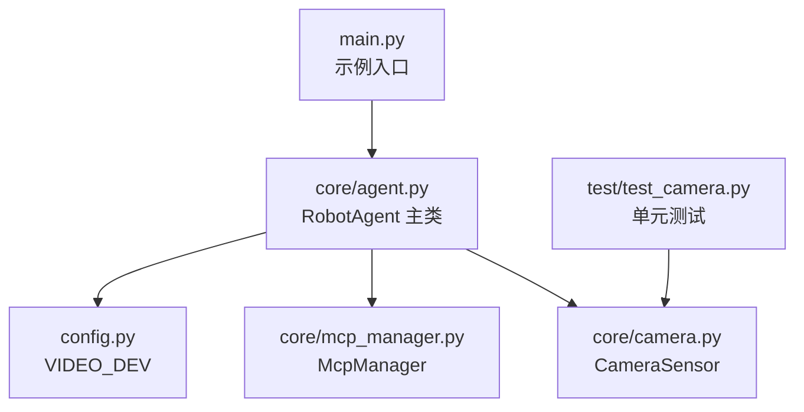
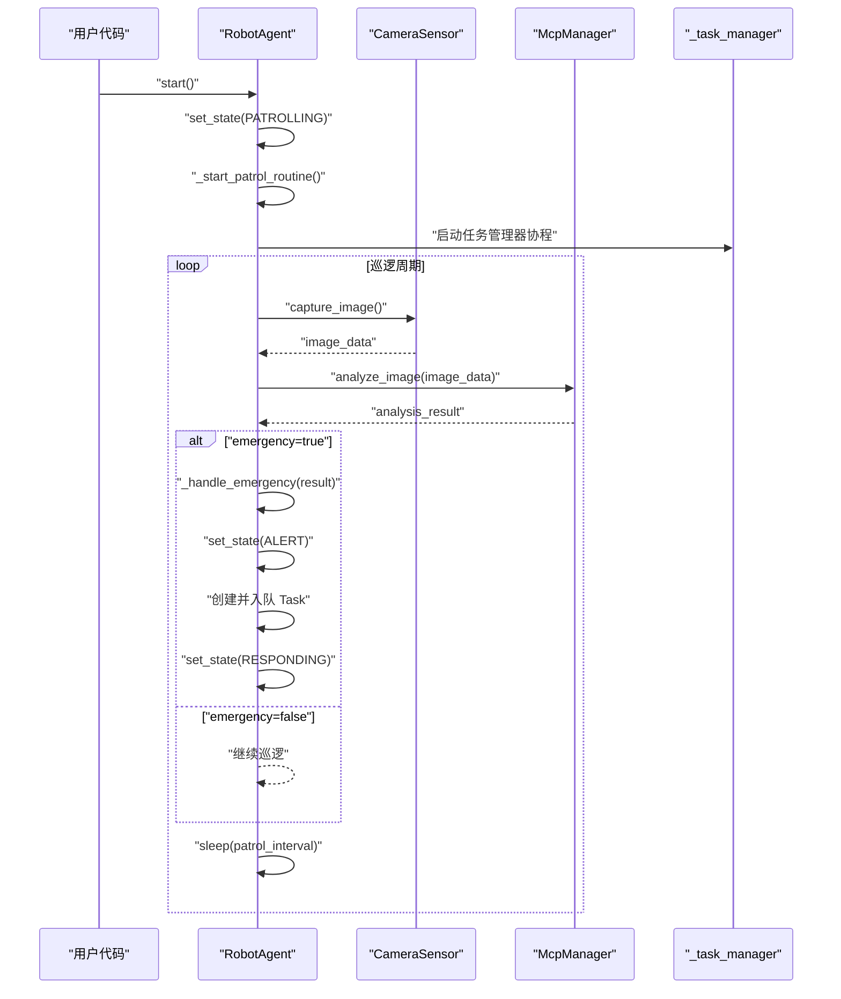
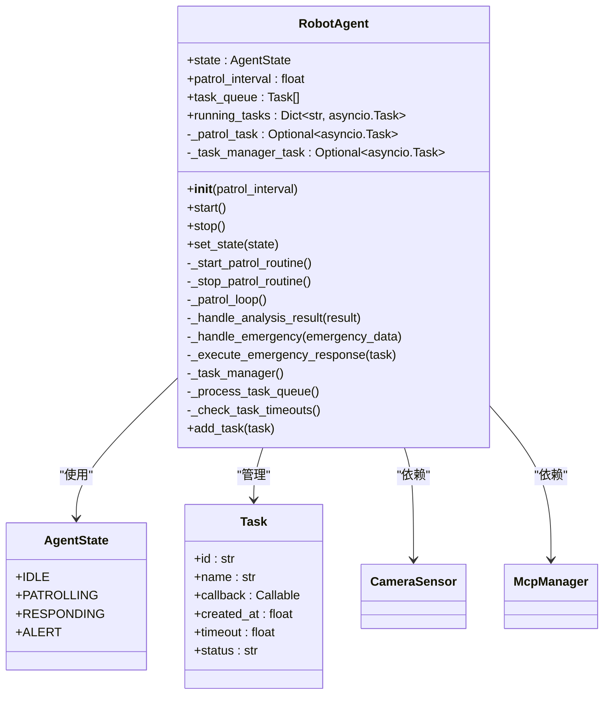
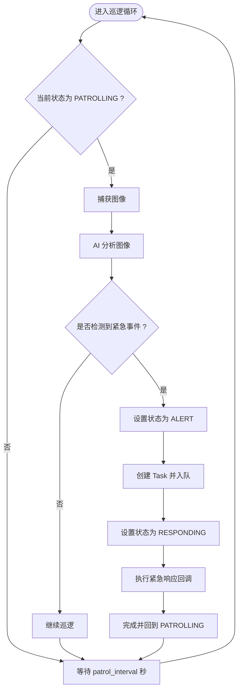
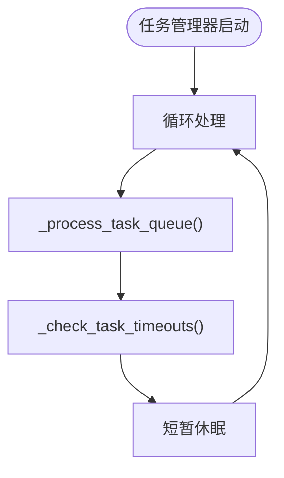
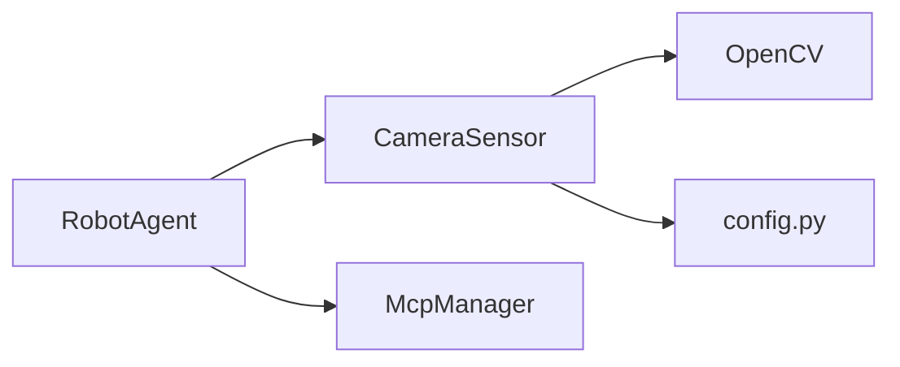

# RobotAgent API

<cite>
**本文引用的文件**
- [core/agent.py](file://core/agent.py)
- [core/camera.py](file://core/camera.py)
- [core/mcp_manager.py](file://core/mcp_manager.py)
- [config.py](file://config.py)
- [main.py](file://main.py)
- [README.md](file://README.md)
- [test/test_camera.py](file://test/test_camera.py)
- [pyproject.toml](file://pyproject.toml)
</cite>

## 目录
1. [简介](#简介)
2. [项目结构](#项目结构)
3. [核心组件](#核心组件)
4. [架构总览](#架构总览)
5. [详细组件分析](#详细组件分析)
6. [依赖关系分析](#依赖关系分析)
7. [性能与并发特性](#性能与并发特性)
8. [故障排查指南](#故障排查指南)
9. [结论](#结论)
10. [附录：API参考与示例](#附录api参考与示例)

## 简介
本文件为 RobotAgent 类的详细 API 文档，聚焦以下内容：
- 构造函数 __init__(patrol_interval) 的参数与初始化行为
- start() 与 stop() 方法的状态切换与任务控制
- set_state(state) 的状态转换逻辑及其对巡逻例程的影响
- 异步调用示例与 add_task(task) 的任务队列管理
- 任务超时机制与状态管理
- 常见问题排查与最佳实践

## 项目结构
该项目采用分层模块化组织，核心逻辑集中在 core 目录下：
- core/agent.py：机器人代理主类与状态机、任务管理、巡逻循环
- core/camera.py：摄像头传感器封装，负责图像采集
- core/mcp_manager.py：AI 分析与应急服务调用的模拟接口
- config.py：全局配置（如摄像头设备名）
- test/test_camera.py：摄像头功能的单元测试
- main.py：示例入口（存在命名差异，详见“附录”）

图表来源
- [core/agent.py](file://core/agent.py#L1-L278)
- [core/camera.py](file://core/camera.py#L1-L57)
- [core/mcp_manager.py](file://core/mcp_manager.py#L1-L28)
- [config.py](file://config.py#L1-L1)
- [test/test_camera.py](file://test/test_camera.py#L1-L43)
- [main.py](file://main.py#L1-L7)

章节来源
- [core/agent.py](file://core/agent.py#L1-L278)
- [core/camera.py](file://core/camera.py#L1-L57)
- [core/mcp_manager.py](file://core/mcp_manager.py#L1-L28)
- [config.py](file://config.py#L1-L1)
- [test/test_camera.py](file://test/test_camera.py#L1-L43)
- [main.py](file://main.py#L1-L7)

## 核心组件
- AgentState：代理状态枚举，包含 IDLE、PATROLLING、RESPONDING、ALERT 四种状态
- Task：任务数据结构，包含 id、name、callback、created_at、timeout、status 等字段
- RobotAgent：机器人代理主类，负责状态管理、巡逻循环、任务队列与超时控制

章节来源
- [core/agent.py](file://core/agent.py#L11-L27)

## 架构总览
RobotAgent 通过 CameraSensor 采集图像，交由 McpManager 执行 AI 分析；根据分析结果决定继续巡逻或进入紧急响应流程。同时维护任务队列与运行中任务集合，支持异步任务的超时检测与清理。

图表来源
- [core/agent.py](file://core/agent.py#L55-L128)
- [core/agent.py](file://core/agent.py#L129-L181)
- [core/agent.py](file://core/agent.py#L182-L200)
- [core/camera.py](file://core/camera.py#L17-L30)
- [core/mcp_manager.py](file://core/mcp_manager.py#L10-L22)

## 详细组件分析

### RobotAgent 类与状态机
- 状态枚举：IDLE、PATROLLING、RESPONDING、ALERT
- 初始化行为：
  - state 设为 IDLE
  - 保存 patrol_interval（秒）
  - 创建 CameraSensor 与 McpManager 实例
  - 初始化任务队列与运行中任务映射
  - 准备巡逻与任务管理的后台协程句柄
- start()：将状态切换至 PATROLLING，触发巡逻例程与任务管理器启动
- stop()：将状态切换至 IDLE，取消所有后台协程与运行中任务
- set_state(state)：根据目标状态启动/停止巡逻例程；在 PATROLLING 时启动巡逻循环，在 IDLE 时停止巡逻循环

图表来源
- [core/agent.py](file://core/agent.py#L11-L27)
- [core/agent.py](file://core/agent.py#L28-L278)

章节来源
- [core/agent.py](file://core/agent.py#L11-L27)
- [core/agent.py](file://core/agent.py#L28-L106)
- [core/agent.py](file://core/agent.py#L108-L181)
- [core/agent.py](file://core/agent.py#L182-L266)

### 巡逻循环与紧急响应
- _patrol_loop()：持续循环，当状态为 PATROLLING 时，调用 CameraSensor 捕获图像并交由 McpManager 分析，随后根据结果决定是否进入紧急响应
- _handle_analysis_result(result)：若检测到紧急事件，则调用 _handle_emergency
- _handle_emergency(emergency_data)：将状态切换为 ALERT，创建 Task 并入队，然后切换为 RESPONDING
- _execute_emergency_response(task)：调用 McpManager.call_emergency_service，更新任务状态并在完成后回到 PATROLLING

图表来源
- [core/agent.py](file://core/agent.py#L108-L181)
- [core/mcp_manager.py](file://core/mcp_manager.py#L24-L28)

章节来源
- [core/agent.py](file://core/agent.py#L108-L181)
- [core/mcp_manager.py](file://core/mcp_manager.py#L10-L28)

### 任务队列与超时管理
- add_task(task)：将自定义任务加入队列
- _task_manager()：周期性处理队列与运行中任务，短暂停歇避免 CPU 占用过高
- _process_task_queue()：遍历队列，检查超时并启动 pending 任务，创建 asyncio.Task 并登记到 running_tasks
- _check_task_timeouts()：检查运行中任务是否超时，取消超时任务并标记状态，清理已完成/超时任务

图表来源
- [core/agent.py](file://core/agent.py#L182-L266)

章节来源
- [core/agent.py](file://core/agent.py#L201-L266)

### 摄像头与 AI 分析
- CameraSensor.capture_image()：异步捕获图像，内部通过线程池避免阻塞
- McpManager.analyze_image(image_data)：模拟 AI 分析返回结构化结果
- McpManager.call_emergency_service(event_details)：模拟调用应急服务

章节来源
- [core/camera.py](file://core/camera.py#L17-L57)
- [core/mcp_manager.py](file://core/mcp_manager.py#L10-L28)
- [config.py](file://config.py#L1-L1)

## 依赖关系分析
- RobotAgent 依赖 CameraSensor 与 McpManager
- CameraSensor 依赖 OpenCV 与配置 VIDEO_DEV
- 测试覆盖了摄像头初始化与捕获成功/失败场景

图表来源
- [core/agent.py](file://core/agent.py#L1-L278)
- [core/camera.py](file://core/camera.py#L1-L57)
- [config.py](file://config.py#L1-L1)

章节来源
- [core/agent.py](file://core/agent.py#L1-L278)
- [core/camera.py](file://core/camera.py#L1-L57)
- [config.py](file://config.py#L1-L1)
- [pyproject.toml](file://pyproject.toml#L1-L14)

## 性能与并发特性
- 使用 asyncio 与 asyncio.create_task 启动后台协程，避免阻塞主线程
- 通过 asyncio.sleep 控制巡逻节奏，降低 CPU 占用
- 任务队列与运行中任务集合采用 O(n) 遍历，建议在高并发场景下优化为优先队列或事件驱动
- 摄像头捕获通过线程池执行同步操作，避免阻塞事件循环

章节来源
- [core/agent.py](file://core/agent.py#L108-L181)
- [core/agent.py](file://core/agent.py#L182-L266)
- [core/camera.py](file://core/camera.py#L17-L30)

## 故障排查指南
- 状态转换失败
  - 现象：调用 start()/stop() 后未进入预期状态
  - 排查：确认 set_state() 是否被正确调用；检查 _start_patrol_routine/_stop_patrol_routine 是否创建/取消了协程
  - 参考路径：[core/agent.py](file://core/agent.py#L55-L106)
- 任务超时处理
  - 现象：任务长时间未完成或未被清理
  - 排查：检查 _process_task_queue 中的超时判断与 _check_task_timeouts 的取消逻辑
  - 参考路径：[core/agent.py](file://core/agent.py#L201-L266)
- 摄像头无法打开或捕获失败
  - 现象：捕获图像返回 None 或报错
  - 排查：确认 VIDEO_DEV 配置；检查 OpenCV 设备是否可用；查看测试用例对异常分支的覆盖
  - 参考路径：[core/camera.py](file://core/camera.py#L17-L57)，[test/test_camera.py](file://test/test_camera.py#L1-L43)，[config.py](file://config.py#L1-L1)
- 应急响应未触发
  - 现象：AI 分析返回 emergency=true，但未创建 Task 或状态未切换
  - 排查：确认 _handle_analysis_result 与 _handle_emergency 的调用链；检查任务入队与状态切换
  - 参考路径：[core/agent.py](file://core/agent.py#L129-L181)，[core/mcp_manager.py](file://core/mcp_manager.py#L10-L22)

章节来源
- [core/agent.py](file://core/agent.py#L55-L181)
- [core/agent.py](file://core/agent.py#L201-L266)
- [core/camera.py](file://core/camera.py#L17-L57)
- [test/test_camera.py](file://test/test_camera.py#L1-L43)
- [config.py](file://config.py#L1-L1)

## 结论
RobotAgent 提供了清晰的状态机与任务管理机制，结合摄像头与 AI 分析实现了自动巡逻与应急响应能力。通过合理的超时与清理策略，保证系统在长时间运行下的稳定性。建议在高负载场景下进一步优化任务调度与资源回收策略。

## 附录：API参考与示例

### 构造函数
- __init__(patrol_interval: float = 30.0)
  - 功能：初始化代理，设置初始状态为 IDLE，创建 CameraSensor 与 McpManager，初始化任务队列与后台协程句柄
  - 参数：patrol_interval（秒），默认 30
  - 返回：无
  - 参考路径：[core/agent.py](file://core/agent.py#L28-L54)

章节来源
- [core/agent.py](file://core/agent.py#L28-L54)

### 启停与状态控制
- start()
  - 功能：将状态切换为 PATROLLING，启动巡逻循环与任务管理器
  - 返回：无
  - 参考路径：[core/agent.py](file://core/agent.py#L55-L59)
- stop()
  - 功能：将状态切换为 IDLE，取消所有后台协程与运行中任务
  - 返回：无
  - 参考路径：[core/agent.py](file://core/agent.py#L60-L75)
- set_state(state: AgentState)
  - 功能：根据目标状态启动/停止巡逻例程
  - 返回：无
  - 参考路径：[core/agent.py](file://core/agent.py#L76-L85)

章节来源
- [core/agent.py](file://core/agent.py#L55-L85)

### 巡逻与应急
- 巡逻循环
  - _patrol_loop()：持续循环，捕获图像并分析，按需进入应急响应
  - 参考路径：[core/agent.py](file://core/agent.py#L108-L128)
- 应急处理
  - _handle_analysis_result(result)：根据分析结果决定是否进入应急
  - _handle_emergency(emergency_data)：创建 Task 并切换状态
  - _execute_emergency_response(task)：调用应急服务并回切状态
  - 参考路径：[core/agent.py](file://core/agent.py#L129-L181)，[core/mcp_manager.py](file://core/mcp_manager.py#L24-L28)

章节来源
- [core/agent.py](file://core/agent.py#L108-L181)
- [core/mcp_manager.py](file://core/mcp_manager.py#L24-L28)

### 任务管理
- add_task(task: Task)
  - 功能：将自定义任务加入队列
  - 返回：无
  - 参考路径：[core/agent.py](file://core/agent.py#L262-L266)
- 任务队列与超时
  - _task_manager()：周期性处理队列与运行中任务
  - _process_task_queue()：启动 pending 任务并检查超时
  - _check_task_timeouts()：取消超时任务并清理完成/超时任务
  - 参考路径：[core/agent.py](file://core/agent.py#L182-L266)

章节来源
- [core/agent.py](file://core/agent.py#L182-L266)

### 摄像头与 AI 分析
- CameraSensor.capture_image()：异步捕获图像
  - 参考路径：[core/camera.py](file://core/camera.py#L17-L30)
- McpManager.analyze_image(image_data)：AI 分析
  - 参考路径：[core/mcp_manager.py](file://core/mcp_manager.py#L10-L22)
- McpManager.call_emergency_service(event_details)：调用应急服务
  - 参考路径：[core/mcp_manager.py](file://core/mcp_manager.py#L24-L28)

章节来源
- [core/camera.py](file://core/camera.py#L17-L57)
- [core/mcp_manager.py](file://core/mcp_manager.py#L10-L28)

### 异步调用示例
- 示例一：指定巡逻间隔并启动/停止
  - 示例路径：[core/agent.py](file://core/agent.py#L268-L278)
- 示例二：入口文件中的调用（注意：入口文件中参数名与构造函数不一致）
  - 示例路径：[main.py](file://main.py#L1-L7)

章节来源
- [core/agent.py](file://core/agent.py#L268-L278)
- [main.py](file://main.py#L1-L7)

### 常见问题与排查
- 状态转换失败：检查 set_state 与 _start_patrol_routine/_stop_patrol_routine 的调用
  - 参考路径：[core/agent.py](file://core/agent.py#L76-L106)
- 任务超时处理：核对 _process_task_queue 与 _check_task_timeouts 的实现
  - 参考路径：[core/agent.py](file://core/agent.py#L201-L266)
- 摄像头捕获失败：确认 VIDEO_DEV 与 OpenCV 设备可用性
  - 参考路径：[config.py](file://config.py#L1-L1)，[core/camera.py](file://core/camera.py#L17-L57)，[test/test_camera.py](file://test/test_camera.py#L1-L43)

章节来源
- [core/agent.py](file://core/agent.py#L76-L106)
- [core/agent.py](file://core/agent.py#L201-L266)
- [config.py](file://config.py#L1-L1)
- [core/camera.py](file://core/camera.py#L17-L57)
- [test/test_camera.py](file://test/test_camera.py#L1-L43)