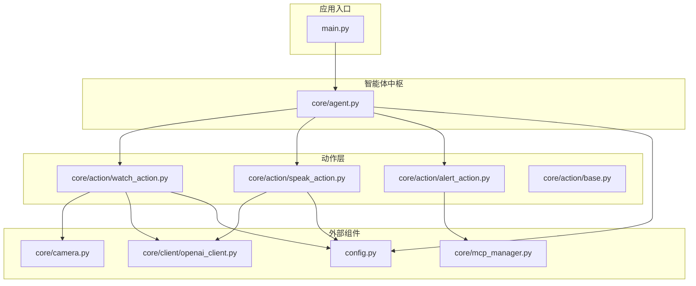
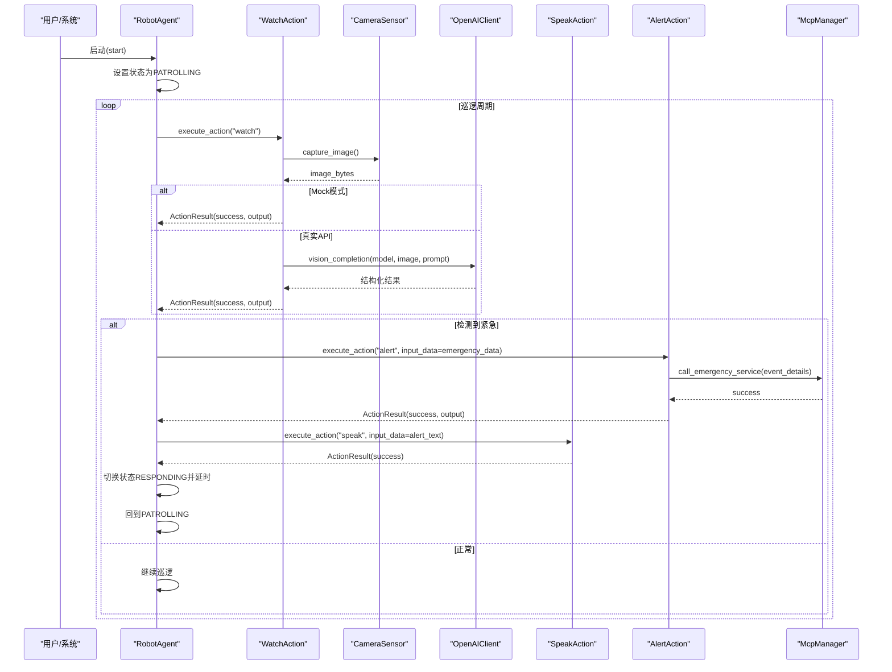
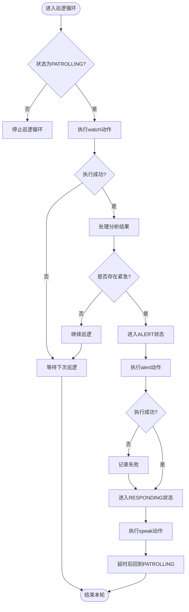
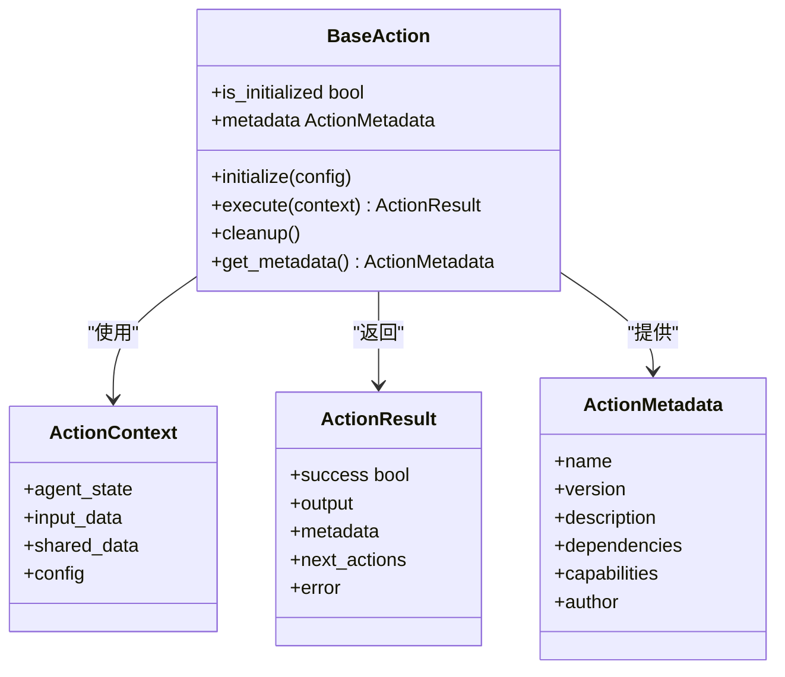
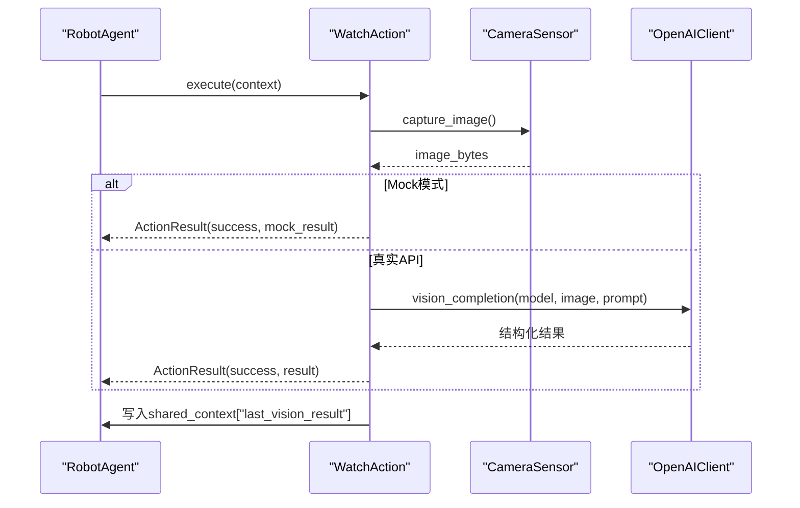
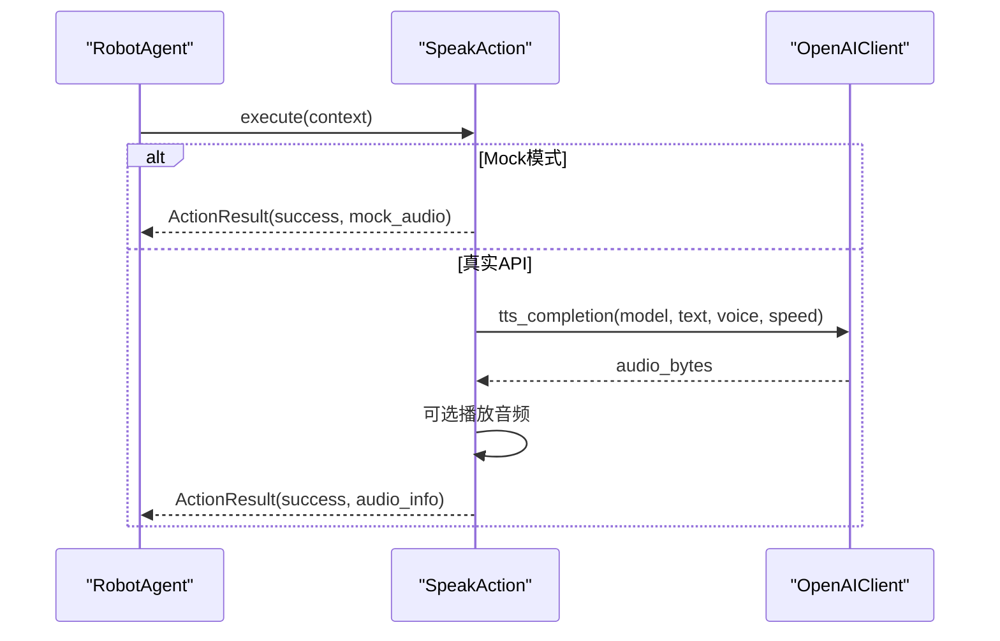
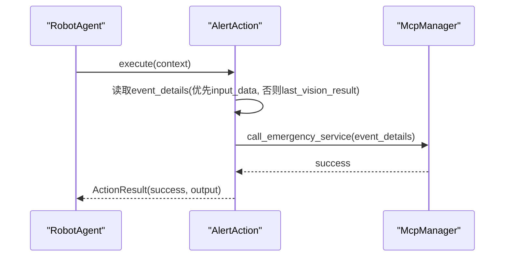
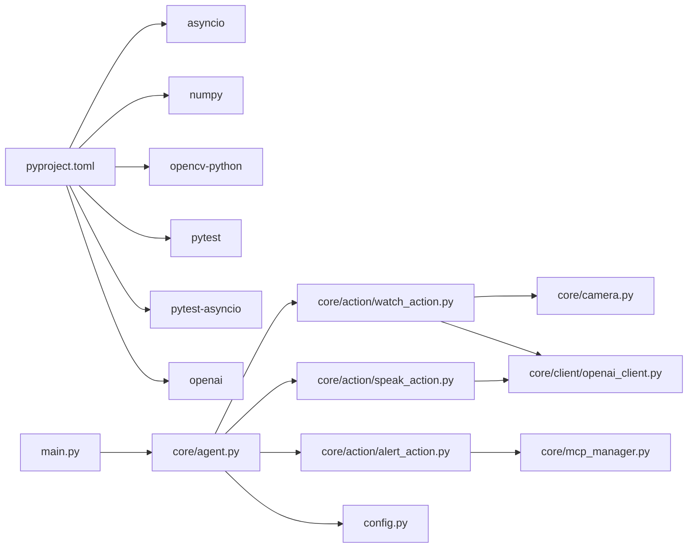

# 应急响应动作

<cite>
**本文引用的文件**
- [README.md](file://README.md)
- [USAGE.md](file://USAGE.md)
- [main.py](file://main.py)
- [config.py](file://config.py)
- [pyproject.toml](file://pyproject.toml)
- [core/agent.py](file://core/agent.py)
- [core/action/base.py](file://core/action/base.py)
- [core/action/watch_action.py](file://core/action/watch_action.py)
- [core/action/speak_action.py](file://core/action/speak_action.py)
- [core/action/alert_action.py](file://core/action/alert_action.py)
- [core/camera.py](file://core/camera.py)
- [core/client/openai_client.py](file://core/client/openai_client.py)
- [core/mcp_manager.py](file://core/mcp_manager.py)
- [test/test_actions.py](file://test/test_actions.py)
- [test/test_camera.py](file://test/test_camera.py)
- [test/test_camera_integration.py](file://test/test_camera_integration.py)
</cite>

## 目录
1. [简介](#简介)
2. [项目结构](#项目结构)
3. [核心组件](#核心组件)
4. [架构总览](#架构总览)
5. [详细组件分析](#详细组件分析)
6. [依赖关系分析](#依赖关系分析)
7. [性能与可靠性](#性能与可靠性)
8. [故障排查指南](#故障排查指南)
9. [结论](#结论)
10. [附录](#附录)

## 简介
本项目是一个基于“动作(Action)”插槽机制的巡检机器人智能体，围绕“应急响应”目标设计，具备环境感知、语音播报与应急联动能力。系统通过 Agent 统一编排多个 Action，实现从“图像理解—语音播报—应急调用”的闭环流程；同时提供 Mock 模式与真实 API 模式，便于开发与部署。

## 项目结构
- 核心目录
  - core/agent.py：智能体中枢，负责状态机、巡逻循环、任务管理与 Action 编排
  - core/action/*：动作实现与抽象基类
  - core/camera.py：摄像头采集封装
  - core/client/openai_client.py：多模态模型统一客户端
  - core/mcp_manager.py：应急服务调用器（预留）
- 运行与配置
  - main.py：应用入口，注册并启动内置动作
  - config.py：硬件与模型配置
  - pyproject.toml：依赖声明
- 测试
  - test/test_actions.py：动作机制与各 Action 行为测试
  - test/test_camera.py：摄像头单元测试
  - test/test_camera_integration.py：摄像头集成测试

图表来源
- [main.py](file://main.py#L1-L39)
- [core/agent.py](file://core/agent.py#L1-L120)
- [core/action/watch_action.py](file://core/action/watch_action.py#L1-L120)
- [core/action/speak_action.py](file://core/action/speak_action.py#L1-L120)
- [core/action/alert_action.py](file://core/action/alert_action.py#L1-L121)
- [core/camera.py](file://core/camera.py#L1-L57)
- [core/client/openai_client.py](file://core/client/openai_client.py#L1-L120)
- [core/mcp_manager.py](file://core/mcp_manager.py#L1-L28)
- [config.py](file://config.py#L1-L17)

章节来源
- [README.md](file://README.md#L1-L25)
- [USAGE.md](file://USAGE.md#L1-L120)
- [pyproject.toml](file://pyproject.toml#L1-L15)

## 核心组件
- 智能体中枢 RobotAgent
  - 状态机：IDLE/PATROLLING/RESPONDING/ALERT
  - 巡逻循环：周期性触发 WatchAction，依据结果切换状态并执行后续动作
  - 任务管理：队列化任务，支持超时与取消
  - 动作编排：注册/注销动作，构造 ActionContext，执行单个或链式动作
- 动作基类 BaseAction 与数据结构
  - ActionMetadata：动作元信息（名称、版本、描述、依赖、能力）
  - ActionContext：执行上下文（agent_state、input_data、shared_data、config）
  - ActionResult：执行结果（success、output、metadata、next_actions、error）
- WatchAction：图像理解与异常检测
- SpeakAction：文本转语音与播放
- AlertAction：应急联动调用
- OpenAIClient：多模态模型统一调用封装
- CameraSensor：摄像头采集封装
- McpManager：应急服务调用器（预留）

章节来源
- [core/agent.py](file://core/agent.py#L1-L120)
- [core/action/base.py](file://core/action/base.py#L1-L93)
- [core/action/watch_action.py](file://core/action/watch_action.py#L1-L120)
- [core/action/speak_action.py](file://core/action/speak_action.py#L1-L120)
- [core/action/alert_action.py](file://core/action/alert_action.py#L1-L121)
- [core/client/openai_client.py](file://core/client/openai_client.py#L1-L120)
- [core/camera.py](file://core/camera.py#L1-L57)
- [core/mcp_manager.py](file://core/mcp_manager.py#L1-L28)

## 架构总览
系统采用“动作插槽+状态机+任务管理”的架构，Agent 作为中枢协调各动作，形成“感知—决策—执行”的闭环。

图表来源
- [core/agent.py](file://core/agent.py#L238-L300)
- [core/action/watch_action.py](file://core/action/watch_action.py#L95-L181)
- [core/action/speak_action.py](file://core/action/speak_action.py#L78-L155)
- [core/action/alert_action.py](file://core/action/alert_action.py#L54-L121)
- [core/camera.py](file://core/camera.py#L17-L57)
- [core/client/openai_client.py](file://core/client/openai_client.py#L89-L157)
- [core/mcp_manager.py](file://core/mcp_manager.py#L24-L28)

## 详细组件分析

### 智能体中枢：RobotAgent
- 职责
  - 状态管理：IDLE/PATROLLING/RESPONDING/ALERT
  - 巡逻循环：定时触发 WatchAction，处理结果并驱动后续动作
  - 任务管理：队列化任务，超时与取消
  - 动作编排：注册/注销动作，构造 ActionContext，执行单个或链式动作
- 关键流程
  - 巡逻循环：在 PATROLLING 状态下周期执行 watch，若检测到紧急则进入 ALERT，依次执行 alert 与 speak，再回到 PATROLLING
  - 状态切换：set_state 控制巡逻与任务管理协程启停
  - 任务队列：add_task、_process_task_queue、_check_task_timeouts

图表来源
- [core/agent.py](file://core/agent.py#L238-L300)

章节来源
- [core/agent.py](file://core/agent.py#L1-L120)
- [core/agent.py](file://core/agent.py#L120-L210)
- [core/agent.py](file://core/agent.py#L210-L320)
- [core/agent.py](file://core/agent.py#L320-L404)

### 动作基类与数据结构：BaseAction、ActionContext、ActionResult、ActionMetadata
- BaseAction：抽象接口，要求实现 initialize、execute、cleanup、get_metadata
- ActionContext：贯穿动作执行的上下文载体
- ActionResult：标准化返回，包含 success、output、metadata、next_actions、error
- ActionMetadata：动作元信息，便于注册与管理

图表来源
- [core/action/base.py](file://core/action/base.py#L1-L93)

章节来源
- [core/action/base.py](file://core/action/base.py#L1-L93)

### 图像理解动作：WatchAction
- 职责：捕获图像，调用视觉模型进行分析，产出结构化结果并写入共享上下文
- 关键点
  - 摄像头采集：异步线程化避免阻塞
  - 视觉模型：支持 Mock 模式与真实 API 模式
  - 结果校验：确保输出包含必需字段
  - 共享数据：将 last_vision_result 写入 shared_context

图表来源
- [core/action/watch_action.py](file://core/action/watch_action.py#L95-L181)
- [core/camera.py](file://core/camera.py#L17-L57)
- [core/client/openai_client.py](file://core/client/openai_client.py#L89-L157)

章节来源
- [core/action/watch_action.py](file://core/action/watch_action.py#L1-L196)
- [core/camera.py](file://core/camera.py#L1-L57)
- [core/client/openai_client.py](file://core/client/openai_client.py#L1-L247)

### 语音合成动作：SpeakAction
- 职责：将文本转为语音并可选播放
- 关键点
  - TTS 模型：支持 Mock 模式与真实 API 模式
  - 音频播放：预留播放逻辑（示例注释），可接入系统播放器
  - 配置：音色、语速、自动播放等

图表来源
- [core/action/speak_action.py](file://core/action/speak_action.py#L78-L155)
- [core/client/openai_client.py](file://core/client/openai_client.py#L158-L202)

章节来源
- [core/action/speak_action.py](file://core/action/speak_action.py#L1-L191)
- [core/client/openai_client.py](file://core/client/openai_client.py#L1-L247)

### 应急调用动作：AlertAction
- 职责：在检测到紧急情况时调用应急服务
- 关键点
  - 依赖 McpManager：调用应急服务
  - 输入来源：优先使用 context.input_data，否则从 shared_data 读取 last_vision_result
  - 结果：返回是否成功调用

图表来源
- [core/action/alert_action.py](file://core/action/alert_action.py#L54-L121)
- [core/mcp_manager.py](file://core/mcp_manager.py#L24-L28)

章节来源
- [core/action/alert_action.py](file://core/action/alert_action.py#L1-L121)
- [core/mcp_manager.py](file://core/mcp_manager.py#L1-L28)

### 外部组件
- OpenAIClient：统一封装 chat/vision/tts/asr 接口，支持 JSON 结果解析与错误降级
- CameraSensor：异步封装摄像头采集，支持 Mock 模式
- McpManager：应急服务调用器（预留，可扩展为 MCP Server 调用器）

章节来源
- [core/client/openai_client.py](file://core/client/openai_client.py#L1-L247)
- [core/camera.py](file://core/camera.py#L1-L57)
- [core/mcp_manager.py](file://core/mcp_manager.py#L1-L28)

## 依赖关系分析
- 运行时依赖
  - Python >= 3.12
  - asyncio、numpy、opencv-python、pytest、pytest-asyncio、openai
- 模块依赖
  - main.py 依赖 core/agent 与内置动作
  - Agent 依赖各动作、config
  - WatchAction 依赖 CameraSensor 与 OpenAIClient
  - SpeakAction 依赖 OpenAIClient
  - AlertAction 依赖 McpManager

图表来源
- [pyproject.toml](file://pyproject.toml#L1-L15)
- [main.py](file://main.py#L1-L39)
- [core/agent.py](file://core/agent.py#L1-L120)
- [core/action/watch_action.py](file://core/action/watch_action.py#L1-L120)
- [core/action/speak_action.py](file://core/action/speak_action.py#L1-L120)
- [core/action/alert_action.py](file://core/action/alert_action.py#L1-L121)
- [core/camera.py](file://core/camera.py#L1-L57)
- [core/client/openai_client.py](file://core/client/openai_client.py#L1-L120)
- [core/mcp_manager.py](file://core/mcp_manager.py#L1-L28)
- [config.py](file://config.py#L1-L17)

章节来源
- [pyproject.toml](file://pyproject.toml#L1-L15)

## 性能与可靠性
- 异步与并发
  - 摄像头采集通过 asyncio.to_thread 避免阻塞
  - 巡逻循环与任务管理并行协程运行
- 超时与容错
  - ACTION_TIMEOUT 与任务超时机制
  - Mock 模式保证开发与测试可用性
- 资源管理
  - 各动作在 cleanup 中释放资源
  - OpenAIClient 生命周期管理
- 可观测性
  - 统一日志前缀，便于追踪
  - ActionResult 输出 elapsed_time、model、audio_size 等指标

[本节为通用指导，无需列出具体文件来源]

## 故障排查指南
- 摄像头无法打开
  - 检查设备路径与权限，修改 config.py 中 VIDEO_DEV
  - 运行摄像头集成测试验证硬件
- API 调用失败
  - 校验 OPENAI_API_KEY 与 OPENAI_BASE_URL
  - 优先使用 Mock 模式定位问题
- Action 执行超时
  - 调整 config.py 中 ACTION_TIMEOUT
  - 优化网络与模型参数
- 动作未注册
  - 确认 main.py 或调用处已注册动作
  - 使用 Agent.register_action(name, action, config_dict)

章节来源
- [USAGE.md](file://USAGE.md#L145-L232)
- [test/test_camera_integration.py](file://test/test_camera_integration.py#L1-L63)
- [test/test_camera.py](file://test/test_camera.py#L1-L43)

## 结论
本项目以“动作插槽+状态机+任务管理”为核心，构建了可扩展的应急响应体系。WatchAction 提供环境感知，SpeakAction 实现语音播报，AlertAction 完成应急联动，配合 Agent 的巡逻与编排能力，形成闭环。通过 Mock 模式与真实 API 的双通道支持，兼顾开发效率与生产可用性。

[本节为总结，无需列出具体文件来源]

## 附录
- 快速开始
  - 配置 OPENAI_API_KEY 与 OPENAI_BASE_URL（可选）
  - 运行 uv run python main.py
- 测试
  - 运行 pytest test/test_actions.py 验证动作机制
  - 运行 pytest test/test_camera.py 验证摄像头单元测试
  - 设置 RUN_INTEGRATION=1 运行集成测试

章节来源
- [README.md](file://README.md#L1-L25)
- [USAGE.md](file://USAGE.md#L1-L120)