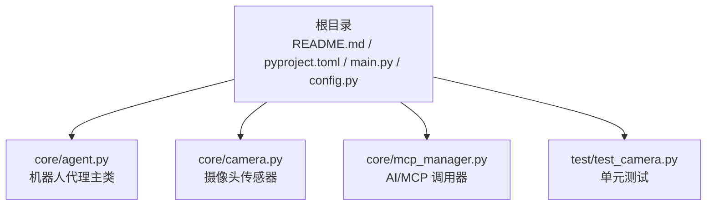
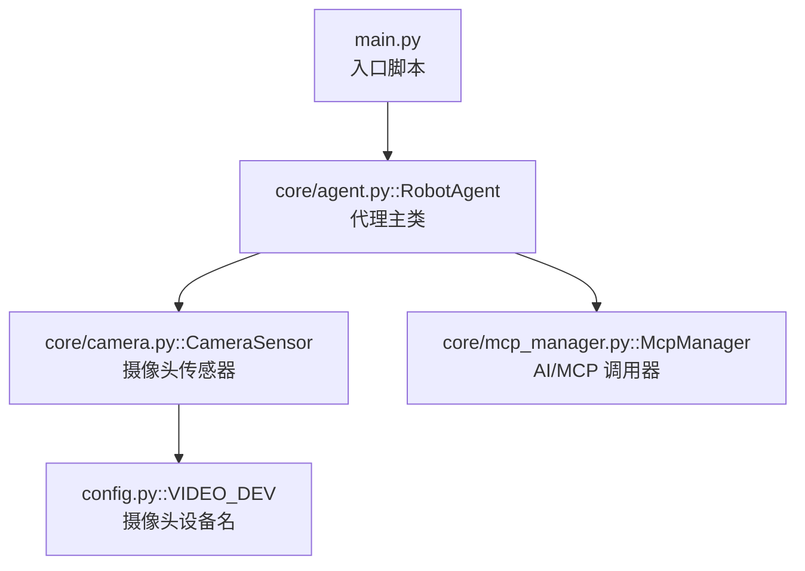
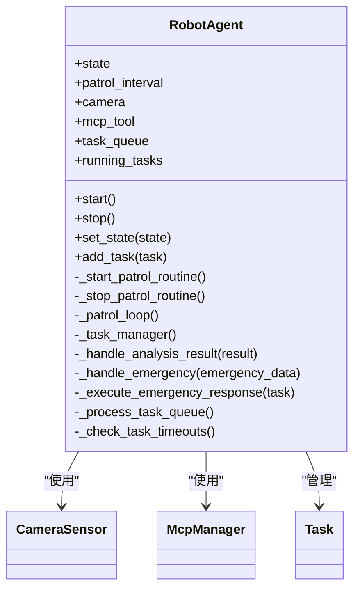
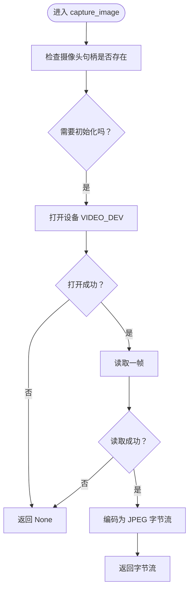
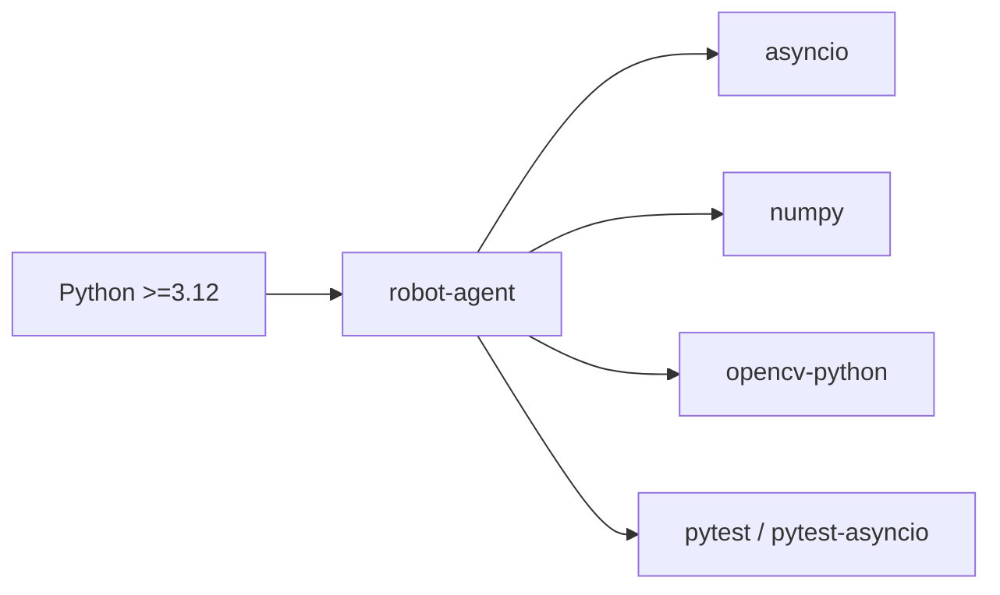

# 快速开始

<cite>
**本文引用的文件**
- [README.md](file://README.md)
- [pyproject.toml](file://pyproject.toml)
- [main.py](file://main.py)
- [config.py](file://config.py)
- [core/agent.py](file://core/agent.py)
- [core/camera.py](file://core/camera.py)
- [core/mcp_manager.py](file://core/mcp_manager.py)
- [test/test_camera.py](file://test/test_camera.py)
</cite>

## 目录
1. [简介](#简介)
2. [项目结构](#项目结构)
3. [核心组件](#核心组件)
4. [架构总览](#架构总览)
5. [详细组件分析](#详细组件分析)
6. [依赖关系分析](#依赖关系分析)
7. [性能与运行建议](#性能与运行建议)
8. [故障排查指南](#故障排查指南)
9. [结论](#结论)
10. [附录：从零到运行](#附录从零到运行)

## 简介
本指南面向零基础开发者，带你用最短时间完成 robot-agent 项目的环境准备、依赖安装、单元测试验证与最小可运行示例。你将学会：
- 使用 uv 工具安装 Python 3.12+ 与项目依赖
- 运行单元测试验证环境
- 修改示例代码，实例化 RobotAgent 并启动事件循环
- 了解并正确配置摄像头设备参数

## 项目结构
项目采用按功能分层的组织方式，核心逻辑集中在 core 目录，入口脚本位于根目录，测试位于 test 目录，配置位于根目录。

图表来源
- [README.md](file://README.md#L1-L18)
- [pyproject.toml](file://pyproject.toml#L1-L14)
- [main.py](file://main.py#L1-L7)
- [config.py](file://config.py#L1-L1)
- [core/agent.py](file://core/agent.py#L1-L278)
- [core/camera.py](file://core/camera.py#L1-L57)
- [core/mcp_manager.py](file://core/mcp_manager.py#L1-L28)
- [test/test_camera.py](file://test/test_camera.py#L1-L43)

章节来源
- [README.md](file://README.md#L1-L18)
- [pyproject.toml](file://pyproject.toml#L1-L14)

## 核心组件
- RobotAgent：机器人代理主类，负责状态机、巡逻循环、任务队列与紧急响应。
- CameraSensor：封装 OpenCV 摄像头访问，支持异步捕获图像。
- McpManager：模拟 AI 分析与紧急服务调用。
- 配置项 VIDEO_DEV：指定摄像头设备名称，默认值为 video0。

章节来源
- [core/agent.py](file://core/agent.py#L1-L278)
- [core/camera.py](file://core/camera.py#L1-L57)
- [core/mcp_manager.py](file://core/mcp_manager.py#L1-L28)
- [config.py](file://config.py#L1-L1)

## 架构总览
下图展示了从入口脚本到各子系统的调用关系与数据流。

图表来源
- [main.py](file://main.py#L1-L7)
- [core/agent.py](file://core/agent.py#L1-L278)
- [core/camera.py](file://core/camera.py#L1-L57)
- [core/mcp_manager.py](file://core/mcp_manager.py#L1-L28)
- [config.py](file://config.py#L1-L1)

## 详细组件分析

### RobotAgent 类
- 职责：维护代理状态、启动/停止巡逻、管理任务队列、处理紧急事件。
- 关键方法：start()/stop()、set_state()、_start_patrol_routine()/_stop_patrol_routine()、_patrol_loop()、_task_manager()、add_task() 等。
- 数据结构：状态枚举、任务队列、运行中任务映射。

图表来源
- [core/agent.py](file://core/agent.py#L1-L278)

章节来源
- [core/agent.py](file://core/agent.py#L1-L278)

### CameraSensor 类
- 职责：通过 OpenCV 捕获摄像头帧并编码为 JPEG 字节流。
- 异步设计：使用 asyncio.to_thread 避免阻塞事件循环。
- 设备配置：从 config.py 读取 VIDEO_DEV。

图表来源
- [core/camera.py](file://core/camera.py#L1-L57)
- [config.py](file://config.py#L1-L1)

章节来源
- [core/camera.py](file://core/camera.py#L1-L57)
- [config.py](file://config.py#L1-L1)

### McpManager 类
- 职责：模拟 AI 图像分析与紧急服务调用。
- 行为：返回固定格式的分析结果；模拟调用紧急服务并返回成功。

章节来源
- [core/mcp_manager.py](file://core/mcp_manager.py#L1-L28)

## 依赖关系分析
- Python 版本要求：>=3.12
- 主要依赖：asyncio、numpy、opencv-python、pytest、pytest-asyncio
- 运行测试：使用 uv run pytest 执行

图表来源
- [pyproject.toml](file://pyproject.toml#L1-L14)
- [README.md](file://README.md#L1-L18)

章节来源
- [pyproject.toml](file://pyproject.toml#L1-L14)
- [README.md](file://README.md#L1-L18)

## 性能与运行建议
- 摄像头设备：默认使用 video0，若你的系统摄像头设备名不同，请在 config.py 中调整 VIDEO_DEV。
- 巡逻间隔：RobotAgent 的 patrol_interval 控制每次巡逻的等待时间，可根据场景调整。
- 异步非阻塞：CameraSensor 通过线程池捕获图像，避免阻塞事件循环。
- 测试并发：pytest-asyncio 支持异步测试，建议配合 -v 查看详细输出。

[本节为通用建议，不直接分析具体文件]

## 故障排查指南
- 摄像头无法打开
  - 现象：控制台打印无法打开摄像头设备或无法读取帧。
  - 排查：确认 VIDEO_DEV 是否正确；检查设备权限与驱动；尝试更换设备名。
  - 参考路径：[core/camera.py](file://core/camera.py#L1-L57)
- 单元测试失败
  - 现象：测试用例未通过或报错。
  - 排查：使用 uv run pytest -v 查看详细日志；检查 OpenCV 模块可用性与模拟配置。
  - 参考路径：[test/test_camera.py](file://test/test_camera.py#L1-L43)
- 事件循环未启动
  - 现象：程序启动但无日志输出。
  - 排查：确保入口脚本中使用 asyncio.run() 启动事件循环；确认 RobotAgent.start() 已被调用。
  - 参考路径：[main.py](file://main.py#L1-L7), [core/agent.py](file://core/agent.py#L1-L278)

章节来源
- [core/camera.py](file://core/camera.py#L1-L57)
- [test/test_camera.py](file://test/test_camera.py#L1-L43)
- [main.py](file://main.py#L1-L7)
- [core/agent.py](file://core/agent.py#L1-L278)

## 结论
通过本指南，你已经完成了环境准备、依赖安装、测试验证，并成功运行了最小示例。建议在真实环境中：
- 根据实际摄像头设备调整 VIDEO_DEV
- 根据业务需求调整巡逻间隔与任务策略
- 在生产部署前完善日志与异常处理

[本节为总结性内容，不直接分析具体文件]

## 附录：从零到运行

### 第一步：准备 Python 环境
- 确保系统已安装 Python 3.12 或更高版本。
- 安装 uv 包管理工具（如尚未安装）。

章节来源
- [pyproject.toml](file://pyproject.toml#L1-L14)

### 第二步：安装依赖
- 在项目根目录执行依赖同步命令，安装所有必需依赖。
- 命令参考：[README.md](file://README.md#L1-L18)

章节来源
- [README.md](file://README.md#L1-L18)

### 第三步：运行单元测试验证环境
- 使用以下命令运行所有单测，验证依赖与环境配置是否正确。
- 命令参考：[README.md](file://README.md#L1-L18)
- 若需查看更详细输出，可添加 -v 参数。
- 命令参考：[README.md](file://README.md#L1-L18)

章节来源
- [README.md](file://README.md#L1-L18)
- [test/test_camera.py](file://test/test_camera.py#L1-L43)

### 第四步：运行最小可运行示例
- 修改入口脚本，实例化 RobotAgent 并调用其 start() 方法，使用 asyncio.run() 启动事件循环。
- 示例入口脚本位置：[main.py](file://main.py#L1-L7)
- 代理主类定义位置：[core/agent.py](file://core/agent.py#L1-L278)

预期控制台输出（示例，实际以运行时为准）：
- 代理初始化与状态变更日志
- 巡逻循环开始与图像捕获日志
- AI 分析与任务处理日志
- 停止代理时的日志

章节来源
- [main.py](file://main.py#L1-L7)
- [core/agent.py](file://core/agent.py#L1-L278)

### 第五步：调整摄像头设备
- 在 config.py 中修改 VIDEO_DEV 为你系统的真实摄像头设备名。
- 默认值参考：[config.py](file://config.py#L1-L1)
- 摄像头读取逻辑参考：[core/camera.py](file://core/camera.py#L1-L57)

章节来源
- [config.py](file://config.py#L1-L1)
- [core/camera.py](file://core/camera.py#L1-L57)