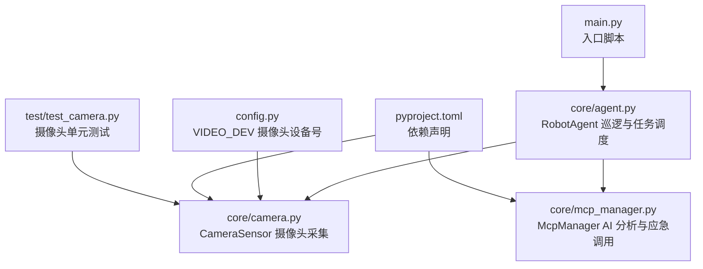
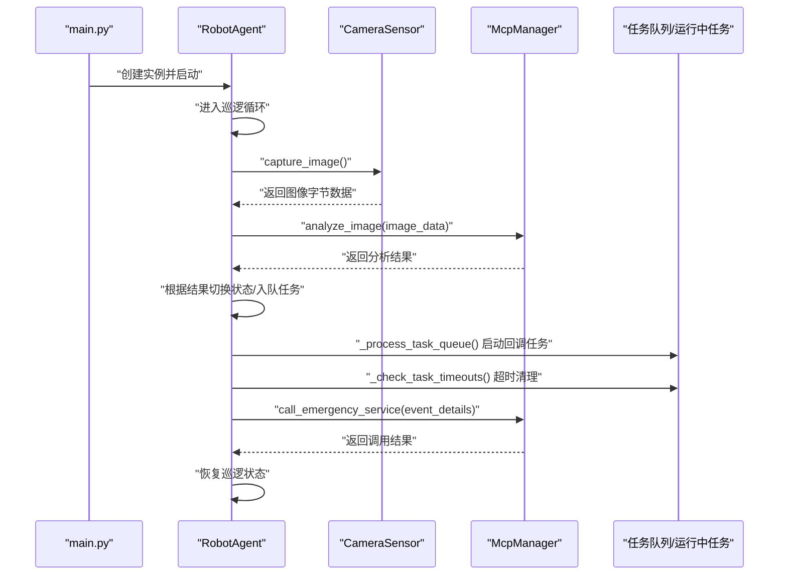
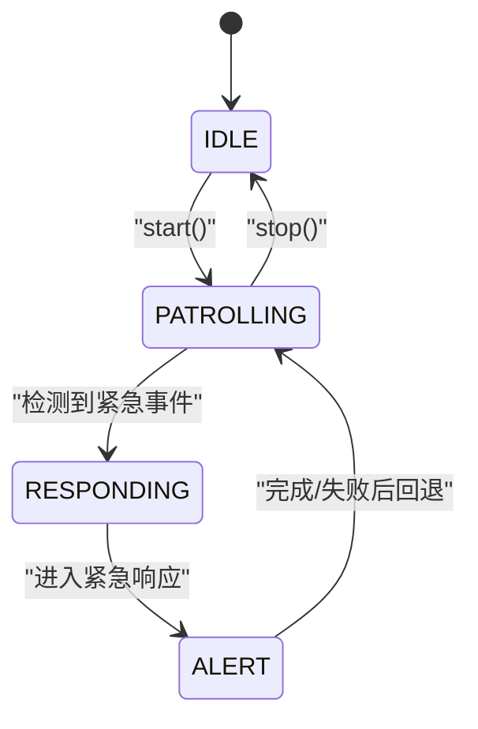
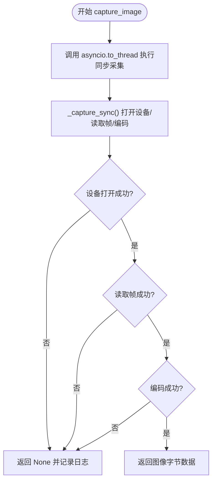
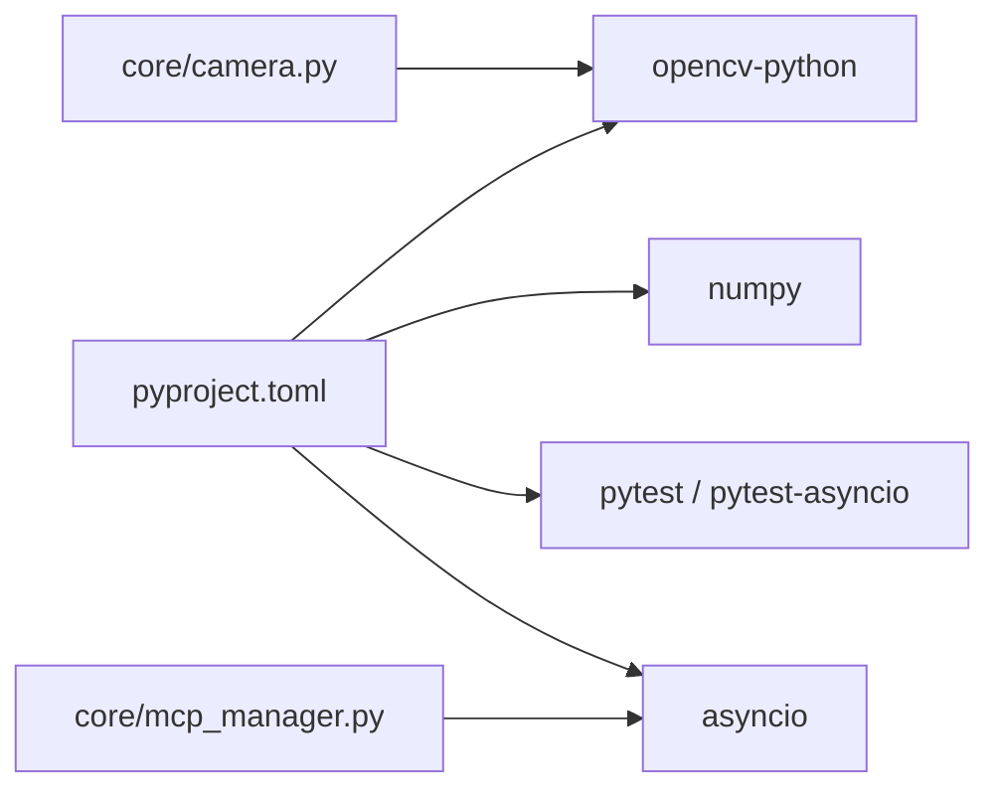

# 最佳实践

<cite>
**本文引用的文件**
- [README.md](file://README.md)
- [config.py](file://config.py)
- [main.py](file://main.py)
- [pyproject.toml](file://pyproject.toml)
- [core/agent.py](file://core/agent.py)
- [core/camera.py](file://core/camera.py)
- [core/mcp_manager.py](file://core/mcp_manager.py)
- [test/test_camera.py](file://test/test_camera.py)
</cite>

## 目录
1. [简介](#简介)
2. [项目结构](#项目结构)
3. [核心组件](#核心组件)
4. [架构总览](#架构总览)
5. [详细组件分析](#详细组件分析)
6. [依赖分析](#依赖分析)
7. [性能考量](#性能考量)
8. [故障排查指南](#故障排查指南)
9. [结论](#结论)
10. [附录](#附录)

## 简介
本指南围绕 robot-agent 项目，总结在异步巡检机器人场景下的最佳实践，重点包括：
- 如何优化巡逻间隔（patrol_interval），在响应速度与系统负载之间取得平衡
- 在 CameraSensor 中使用 asyncio.to_thread 执行同步 OpenCV 操作，避免阻塞事件循环
- 生产环境对 McpManager 的 AI 调用建议加入重试与错误处理
- 合理配置任务超时（timeout），防止任务队列积压
- 状态管理的最佳实践，确保状态转换清晰、可预测
- 部署前进行硬件兼容性测试，尤其是摄像头设备的 VIDEO_DEV 配置

## 项目结构
该项目采用按功能分层的组织方式：核心业务逻辑集中在 core 目录，入口脚本位于根目录，测试位于 test 目录，配置集中于 config.py，依赖通过 pyproject.toml 管理。

图表来源
- [main.py](file://main.py#L1-L7)
- [core/agent.py](file://core/agent.py#L28-L120)
- [core/camera.py](file://core/camera.py#L1-L57)
- [core/mcp_manager.py](file://core/mcp_manager.py#L1-L28)
- [config.py](file://config.py#L1-L1)
- [pyproject.toml](file://pyproject.toml#L1-L14)
- [test/test_camera.py](file://test/test_camera.py#L1-L43)

章节来源
- [README.md](file://README.md#L1-L18)
- [pyproject.toml](file://pyproject.toml#L1-L14)

## 核心组件
- RobotAgent：负责状态机、巡逻循环、任务队列与超时管理、紧急响应流程
- CameraSensor：封装 OpenCV 摄像头采集，使用 asyncio.to_thread 执行同步 I/O，避免阻塞事件循环
- McpManager：模拟 AI 分析与应急服务调用，提供异步接口
- 配置与入口：VIDEO_DEV 来自 config.py；main.py 作为示例入口，传入 wake_interval（用于演示）

章节来源
- [core/agent.py](file://core/agent.py#L28-L120)
- [core/camera.py](file://core/camera.py#L1-L57)
- [core/mcp_manager.py](file://core/mcp_manager.py#L1-L28)
- [config.py](file://config.py#L1-L1)
- [main.py](file://main.py#L1-L7)

## 架构总览
下图展示了从巡逻到任务执行的整体流程，以及各组件之间的交互关系。

图表来源
- [main.py](file://main.py#L1-L7)
- [core/agent.py](file://core/agent.py#L108-L181)
- [core/camera.py](file://core/camera.py#L17-L30)
- [core/mcp_manager.py](file://core/mcp_manager.py#L10-L28)

## 详细组件分析

### 巡逻与状态管理（RobotAgent）
- 状态机：IDLE → PATROLLING → RESPONDING → ALERT → PATROLLING（紧急处理完成后回退）
- 巡逻循环：周期性调用摄像头采集与 AI 分析，并根据结果决定是否进入紧急状态与入队任务
- 任务队列：支持 pending/running/completed/failed/timeout 状态，定时扫描并清理完成/超时任务
- 超时策略：任务创建时间超过 timeout 即标记为 timeout 并取消运行中任务

图表来源
- [core/agent.py](file://core/agent.py#L11-L27)
- [core/agent.py](file://core/agent.py#L76-L106)
- [core/agent.py](file://core/agent.py#L108-L181)

章节来源
- [core/agent.py](file://core/agent.py#L28-L120)
- [core/agent.py](file://core/agent.py#L182-L266)

### 摄像头采集（CameraSensor）
- 使用 asyncio.to_thread 执行同步 OpenCV 操作，避免阻塞事件循环
- 设备号来自 config.py 的 VIDEO_DEV，默认值为 video0
- 错误路径：无法打开设备、无法读取帧、编码失败等均返回 None 并打印日志

图表来源
- [core/camera.py](file://core/camera.py#L17-L30)
- [core/camera.py](file://core/camera.py#L31-L57)
- [config.py](file://config.py#L1-L1)

章节来源
- [core/camera.py](file://core/camera.py#L1-L57)
- [test/test_camera.py](file://test/test_camera.py#L1-L43)

### AI 分析与应急调用（McpManager）
- analyze_image：模拟 AI 分析，返回包含 action、objects_detected、emergency、confidence 的字典
- call_emergency_service：模拟调用应急服务，返回布尔结果
- 建议：在生产环境为 AI 调用增加重试与错误处理，避免单次失败导致状态卡死

章节来源
- [core/mcp_manager.py](file://core/mcp_manager.py#L1-L28)

## 依赖分析
- OpenCV 与 numpy：用于图像采集与处理
- pytest 与 pytest-asyncio：用于异步单元测试
- asyncio：用于事件循环与并发任务管理

图表来源
- [pyproject.toml](file://pyproject.toml#L1-L14)
- [core/camera.py](file://core/camera.py#L1-L57)
- [core/mcp_manager.py](file://core/mcp_manager.py#L1-L28)

章节来源
- [pyproject.toml](file://pyproject.toml#L1-L14)

## 性能考量

### 巡逻间隔（patrol_interval）优化
- 目标：在“响应速度”与“系统负载”之间取得平衡
- 影响因素
  - 摄像头采集与 AI 分析耗时：两者均为异步调用，但内部同步 I/O 通过 asyncio.to_thread 承担
  - 任务队列处理频率：任务管理器每秒轮询一次，避免过度占用 CPU
  - 紧急事件触发频率：越频繁，队列越活跃，需配合合理的 timeout 与优先级策略
- 建议
  - 初期以 30 秒为基准，结合实际硬件与网络状况逐步调整
  - 若摄像头采集或 AI 分析耗时较长，适当增大间隔，避免队列积压
  - 对高优先级任务（如紧急事件）可考虑缩短间隔或提升优先级，但要评估整体负载

章节来源
- [core/agent.py](file://core/agent.py#L108-L123)
- [core/agent.py](file://core/agent.py#L182-L200)
- [core/agent.py](file://core/agent.py#L201-L232)

### 避免阻塞事件循环（CameraSensor 中的 asyncio.to_thread）
- 关键点：OpenCV 的摄像头打开、读取帧、编码等均为同步阻塞操作，必须通过 asyncio.to_thread 放入线程池执行
- 效果：保持事件循环非阻塞，允许其他协程并发执行，提高整体吞吐

章节来源
- [core/camera.py](file://core/camera.py#L17-L30)

### 任务超时（timeout）配置
- 当前实现
  - 任务队列扫描：若任务创建时间超过 timeout，则标记为 timeout 并取消运行中任务
  - 运行中任务检查：同样基于创建时间判断是否超时并清理
- 建议
  - 根据任务类型设定不同 timeout：巡逻类任务可设为较短，应急响应类可适当延长
  - 防止队列积压：当任务堆积时，及时清理超时任务并记录日志，必要时降级处理

章节来源
- [core/agent.py](file://core/agent.py#L201-L232)
- [core/agent.py](file://core/agent.py#L233-L261)

### 生产环境的 AI 调用重试与错误处理（McpManager）
- 现状：AI 分析与应急调用为异步方法，内部有固定延迟，未包含重试与错误处理
- 建议
  - 引入指数退避重试：对网络波动或模型服务不稳定的情况提升成功率
  - 包装异常：捕获网络/模型服务异常并降级处理（如返回默认安全策略）
  - 记录指标：统计失败率、重试次数、平均耗时，便于监控与优化

章节来源
- [core/mcp_manager.py](file://core/mcp_manager.py#L10-L28)

## 故障排查指南

### 摄像头设备问题
- 症状：无法打开摄像头或读取帧失败
- 排查要点
  - 确认 VIDEO_DEV 是否正确（默认 video0）
  - 检查设备权限与驱动
  - 观察日志输出，定位具体失败阶段（打开设备/读取帧/编码）
- 测试参考：单元测试覆盖了成功与失败两种路径，可作为本地验证依据

章节来源
- [config.py](file://config.py#L1-L1)
- [core/camera.py](file://core/camera.py#L31-L57)
- [test/test_camera.py](file://test/test_camera.py#L1-L43)

### 任务队列积压与超时
- 症状：任务长时间未完成或反复超时
- 排查要点
  - 检查 patrol_interval 是否过小导致任务堆积
  - 核对 timeout 设置是否合理
  - 关注运行中任务的清理逻辑是否生效

章节来源
- [core/agent.py](file://core/agent.py#L201-L261)

### 入口与运行
- 入口示例：main.py 展示了如何创建 RobotAgent 并启动，wake_interval 作为参数传入（用于演示）
- 建议：在实际部署中，将 wake_interval 作为可配置项，结合硬件能力动态调整

章节来源
- [main.py](file://main.py#L1-L7)

## 结论
- 巡逻间隔应结合硬件与网络状况动态调整，避免过密导致队列积压
- 使用 asyncio.to_thread 执行同步 OpenCV 操作是异步应用的关键性能点
- 生产环境应对 McpManager 的 AI 调用增加重试与错误处理
- 任务超时配置需因任务类型而异，防止队列积压
- 状态管理应清晰可预测，紧急事件处理完成后应回退到巡逻状态
- 部署前务必进行摄像头设备的硬件兼容性测试，确认 VIDEO_DEV 配置正确

## 附录

### 配置清单与建议
- VIDEO_DEV：摄像头设备号，默认值为 video0；部署前请确认设备存在且权限正确
- patrol_interval：巡逻间隔（秒），建议从 30 秒起步，结合实际性能测试调整
- timeout：任务超时（秒），建议为不同类型任务设置差异化阈值

章节来源
- [config.py](file://config.py#L1-L1)
- [core/agent.py](file://core/agent.py#L28-L40)
- [core/agent.py](file://core/agent.py#L201-L232)