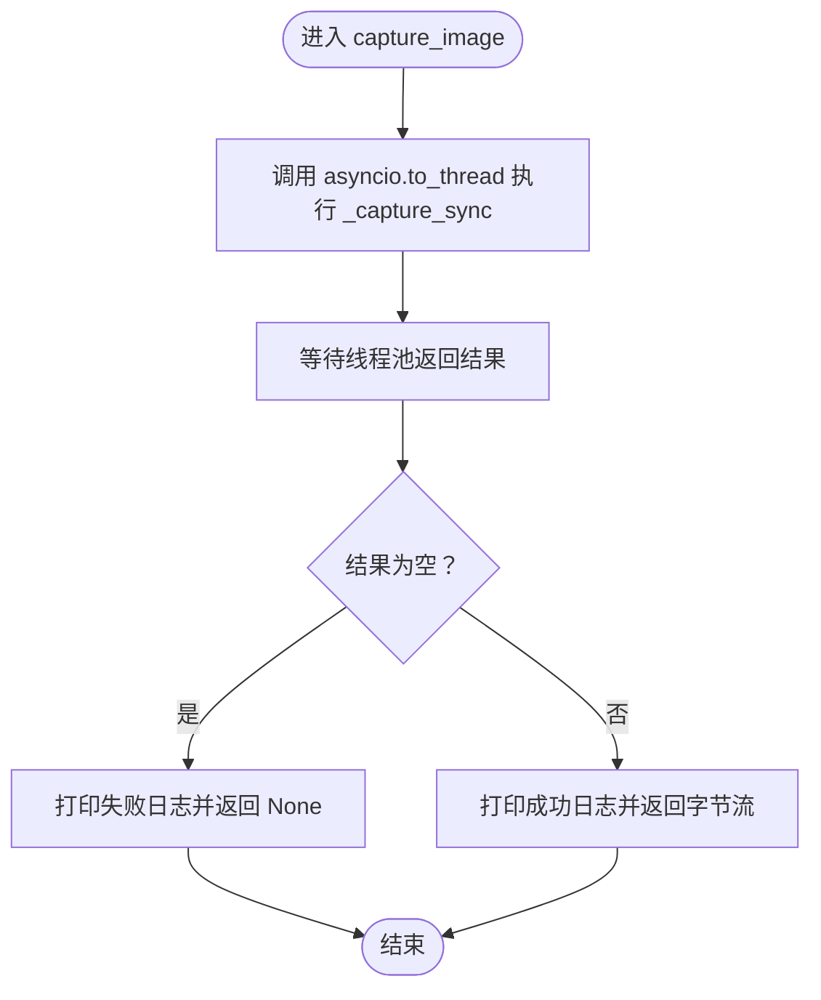

# CameraSensor图像采集模块

<cite>
**本文引用的文件列表**
- [core/camera.py](file://core/camera.py)
- [config.py](file://config.py)
- [test/test_camera.py](file://test/test_camera.py)
- [core/agent.py](file://core/agent.py)
- [core/mcp_manager.py](file://core/mcp_manager.py)
- [README.md](file://README.md)
</cite>

## 目录
1. [简介](#简介)
2. [项目结构](#项目结构)
3. [核心组件](#核心组件)
4. [架构总览](#架构总览)
5. [组件详细分析](#组件详细分析)
6. [依赖关系分析](#依赖关系分析)
7. [性能考量](#性能考量)
8. [故障排查指南](#故障排查指南)
9. [结论](#结论)
10. [附录](#附录)

## 简介
本文件面向CameraSensor图像采集模块，系统性阐述其作为图像采集端的实现细节，重点覆盖以下方面：
- 与OpenCV（cv2）库的集成方式
- capture_image异步方法通过asyncio.to_thread调用同步的_capture_sync方法，避免阻塞事件循环
- _capture_sync内部实现：如何使用cv2.VideoCapture访问VIDEO_DEV指定的摄像头设备，读取视频帧，并通过cv2.imencode将BGR格式的numpy数组编码为JPEG字节流
- 生命周期方法__init__与__del__的作用，特别是资源释放的重要性
- 结合config.py中的VIDEO_DEV配置项，说明如何通过外部配置指定摄像头设备索引
- 错误处理策略：无法打开摄像头、读取帧失败等异常捕获与日志输出
- 不同操作系统（Windows/Linux）下摄像头设备路径的配置示例
- 图像质量参数[IMWRITE_JPEG_QUALITY, 85]对性能与带宽的影响及优化建议

## 项目结构
该模块位于core目录下，与配置、代理、MCP工具共同构成机器人巡检系统的图像采集与分析链路。关键文件如下：
- core/camera.py：CameraSensor类的实现，负责图像采集与编码
- config.py：全局配置，包含VIDEO_DEV摄像头设备索引
- test/test_camera.py：针对CameraSensor的单元测试，验证初始化与捕获流程
- core/agent.py：机器人代理，调度CameraSensor进行周期性巡逻与图像分析
- core/mcp_manager.py：模拟AI分析与应急服务调用的工具层
- README.md：项目运行与测试说明

图表来源
- [core/camera.py](file://core/camera.py#L1-L57)
- [config.py](file://config.py#L1-L1)
- [test/test_camera.py](file://test/test_camera.py#L1-L43)
- [core/agent.py](file://core/agent.py#L1-L278)
- [core/mcp_manager.py](file://core/mcp_manager.py#L1-L28)
- [README.md](file://README.md#L1-L18)

章节来源
- [core/camera.py](file://core/camera.py#L1-L57)
- [config.py](file://config.py#L1-L1)
- [test/test_camera.py](file://test/test_camera.py#L1-L43)
- [core/agent.py](file://core/agent.py#L1-L278)
- [core/mcp_manager.py](file://core/mcp_manager.py#L1-L28)
- [README.md](file://README.md#L1-L18)

## 核心组件
- CameraSensor：图像采集与编码的核心类，提供异步捕获接口capture_image，并在内部通过线程池执行耗时的OpenCV操作，避免阻塞事件循环。
- 配置项VIDEO_DEV：来自config.py，用于指定摄像头设备索引或路径。
- RobotAgent：在巡逻循环中调用CameraSensor进行图像采集，并将图像交由MCP工具进行分析。
- MCP工具：模拟AI分析与应急服务调用，与CameraSensor解耦。

章节来源
- [core/camera.py](file://core/camera.py#L1-L57)
- [config.py](file://config.py#L1-L1)
- [core/agent.py](file://core/agent.py#L108-L124)
- [core/mcp_manager.py](file://core/mcp_manager.py#L1-L28)

## 架构总览
CameraSensor作为图像采集端，与RobotAgent协作完成周期性巡逻与图像分析。整体流程如下：
- RobotAgent在巡逻循环中调用CameraSensor.capture_image获取图像字节流
- CameraSensor通过asyncio.to_thread将耗时的_openCV操作委派给线程池执行
- _capture_sync内部使用cv2.VideoCapture读取帧，再用cv2.imencode将BGR帧编码为JPEG字节流
- 返回的字节流被RobotAgent传递给MCP工具进行分析

图表来源
- [core/agent.py](file://core/agent.py#L108-L124)
- [core/camera.py](file://core/camera.py#L17-L57)
- [core/mcp_manager.py](file://core/mcp_manager.py#L10-L22)

## 组件详细分析

### CameraSensor类
- 类职责：封装OpenCV图像采集与JPEG编码，提供异步接口，避免阻塞事件循环
- 关键方法：
  - __init__：初始化cap为None，不立即打开设备，按需延迟打开
  - __del__：析构时释放摄像头资源，确保进程退出前正确释放
  - capture_image：对外暴露的异步接口，内部通过asyncio.to_thread调用同步方法
  - _capture_sync：同步实现，负责设备打开、帧读取、JPEG编码与异常处理

图表来源
- [core/camera.py](file://core/camera.py#L1-L57)

章节来源
- [core/camera.py](file://core/camera.py#L1-L57)

### 异步捕获流程与线程委派
- capture_image通过asyncio.to_thread将耗时的_openCV操作放入线程池，避免阻塞事件循环
- 若返回None，表示捕获失败；否则返回JPEG字节流

图表来源
- [core/camera.py](file://core/camera.py#L17-L29)

章节来源
- [core/camera.py](file://core/camera.py#L17-L29)

### 同步采集实现（_capture_sync）
- 设备打开：首次调用时创建cv2.VideoCapture(VIDEO_DEV)，若无法打开则返回None
- 帧读取：调用cap.read()，若ret为False则返回None
- 编码：使用cv2.imencode将BGR帧编码为JPEG字节流，质量参数为[IMWRITE_JPEG_QUALITY, 85]
- 异常处理：捕获异常并返回None，同时打印错误日志

图表来源
- [core/camera.py](file://core/camera.py#L31-L57)

章节来源
- [core/camera.py](file://core/camera.py#L31-L57)

### 生命周期与资源释放
- __init__：仅初始化cap为None，不立即打开设备，降低启动成本
- __del__：若cap非空则调用release释放资源，防止资源泄漏
- 注意：在某些情况下，如事件循环提前退出且未触发垃圾回收，可能不会调用__del__。建议在业务层面显式关闭或使用上下文管理器模式增强可靠性

章节来源
- [core/camera.py](file://core/camera.py#L8-L16)

### 与配置的集成（VIDEO_DEV）
- VIDEO_DEV定义于config.py，CameraSensor在首次打开设备时传入该值作为设备索引或路径
- 可通过修改config.py中的VIDEO_DEV来切换不同的摄像头设备

章节来源
- [config.py](file://config.py#L1-L1)
- [core/camera.py](file://core/camera.py#L35-L39)

### 与RobotAgent的协作
- RobotAgent在巡逻循环中调用CameraSensor.capture_image获取图像字节流
- 获取到图像后，交由MCP工具进行分析，并根据结果采取相应动作

章节来源
- [core/agent.py](file://core/agent.py#L108-L124)
- [core/mcp_manager.py](file://core/mcp_manager.py#L10-L22)

### 测试验证
- 单元测试覆盖了初始化、成功捕获与失败捕获三种场景
- 使用unittest.mock对cv2进行打桩，验证VideoCapture、isOpened、read与imencode的行为

章节来源
- [test/test_camera.py](file://test/test_camera.py#L1-L43)

## 依赖关系分析
- 内部依赖
  - CameraSensor依赖config.py中的VIDEO_DEV
  - RobotAgent依赖CameraSensor进行图像采集
  - RobotAgent依赖MCP工具进行图像分析与应急调用
- 外部依赖
  - OpenCV（cv2）：用于摄像头设备访问、帧读取与JPEG编码
  - asyncio：用于异步编程与线程委派

图表来源
- [core/camera.py](file://core/camera.py#L1-L57)
- [config.py](file://config.py#L1-L1)
- [core/agent.py](file://core/agent.py#L108-L124)
- [core/mcp_manager.py](file://core/mcp_manager.py#L1-L28)

章节来源
- [core/camera.py](file://core/camera.py#L1-L57)
- [config.py](file://config.py#L1-L1)
- [core/agent.py](file://core/agent.py#L108-L124)
- [core/mcp_manager.py](file://core/mcp_manager.py#L1-L28)

## 性能考量
- 线程委派与事件循环
  - 通过asyncio.to_thread将OpenCV的阻塞操作放入线程池，避免阻塞事件循环，提升整体并发能力
- 图像质量参数
  - 当前使用[IMWRITE_JPEG_QUALITY, 85]进行编码，兼顾画质与体积
  - 质量越高，体积越大，网络传输与存储压力越大；质量越低，体积越小，但画质下降
  - 在带宽受限或实时性要求高的场景，可适当降低质量参数以换取更低延迟与更小流量
- 帧率与采样间隔
  - RobotAgent的巡逻间隔（patrol_interval）决定了图像采集频率，应与摄像头帧率与网络带宽匹配
- 设备打开策略
  - CameraSensor采用按需打开设备，减少不必要的初始化成本；若频繁切换设备，可考虑缓存与重用策略

章节来源
- [core/camera.py](file://core/camera.py#L17-L29)
- [core/camera.py](file://core/camera.py#L51-L53)
- [core/agent.py](file://core/agent.py#L31-L40)

## 故障排查指南
- 无法打开摄像头
  - 现象：打印“Cannot open camera device ...”并返回None
  - 排查要点：确认VIDEO_DEV配置是否正确；检查设备是否存在且未被其他程序占用；在Linux上确认权限与设备路径；在Windows上确认设备驱动与索引
- 读取帧失败
  - 现象：打印“Cannot read frame from camera”并返回None
  - 排查要点：确认摄像头连接稳定；检查设备权限；尝试降低分辨率或帧率；确认设备支持当前设置
- 异常捕获与日志
  - _capture_sync内部捕获异常并返回None，同时打印错误日志，便于定位问题
- 单元测试参考
  - 使用test/test_camera.py中的测试用例，验证初始化与捕获流程，必要时通过打桩模拟不同场景

章节来源
- [core/camera.py](file://core/camera.py#L37-L39)
- [core/camera.py](file://core/camera.py#L47-L49)
- [core/camera.py](file://core/camera.py#L55-L57)
- [test/test_camera.py](file://test/test_camera.py#L1-L43)

## 结论
CameraSensor模块通过异步线程委派与OpenCV集成，实现了可靠的图像采集与编码能力。其设计遵循“延迟打开设备、按需释放资源”的原则，配合配置化设备索引与完善的错误处理，能够在不同环境下稳定工作。结合RobotAgent的巡逻机制与MCP工具的分析能力，形成完整的图像采集与智能分析闭环。建议在实际部署中根据带宽与实时性需求调整图像质量参数与采集频率，并完善资源释放与异常监控机制。

## 附录

### 操作系统设备路径示例
- Linux
  - 设备路径通常为/dev/videoX，例如/dev/video0、/dev/video1
  - 可通过ls /dev/video*查看可用设备
- Windows
  - 设备路径通常为物理设备号或通过DirectShow/Video for Windows接口暴露的名称
  - 可通过设备管理器或第三方工具查看可用摄像头设备

章节来源
- [config.py](file://config.py#L1-L1)

### 配置与使用建议
- 修改VIDEO_DEV以切换摄像头设备
- 在高并发场景下，合理设置RobotAgent的巡逻间隔，避免过度占用I/O与网络
- 对于网络传输，建议在上层应用中对JPEG字节流进行压缩或分片处理，进一步降低带宽压力

章节来源
- [config.py](file://config.py#L1-L1)
- [core/agent.py](file://core/agent.py#L31-L40)