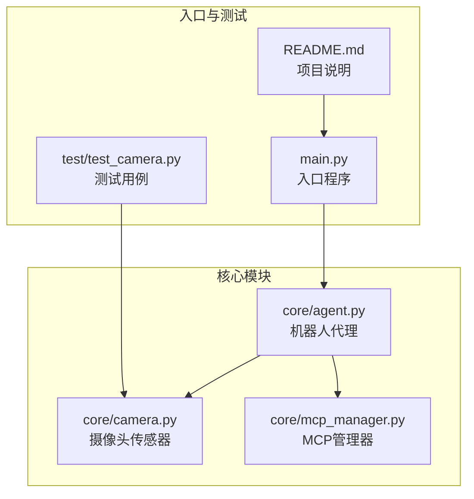
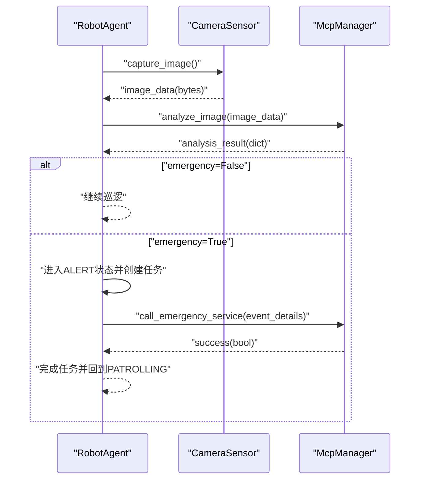
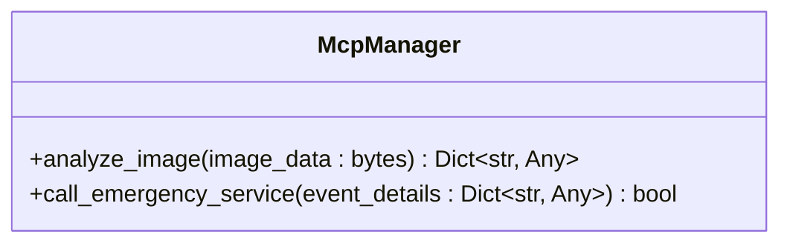
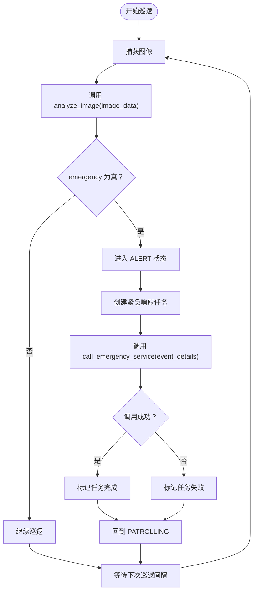
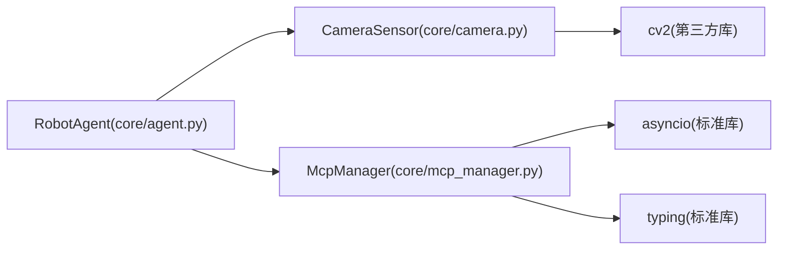

# McpManager AI分析接口

<cite>
**本文引用的文件**
- [core/mcp_manager.py](file://core/mcp_manager.py)
- [core/agent.py](file://core/agent.py)
- [core/camera.py](file://core/camera.py)
- [main.py](file://main.py)
- [README.md](file://README.md)
- [test/test_camera.py](file://test/test_camera.py)
</cite>

## 目录
1. [简介](#简介)
2. [项目结构](#项目结构)
3. [核心组件](#核心组件)
4. [架构总览](#架构总览)
5. [详细组件分析](#详细组件分析)
6. [依赖关系分析](#依赖关系分析)
7. [性能与并发特性](#性能与并发特性)
8. [故障排查指南](#故障排查指南)
9. [结论](#结论)
10. [附录：API规范与数据结构](#附录api规范与数据结构)

## 简介
本文件面向开发者，系统化梳理 McpManager 模块在机器人巡检系统中的角色与职责，重点说明其作为“AI能力抽象层”的定位，并给出 analyze_image 与 call_emergency_service 两个核心异步方法的接口规范与行为约定。文档同时阐述该模块作为扩展点的设计意图，以及未来从“MCP Tool Caller”演进为“MCP Server 调用器”的架构方向指引。为便于理解，文档提供了正常巡逻与紧急事件两种场景下的模拟返回值差异说明，并对返回值数据结构进行定义与解读。

## 项目结构
该项目采用按功能分层的组织方式：
- 核心业务逻辑位于 core 目录，包含机器人代理、摄像头传感器与MCP管理器等模块
- 测试位于 test 目录，使用 pytest 进行异步测试
- 入口程序位于根目录，用于启动机器人代理

图表来源
- [core/agent.py](file://core/agent.py#L1-L278)
- [core/camera.py](file://core/camera.py#L1-L57)
- [core/mcp_manager.py](file://core/mcp_manager.py#L1-L28)
- [main.py](file://main.py#L1-L7)
- [README.md](file://README.md#L1-L18)

章节来源
- [core/agent.py](file://core/agent.py#L1-L278)
- [core/camera.py](file://core/camera.py#L1-L57)
- [core/mcp_manager.py](file://core/mcp_manager.py#L1-L28)
- [main.py](file://main.py#L1-L7)
- [README.md](file://README.md#L1-L18)

## 核心组件
- McpManager：AI能力抽象层，负责图像分析与紧急服务调用的异步接口封装
- RobotAgent：机器人代理，驱动摄像头采集图像并调用 McpManager 执行分析与应急响应
- CameraSensor：摄像头传感器，负责图像采集与编码

章节来源
- [core/mcp_manager.py](file://core/mcp_manager.py#L1-L28)
- [core/agent.py](file://core/agent.py#L1-L278)
- [core/camera.py](file://core/camera.py#L1-L57)

## 架构总览
下图展示了机器人代理在巡逻过程中与 McpManager 的交互流程，以及紧急事件触发后的响应机制。

图表来源
- [core/agent.py](file://core/agent.py#L108-L179)
- [core/mcp_manager.py](file://core/mcp_manager.py#L10-L28)

## 详细组件分析

### McpManager 类与方法
McpManager 提供两个核心异步方法：
- analyze_image(image_data: bytes) -> Dict[str, Any]
- call_emergency_service(event_details: Dict[str, Any]) -> bool

图表来源
- [core/mcp_manager.py](file://core/mcp_manager.py#L10-L28)

章节来源
- [core/mcp_manager.py](file://core/mcp_manager.py#L1-L28)

#### analyze_image 方法
- 输入：bytes 类型的图像数据
- 行为：模拟向远程AI服务发送请求（当前通过异步睡眠模拟网络延迟），返回标准分析结果字典
- 返回值：包含 action、objects_detected、emergency、confidence 字段的字典
- 设计要点：
  - 当前返回值为模拟数据，emergency 字段为 False，表示“无紧急事件”
  - confidence 字段用于表达AI置信度，可用于后续决策阈值设定
  - action 字段用于指示下一步动作（如继续巡逻）

章节来源
- [core/mcp_manager.py](file://core/mcp_manager.py#L10-L22)

#### call_emergency_service 方法
- 输入：事件详情字典（由上层传入，包含紧急事件相关信息）
- 行为：模拟调用紧急服务（当前通过异步睡眠模拟网络延迟）
- 返回值：bool，表示调用是否成功
- 设计要点：
  - 当前返回 True，表示“调用成功”
  - 实际部署中应对接真实紧急服务或MCP Server

章节来源
- [core/mcp_manager.py](file://core/mcp_manager.py#L24-L28)

### RobotAgent 中的使用方式
- 巡逻循环中，Agent 会周期性调用摄像头采集图像，并将图像数据传递给 McpManager.analyze_image
- 根据返回的 emergency 字段决定是否进入紧急响应流程
- 紧急响应流程中，Agent 将紧急事件数据传递给 McpManager.call_emergency_service 并等待结果

图表来源
- [core/agent.py](file://core/agent.py#L108-L179)
- [core/mcp_manager.py](file://core/mcp_manager.py#L10-L28)

章节来源
- [core/agent.py](file://core/agent.py#L108-L179)

### CameraSensor 与 McpManager 的协作
- CameraSensor 提供异步图像采集能力，避免阻塞事件循环
- McpManager 在 Agent 的巡逻循环中被调用，承担AI分析与应急调用的抽象职责

章节来源
- [core/camera.py](file://core/camera.py#L1-L57)
- [core/mcp_manager.py](file://core/mcp_manager.py#L10-L28)

## 依赖关系分析
- RobotAgent 依赖 CameraSensor 与 McpManager
- McpManager 仅依赖标准库 asyncio 与 typing
- CameraSensor 依赖 OpenCV（cv2）进行图像采集与编码

图表来源
- [core/agent.py](file://core/agent.py#L1-L278)
- [core/camera.py](file://core/camera.py#L1-L57)
- [core/mcp_manager.py](file://core/mcp_manager.py#L1-L28)

章节来源
- [core/agent.py](file://core/agent.py#L1-L278)
- [core/camera.py](file://core/camera.py#L1-L57)
- [core/mcp_manager.py](file://core/mcp_manager.py#L1-L28)

## 性能与并发特性
- 异步设计：McpManager 的两个方法均为异步，避免阻塞事件循环
- 睡眠模拟：当前实现通过 asyncio.sleep 模拟网络延迟，便于演示与测试
- 任务管理：Agent 内置任务队列与超时管理，确保紧急响应任务有序执行
- I/O 非阻塞：CameraSensor 使用 asyncio.to_thread 将耗时的摄像头操作放入线程池，避免阻塞

章节来源
- [core/mcp_manager.py](file://core/mcp_manager.py#L10-L28)
- [core/agent.py](file://core/agent.py#L182-L261)
- [core/camera.py](file://core/camera.py#L17-L30)

## 故障排查指南
- 图像采集失败：检查摄像头设备路径与权限；确认 OpenCV 可打开设备并能读取帧
- 分析结果异常：确认 McpManager 返回字典包含必需字段；关注 emergency 字段以判断是否进入紧急流程
- 紧急调用失败：检查 call_emergency_service 返回值；当前实现固定返回 True，部署时需接入真实服务
- 任务超时：检查任务超时阈值与任务队列处理逻辑

章节来源
- [core/camera.py](file://core/camera.py#L31-L57)
- [core/agent.py](file://core/agent.py#L182-L261)
- [core/mcp_manager.py](file://core/mcp_manager.py#L24-L28)

## 结论
McpManager 作为AI能力抽象层，为机器人代理提供了清晰的异步接口，屏蔽了底层AI服务的具体实现细节。当前版本通过模拟返回值演示了正常巡逻与紧急事件的处理流程。未来可按注释指引，将 McpManager 从“MCP Tool Caller”演进为“MCP Server 调用器”，以支持多服务器连接与更灵活的AI服务编排。

## 附录：API规范与数据结构

### 接口规范
- analyze_image(image_data: bytes) -> Dict[str, Any]
  - 功能：对输入的图像字节流进行AI分析
  - 返回：包含 action、objects_detected、emergency、confidence 的字典
- call_emergency_service(event_details: Dict[str, Any]) -> bool
  - 功能：根据事件详情调用紧急服务
  - 返回：布尔值，表示调用是否成功

章节来源
- [core/mcp_manager.py](file://core/mcp_manager.py#L10-L28)

### 返回值数据结构定义
- analyze_image 返回字典字段
  - action: 字符串，指示下一步动作（例如继续巡逻）
  - objects_detected: 列表，检测到的物体类型
  - emergency: 布尔值，触发紧急响应的关键判断依据
  - confidence: 浮点数，AI置信度
- call_emergency_service 返回值
  - success: 布尔值，表示调用成功与否

章节来源
- [core/mcp_manager.py](file://core/mcp_manager.py#L16-L22)
- [core/mcp_manager.py](file://core/mcp_manager.py#L24-L28)

### 场景示例与差异说明
- 正常巡逻场景
  - emergency 字段为 False
  - 返回值不触发紧急响应流程
- 紧急事件场景
  - emergency 字段为 True
  - Agent 进入 ALERT 状态并创建紧急响应任务
  - 调用 call_emergency_service 并根据返回值更新任务状态

章节来源
- [core/agent.py](file://core/agent.py#L129-L179)
- [core/mcp_manager.py](file://core/mcp_manager.py#L16-L22)
- [core/mcp_manager.py](file://core/mcp_manager.py#L24-L28)

### 待办事项与扩展指引
- 注释中明确指出：当前实现不应仅为“MCP Tool Caller”，而应升级为“MCP Server 调用器”，以便管理 Agent 连接的 Server 连接
- 扩展建议：
  - 引入 MCP Server 客户端，建立与远端AI服务的稳定连接
  - 支持多服务器配置与负载均衡
  - 将模拟返回替换为真实AI服务的响应解析
  - 增强错误处理与重试策略

章节来源
- [core/mcp_manager.py](file://core/mcp_manager.py#L1-L3)

### 与其他模块的集成关系
- RobotAgent 在巡逻循环中调用 McpManager.analyze_image，并依据 emergency 字段决定是否进入紧急响应
- CameraSensor 提供图像数据，供 McpManager.analyze_image 使用

章节来源
- [core/agent.py](file://core/agent.py#L108-L179)
- [core/camera.py](file://core/camera.py#L17-L30)
- [core/mcp_manager.py](file://core/mcp_manager.py#L10-L22)