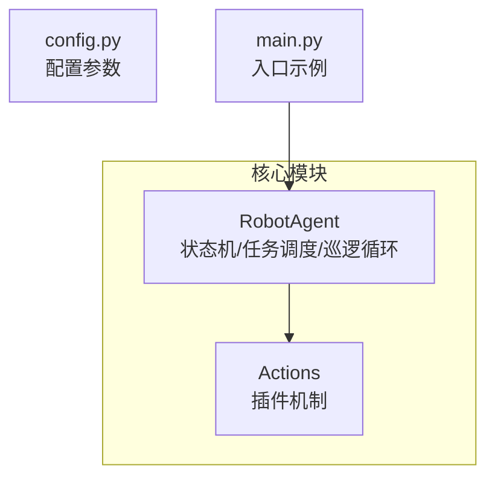
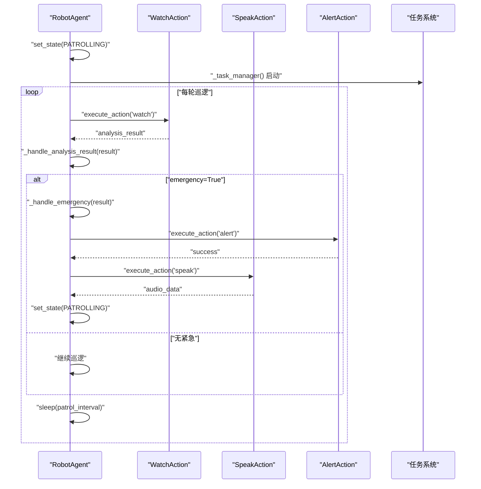
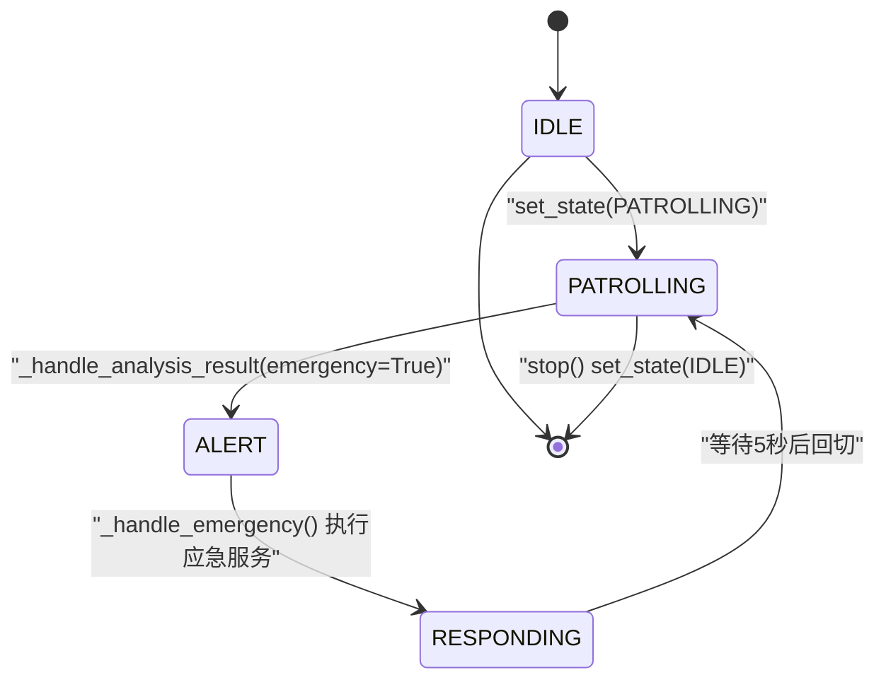
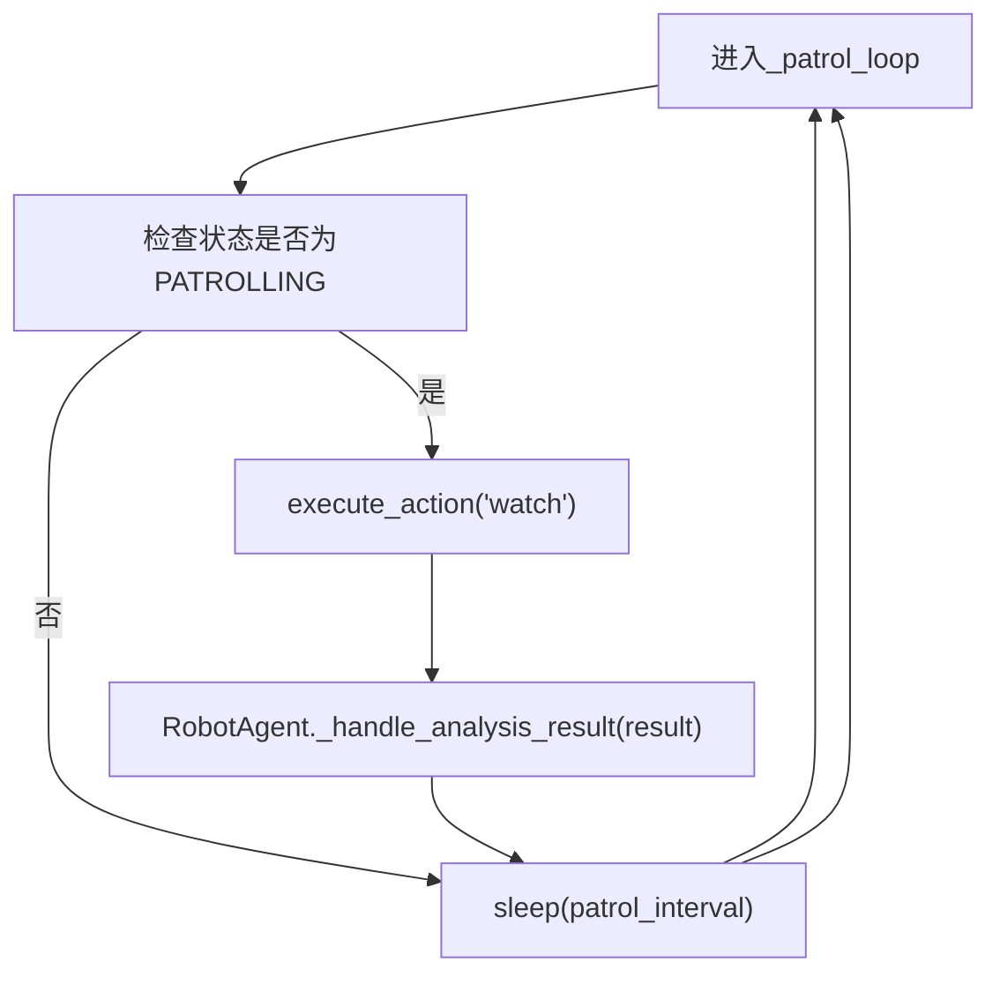
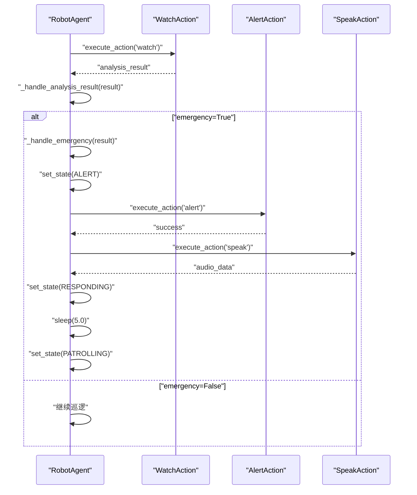
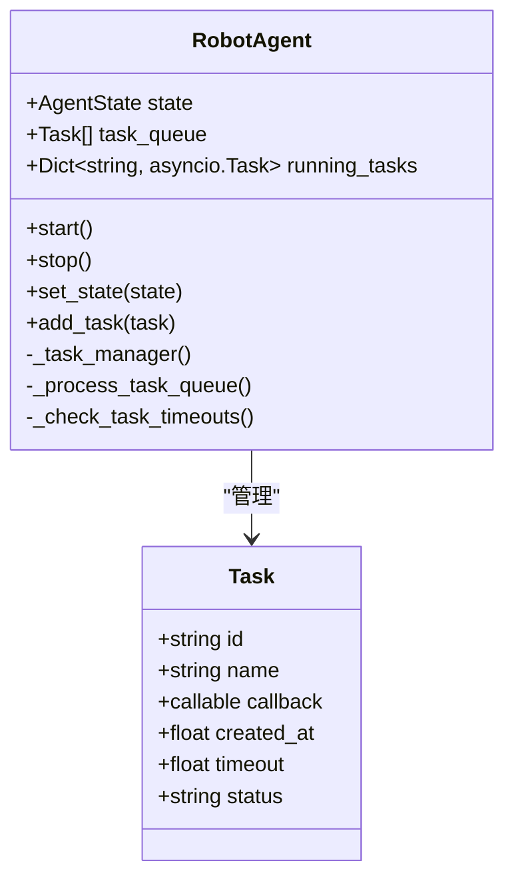
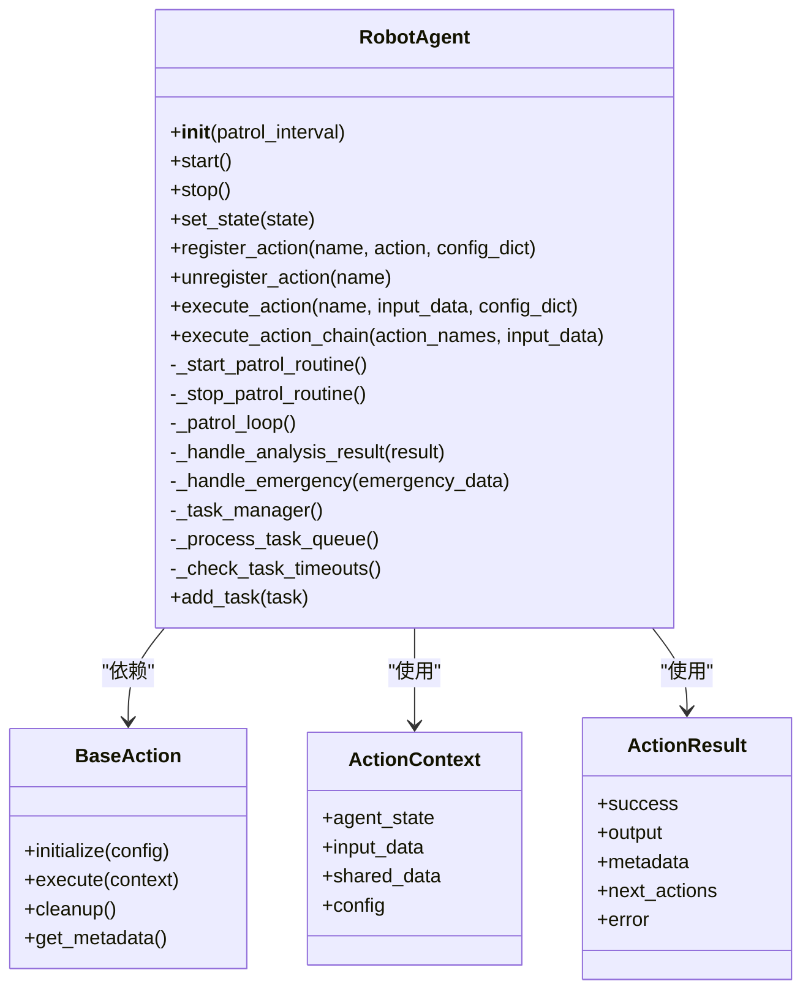
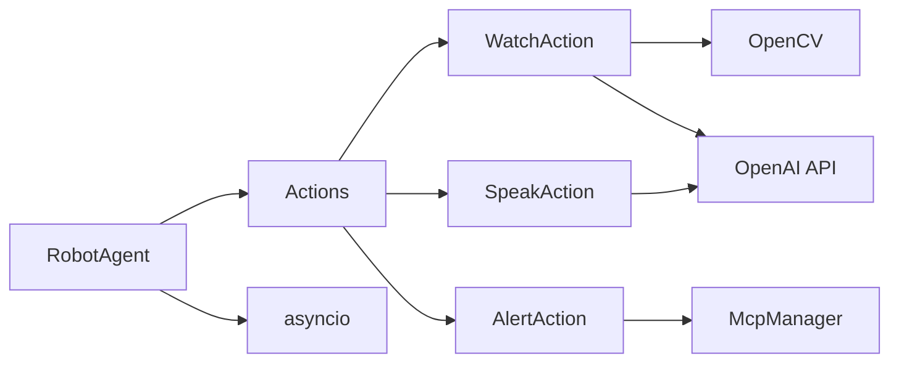

# RobotAgent核心模块

<cite>
**本文引用的文件**
- [core/agent.py](file://core/agent.py)
- [core/action/base.py](file://core/action/base.py)
- [core/action/watch_action.py](file://core/action/watch_action.py)
- [core/action/speak_action.py](file://core/action/speak_action.py)
- [core/action/alert_action.py](file://core/action/alert_action.py)
- [main.py](file://main.py)
- [config.py](file://config.py)
- [USAGE.md](file://USAGE.md)
</cite>

## 更新摘要
**变更内容**
- 重构RobotAgent类，移除直接集成的摄像头和MCP工具，改为通过Action插件机制管理功能模块
- 详细阐述Action插件架构，包括register_action、execute_action等方法的使用
- 更新状态机和巡逻循环的实现，展示如何通过Action链执行任务
- 说明共享上下文(shared_context)在Action间传递数据的机制
- 提供新的启动和调用示例，反映重构后的API

## 目录
1. [简介](#简介)
2. [项目结构](#项目结构)
3. [核心组件](#核心组件)
4. [架构总览](#架构总览)
5. [详细组件分析](#详细组件分析)
6. [依赖分析](#依赖分析)
7. [性能考虑](#性能考虑)
8. [故障排查指南](#故障排查指南)
9. [结论](#结论)
10. [附录](#附录)

## 简介
本文件面向RobotAgent核心模块，聚焦重构后的RobotAgent类作为系统控制中枢的设计与实现，系统性阐述以下关键点：
- 在构造函数中如何初始化Action插槽机制，支持动态注册和执行动作链
- AgentState枚举（IDLE、PATROLLING、RESPONDING、ALERT）的状态转换机制及set_state的应用
- 异步巡逻循环_patrol_loop的工作流程：如何周期性调用execute_action("watch")获取图像分析结果
- 任务管理器_task_manager如何协调_task_process_queue与_check_task_timeouts，完成任务队列与超时控制
- 紧急响应机制：当_handle_analysis_result检测到emergency为True时，如何触发_execute_action_chain执行应急动作链
- start()与stop()方法的调用示例与系统启停流程
- 结合代码片段路径说明Task数据类的结构及其在整个任务调度系统中的作用
- 异常处理策略，特别是对asyncio.CancelledError的捕获与响应

## 项目结构
该项目采用按功能分层的组织方式，核心逻辑集中在core目录下：
- core/agent.py：机器人代理主类、状态机、任务调度与紧急响应
- core/action/：Action插件模块，包含WatchAction、SpeakAction、AlertAction等
- core/action/base.py：Action抽象基类和相关数据结构
- config.py：全局配置（如API密钥、模型名称等）
- main.py：入口示例
- USAGE.md：使用指南

**图表来源**
- [core/agent.py](file://core/agent.py#L37-L383)
- [core/action/base.py](file://core/action/base.py#L37-L91)
- [config.py](file://config.py#L1-L17)
- [main.py](file://main.py#L1-L39)

## 核心组件
本节概述RobotAgent类的关键职责与数据结构：
- 状态管理：维护AgentState枚举，提供set_state切换巡逻/空闲/响应/告警状态
- 巡逻循环：定时执行watch Action进行图像理解，根据结果决定继续巡逻或进入紧急响应
- 任务调度：维护任务队列与运行中任务映射，统一处理任务启动、超时与清理
- 紧急响应：检测AI返回的emergency标志，执行alert和speak Action链进行应急响应
- Action插件机制：通过register_action、execute_action等方法管理Action插件，支持动态注册和执行动作链

**Section sources**
- [core/agent.py](file://core/agent.py#L50-L66)
- [core/agent.py](file://core/agent.py#L70-L94)
- [core/agent.py](file://core/agent.py#L95-L137)
- [core/agent.py](file://core/agent.py#L138-L204)

## 架构总览
RobotAgent作为控制中枢，通过Action插件机制协调各类功能模块：
- WatchAction负责图像理解，调用视觉模型分析摄像头图像
- SpeakAction负责语音合成，将文本转换为语音输出
- AlertAction负责应急调用，处理紧急情况
- RobotAgent通过状态机驱动巡逻循环，通过任务管理器驱动任务生命周期

**图表来源**
- [core/agent.py](file://core/agent.py#L237-L258)
- [core/agent.py](file://core/agent.py#L264-L274)
- [core/agent.py](file://core/agent.py#L275-L298)
- [core/action/watch_action.py](file://core/action/watch_action.py#L95-L171)
- [core/action/speak_action.py](file://core/action/speak_action.py#L78-L145)
- [core/action/alert_action.py](file://core/action/alert_action.py#L54-L93)

## 详细组件分析

### RobotAgent类与状态机
- AgentState枚举定义了IDLE、PATROLLING、RESPONDING、ALERT四种状态
- set_state负责状态变更与例程启停：PATROLLING时启动巡逻与任务管理例程；IDLE时停止两者
- 状态转换路径：
  - IDLE → PATROLLING：start()调用set_state触发
  - PATROLLING → ALERT：_handle_analysis_result检测emergency后触发
  - ALERT → RESPONDING：_handle_emergency执行应急服务并切换
  - RESPONDING → PATROLLING：等待5秒后回切

**图表来源**
- [core/agent.py](file://core/agent.py#L21-L27)
- [core/agent.py](file://core/agent.py#L205-L214)
- [core/agent.py](file://core/agent.py#L275-L298)

### 巡逻循环_patrol_loop
- 周期性逻辑：在PATROLLING状态下，每隔patrol_interval秒执行一次
- 流程步骤：
  1) 调用execute_action("watch")执行图像理解
  2) 调用_handle_analysis_result处理结果
  3) 睡眠等待下次巡逻
- 异常处理：捕获CancelledError与通用异常，保证协程可被安全取消

**图表来源**
- [core/agent.py](file://core/agent.py#L237-L258)
- [core/action/watch_action.py](file://core/action/watch_action.py#L95-L171)

### 分析结果处理_handle_analysis_result与紧急响应
- 当result.emergency为True时，进入紧急流程：
  - 调用_handle_emergency：设置状态为ALERT
  - 执行alert Action调用应急服务
  - 执行speak Action进行语音播报
  - 设置状态为RESPONDING
  - 等待5秒后回切PATROLLING
- 当result.emergency为False时，继续巡逻

**图表来源**
- [core/agent.py](file://core/agent.py#L264-L298)
- [core/action/alert_action.py](file://core/action/alert_action.py#L54-L93)
- [core/action/speak_action.py](file://core/action/speak_action.py#L78-L145)

### 任务管理器_task_manager与Task数据类
- Task数据类包含字段：id、name、callback、created_at、timeout、status
- _task_manager持续循环：
  - 调用_process_task_queue处理队列（启动pending任务，标记超时任务）
  - 调用_check_task_timeouts检查运行中任务超时并取消
  - 每轮短暂休眠避免CPU占用过高
- _process_task_queue：
  - 遍历队列，计算任务存活时间，超过timeout则标记timeout并移除
  - 对pending任务创建asyncio.Task并加入running_tasks映射
  - 从队列中移除已处理任务
- _check_task_timeouts：
  - 遍历running_tasks，查找对应Task对象，若超时则取消asyncio.Task并标记timeout
  - 清理已完成或超时的任务

**图表来源**
- [core/agent.py](file://core/agent.py#L28-L37)
- [core/agent.py](file://core/agent.py#L300-L379)

### 依赖关系与初始化
- RobotAgent.__init__中：
  - 初始化状态为IDLE
  - 创建Actions插槽：actions、action_metadata、shared_context
  - 初始化任务队列与运行中任务映射
  - 初始化巡逻与任务管理协程句柄
- Action插件机制：通过register_action注册Action实例，支持动态扩展功能

**图表来源**
- [core/agent.py](file://core/agent.py#L43-L66)
- [core/action/base.py](file://core/action/base.py#L37-L91)

## 依赖分析
- 内部耦合：
  - RobotAgent与Action插件之间为松耦合关系，通过标准接口交互
  - 任务系统与RobotAgent强耦合，但通过回调解耦具体执行逻辑
- 外部依赖：
  - OpenCV用于图像采集（通过CameraSensor封装）
  - OpenAI API用于视觉理解和语音合成
  - asyncio用于协程调度与取消
- 潜在风险：
  - Action间依赖关系需要明确管理
  - 共享上下文(shared_context)可能存在数据冲突

**图表来源**
- [core/agent.py](file://core/agent.py#L54-L56)
- [core/action/watch_action.py](file://core/action/watch_action.py#L36-L38)
- [core/action/speak_action.py](file://core/action/speak_action.py#L23-L24)
- [core/action/alert_action.py](file://core/action/alert_action.py#L22)

## 性能考虑
- 图像采集异步化：CameraSensor.capture_image通过线程执行耗时的OpenCV操作，避免阻塞事件循环
- 巡逻间隔：通过patrol_interval控制CPU占用，可根据场景调整
- 任务批处理：_task_manager每轮只做必要检查与短暂停顿，降低开销
- 超时控制：对pending与running任务分别检查，及时取消超时任务，防止资源泄漏
- Action初始化：在register_action时初始化Action，避免运行时开销

[本节为通用建议，无需列出具体文件来源]

## 故障排查指南
- 巡逻循环异常：
  - 现象：协程无法退出或重复打印错误
  - 排查：确认stop()是否正确调用并取消_patrol_task与_task_manager_task
  - 参考路径：[core/agent.py](file://core/agent.py#L74-L94)
- Action执行失败：
  - 现象：execute_action返回失败
  - 排查：检查Action是否已注册；API密钥是否正确；网络连接是否正常
  - 参考路径：[core/agent.py](file://core/agent.py#L138-L177)，[USAGE.md](file://USAGE.md#L146-L158)
- 任务未执行或超时：
  - 现象：任务状态停留在pending或timeout
  - 排查：确认add_task是否正确调用；timeout值是否合理；_task_manager是否在运行
  - 参考路径：[core/agent.py](file://core/agent.py#L381-L383)，[core/agent.py](file://core/agent.py#L300-L379)
- 紧急响应未触发：
  - 现象：AI返回emergency=True但未执行应急服务
  - 排查：确认_handle_analysis_result分支逻辑；检查_watch Action是否返回正确格式
  - 参考路径：[core/agent.py](file://core/agent.py#L264-L274)，[core/action/watch_action.py](file://core/action/watch_action.py#L144-L153)

**Section sources**
- [core/agent.py](file://core/agent.py#L74-L94)
- [core/agent.py](file://core/agent.py#L138-L177)
- [core/agent.py](file://core/agent.py#L381-L383)
- [core/agent.py](file://core/agent.py#L300-L379)
- [core/agent.py](file://core/agent.py#L264-L274)
- [core/action/watch_action.py](file://core/action/watch_action.py#L144-L153)
- [USAGE.md](file://USAGE.md#L146-L158)

## 结论
RobotAgent通过Action插件机制实现了"定时巡逻+AI分析+紧急响应"的闭环控制。其设计优点在于：
- 插件化架构明确，易于扩展与维护
- 异步化处理I/O密集型任务，提升系统吞吐
- 任务超时与取消机制完善，具备良好的鲁棒性
- 共享上下文机制支持Action间数据传递
建议后续优化方向：
- 增加Action依赖管理
- 优化共享上下文的数据隔离
- 增加更详细的日志记录

[本节为总结性内容，无需列出具体文件来源]

## 附录

### 启停流程与调用示例
- 启动：调用start()后，set_state进入PATROLLING，启动_patrol_loop与task_manager
- 停止：调用stop()后，set_state进入IDLE，取消所有协程与运行中任务
- 示例参考路径：
  - [core/agent.py](file://core/agent.py#L69-L94)
  - [main.py](file://main.py#L5-L39)

**Section sources**
- [core/agent.py](file://core/agent.py#L69-L94)
- [main.py](file://main.py#L5-L39)

### Task数据类结构说明
- 字段：id、name、callback、created_at、timeout、status
- 作用：承载任务元数据与执行回调，配合任务管理器完成调度与超时控制
- 使用参考路径：
  - [core/agent.py](file://core/agent.py#L28-L37)
  - [core/agent.py](file://core/agent.py#L300-L379)

**Section sources**
- [core/agent.py](file://core/agent.py#L28-L37)
- [core/agent.py](file://core/agent.py#L300-L379)

### 异常处理策略
- 巡逻循环与任务管理均捕获CancelledError，确保协程可被安全取消
- 通用异常被捕获并打印，避免崩溃传播
- 参考路径：
  - [core/agent.py](file://core/agent.py#L259-L263)
  - [core/agent.py](file://core/agent.py#L314-L318)

**Section sources**
- [core/agent.py](file://core/agent.py#L259-L263)
- [core/agent.py](file://core/agent.py#L314-L318)

### main.py类型不匹配问题
- 现象：已重构为Action机制，不再使用AgentMode
- 建议：无需修改，当前实现正确
- 参考路径：
  - [main.py](file://main.py#L5-L39)

**Section sources**
- [main.py](file://main.py#L5-L39)

### 摄像头测试参考
- 测试覆盖：初始化、成功采集、失败采集
- 参考路径：
  - [test/test_actions.py](file://test/test_actions.py#L190-L275)

**Section sources**
- [test/test_actions.py](file://test/test_actions.py#L190-L275)

### README运行说明
- 使用pytest运行单测
- 参考路径：
  - [README.md](file://README.md#L1-L24)

**Section sources**
- [README.md](file://README.md#L1-L24)