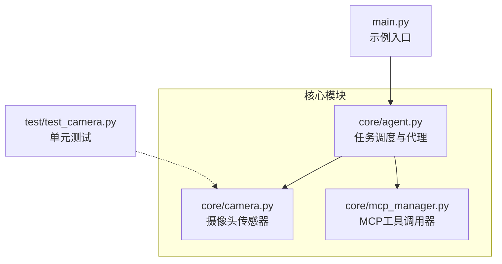
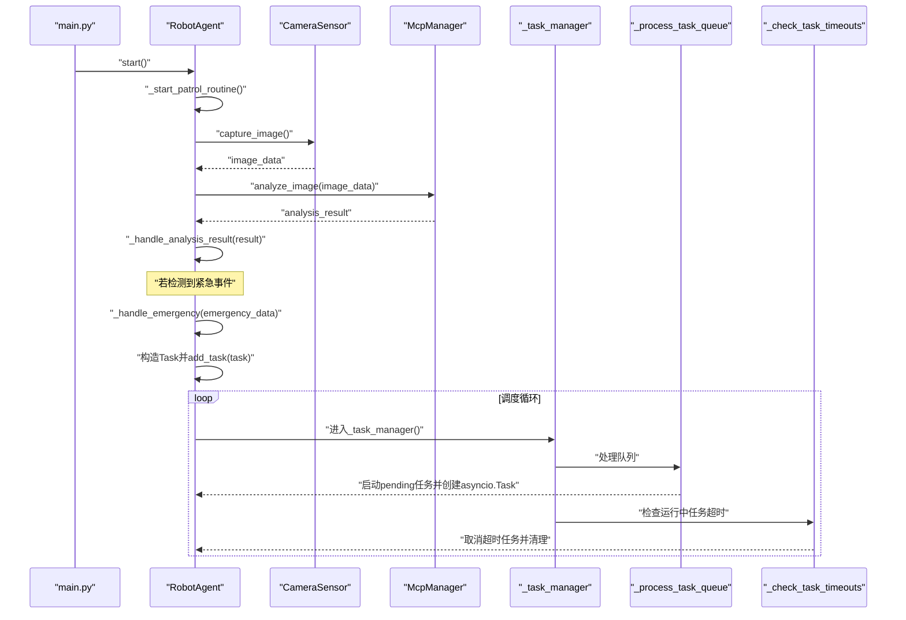
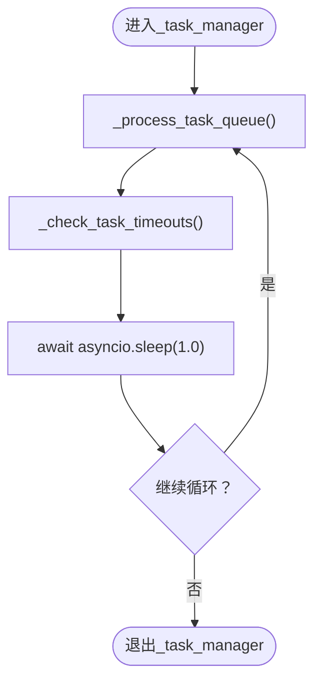
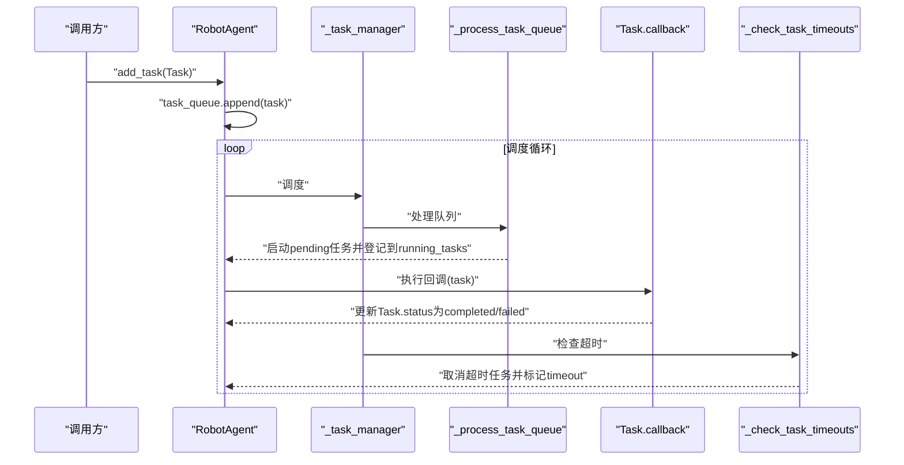
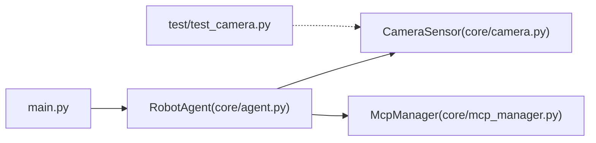

# 任务调度

<cite>
**本文引用的文件**
- [core/agent.py](file://core/agent.py)
- [core/camera.py](file://core/camera.py)
- [core/mcp_manager.py](file://core/mcp_manager.py)
- [main.py](file://main.py)
- [README.md](file://README.md)
- [test/test_camera.py](file://test/test_camera.py)
</cite>

## 目录
1. [简介](#简介)
2. [项目结构](#项目结构)
3. [核心组件](#核心组件)
4. [架构总览](#架构总览)
5. [详细组件分析](#详细组件分析)
6. [依赖关系分析](#依赖关系分析)
7. [性能考量](#性能考量)
8. [故障排查指南](#故障排查指南)
9. [结论](#结论)
10. [附录](#附录)

## 简介
本文件面向RobotAgent任务调度系统，聚焦于Task数据类的设计与职责、异步任务管理器_task_manager的工作机制、任务队列与运行中任务字典的协同、add_task接口的行为、任务完成/超时的状态更新流程，以及异常处理策略（尤其是对asyncio.CancelledError的捕获与响应）。同时提供性能优化建议与排障指引，帮助读者在不直接阅读源码的情况下理解系统运作。

## 项目结构
- 核心模块
  - core/agent.py：定义任务数据类Task、机器人代理RobotAgent及其任务调度逻辑
  - core/camera.py：摄像头传感器模拟，负责捕获图像
  - core/mcp_manager.py：MCP工具调用器，提供图像分析与紧急服务调用
- 示例入口
  - main.py：示例入口，演示如何创建并运行RobotAgent
- 测试
  - test/test_camera.py：摄像头模块的单元测试

图表来源
- [core/agent.py](file://core/agent.py#L1-L278)
- [core/camera.py](file://core/camera.py#L1-L57)
- [core/mcp_manager.py](file://core/mcp_manager.py#L1-L28)
- [main.py](file://main.py#L1-L7)
- [test/test_camera.py](file://test/test_camera.py#L1-L43)

章节来源
- [core/agent.py](file://core/agent.py#L1-L278)
- [core/camera.py](file://core/camera.py#L1-L57)
- [core/mcp_manager.py](file://core/mcp_manager.py#L1-L28)
- [main.py](file://main.py#L1-L7)
- [README.md](file://README.md#L1-L18)

## 核心组件
- Task数据类
  - 字段与类型
    - id: 字符串，唯一标识
    - name: 字符串，任务名称
    - callback: 可调用对象，任务执行回调
    - created_at: 浮点数，任务创建时间戳
    - timeout: 浮点数，默认60.0，单位秒
    - status: 字符串，默认"pending"，可选值："pending"、"running"、"completed"、"failed"、"timeout"
  - 用途
    - 描述一次可调度的任务，包含执行体、创建时间、超时阈值与状态
- RobotAgent
  - 任务管理
    - task_queue: 任务列表，存放待处理任务
    - running_tasks: 运行中任务映射，键为任务id，值为对应的asyncio.Task
  - 生命周期与状态
    - 状态枚举：IDLE、PATROLLING、RESPONDING、ALERT
    - start/stop：启动/停止代理，内部会取消巡逻与任务管理协程，并取消所有运行中任务
  - 关键方法
    - add_task(task): 将任务追加到队列
    - _task_manager(): 主调度循环，周期性调用_process_task_queue与_check_task_timeouts
    - _process_task_queue(): 扫描队列，启动pending任务并创建asyncio.Task；同时处理超时任务
    - _check_task_timeouts(): 检查运行中任务是否超时，取消并清理；清理已完成或超时的asyncio.Task

章节来源
- [core/agent.py](file://core/agent.py#L18-L27)
- [core/agent.py](file://core/agent.py#L45-L52)
- [core/agent.py](file://core/agent.py#L182-L200)
- [core/agent.py](file://core/agent.py#L201-L232)
- [core/agent.py](file://core/agent.py#L233-L261)
- [core/agent.py](file://core/agent.py#L262-L266)

## 架构总览
下图展示了RobotAgent如何在巡逻循环中触发紧急任务，以及任务管理器如何协调队列与运行中任务。

图表来源
- [core/agent.py](file://core/agent.py#L86-L106)
- [core/agent.py](file://core/agent.py#L108-L139)
- [core/agent.py](file://core/agent.py#L140-L160)
- [core/agent.py](file://core/agent.py#L182-L200)
- [core/agent.py](file://core/agent.py#L201-L232)
- [core/agent.py](file://core/agent.py#L233-L261)
- [core/camera.py](file://core/camera.py#L17-L29)
- [core/mcp_manager.py](file://core/mcp_manager.py#L10-L22)

## 详细组件分析

### Task数据类结构设计
- 字段与语义
  - id：任务唯一标识，用于关联running_tasks字典与日志输出
  - name：任务名称，便于调试与可观测性
  - callback：任务执行函数，接收Task实例作为参数
  - created_at：任务创建时间戳，用于超时判断
  - timeout：任务超时阈值，默认60.0秒
  - status：任务状态，初始为"pending"，执行中为"running"，完成后为"completed"/"failed"，超时为"timeout"
- 设计要点
  - 使用dataclass简化字段声明与默认值
  - 将状态与超时阈值内聚在Task中，便于统一处理
  - callback签名接收Task，便于在回调中直接更新任务状态

章节来源
- [core/agent.py](file://core/agent.py#L18-L27)

### 异步任务管理器工作原理
- _task_manager()
  - 周期性执行：先调用_process_task_queue，再调用_check_task_timeouts，最后短暂sleep
  - 异常处理：捕获CancelledError与通用异常，分别记录取消与错误信息
- _process_task_queue()
  - 遍历task_queue：
    - 若任务已超时：标记为"timeout"并加入已处理列表
    - 若任务状态为"pending"：标记为"running"，创建asyncio.Task并加入running_tasks，同时加入已处理列表
  - 移除已处理任务（避免重复处理）
- _check_task_timeouts()
  - 对每个运行中任务：
    - 在队列中查找对应Task，计算当前时间与created_at之差
    - 若超时：取消asyncio.Task，标记Task为"timeout"，收集待清理id
  - 清理：移除done()的asyncio.Task与其对应的Task

图表来源
- [core/agent.py](file://core/agent.py#L182-L200)
- [core/agent.py](file://core/agent.py#L201-L232)
- [core/agent.py](file://core/agent.py#L233-L261)

章节来源
- [core/agent.py](file://core/agent.py#L182-L200)
- [core/agent.py](file://core/agent.py#L201-L232)
- [core/agent.py](file://core/agent.py#L233-L261)

### 任务队列与运行中任务字典的协同
- 数据结构
  - task_queue：按到达顺序存放Task
  - running_tasks：以任务id为键，asyncio.Task为值
- 协同机制
  - _process_task_queue：当Task.status为"pending"时，将其状态改为"running"，创建asyncio.Task并登记到running_tasks；随后从task_queue移除该Task
  - _check_task_timeouts：遍历running_tasks，若对应Task超时则取消asyncio.Task并标记Task为"timeout"；随后清理done()的asyncio.Task
- 关键点
  - 通过Task.id与running_tasks建立强关联，确保超时与清理能快速定位
  - 采用“已处理列表”批量移除task_queue中的任务，避免边遍历边删除带来的复杂性

章节来源
- [core/agent.py](file://core/agent.py#L45-L52)
- [core/agent.py](file://core/agent.py#L201-L232)
- [core/agent.py](file://core/agent.py#L233-L261)

### add_task接口与状态更新机制
- add_task(task)
  - 将任务追加到task_queue，打印日志
- 状态更新
  - _process_task_queue：将"pending"任务改为"running"并创建asyncio.Task
  - 任务回调内部：根据执行结果将Task.status设为"completed"或"failed"
  - _check_task_timeouts：若超时，将Task.status设为"timeout"并取消asyncio.Task
  - 清理阶段：移除done()或超时的asyncio.Task与对应Task

图表来源
- [core/agent.py](file://core/agent.py#L262-L266)
- [core/agent.py](file://core/agent.py#L201-L232)
- [core/agent.py](file://core/agent.py#L161-L181)
- [core/agent.py](file://core/agent.py#L233-L261)

章节来源
- [core/agent.py](file://core/agent.py#L262-L266)
- [core/agent.py](file://core/agent.py#L161-L181)
- [core/agent.py](file://core/agent.py#L233-L261)

### 异常处理策略
- 巡逻循环与任务管理器
  - 捕获CancelledError：优雅退出，记录取消信息
  - 捕获通用异常：记录错误信息，避免崩溃
- 任务回调
  - try/except包裹业务逻辑，出现异常时将Task.status置为"failed"
- 运行中任务超时
  - 调用asyncio.Task.cancel()取消任务，随后在清理阶段移除
- 停止代理
  - 取消_patrol_task、_task_manager_task以及所有running_tasks

章节来源
- [core/agent.py](file://core/agent.py#L108-L139)
- [core/agent.py](file://core/agent.py#L161-L181)
- [core/agent.py](file://core/agent.py#L182-L200)
- [core/agent.py](file://core/agent.py#L65-L75)

### 与外部组件的交互
- 摄像头传感器CameraSensor
  - 提供异步捕获图像能力，内部通过线程池避免阻塞
- MCP工具调用器McpManager
  - 提供图像分析与紧急服务调用，模拟异步延迟

章节来源
- [core/camera.py](file://core/camera.py#L17-L29)
- [core/mcp_manager.py](file://core/mcp_manager.py#L10-L22)

## 依赖关系分析
- RobotAgent依赖CameraSensor与McpManager
- main.py创建并运行RobotAgent
- 测试test/test_camera.py验证CameraSensor行为

图表来源
- [core/agent.py](file://core/agent.py#L1-L278)
- [core/camera.py](file://core/camera.py#L1-L57)
- [core/mcp_manager.py](file://core/mcp_manager.py#L1-L28)
- [main.py](file://main.py#L1-L7)
- [test/test_camera.py](file://test/test_camera.py#L1-L43)

章节来源
- [core/agent.py](file://core/agent.py#L1-L278)
- [core/camera.py](file://core/camera.py#L1-L57)
- [core/mcp_manager.py](file://core/mcp_manager.py#L1-L28)
- [main.py](file://main.py#L1-L7)
- [test/test_camera.py](file://test/test_camera.py#L1-L43)

## 性能考量
- 合理设置timeout
  - 根据任务性质设定timeout，避免过短导致误杀或过长导致资源占用
  - 对耗时较长的回调（如网络请求、模型推理）应适当提高timeout
- 避免任务积压
  - 控制task_queue增长速度，必要时限制并发或引入优先级
  - 通过_check_task_timeouts及时清理超时任务，防止内存泄漏
- CPU占用
  - _task_manager中每轮sleep 1秒，避免忙等；可根据负载调整sleep间隔
- I/O阻塞规避
  - 摄像头捕获通过线程池执行，避免阻塞事件循环

章节来源
- [core/agent.py](file://core/agent.py#L182-L200)
- [core/agent.py](file://core/agent.py#L233-L261)
- [core/camera.py](file://core/camera.py#L17-L29)

## 故障排查指南
- 任务未执行
  - 检查Task.status是否仍为"pending"，确认是否被_process_task_queue处理
  - 确认_task_manager是否在运行且未被取消
- 任务超时
  - 查看Task.timeout与created_at差值是否超过阈值
  - 检查_check_task_timeouts是否清理了asyncio.Task
- 回调异常
  - 查看回调内部是否抛出异常并导致Task.status变为"failed"
- 代理停止后仍有任务残留
  - 确认stop()是否调用了cancel()并清理running_tasks

章节来源
- [core/agent.py](file://core/agent.py#L65-L75)
- [core/agent.py](file://core/agent.py#L201-L232)
- [core/agent.py](file://core/agent.py#L233-L261)
- [core/agent.py](file://core/agent.py#L161-L181)

## 结论
该任务调度系统以Task为核心数据载体，通过_robot_manager的双轨扫描（队列处理+超时检查）实现对pending与running任务的统一管理。配合add_task接口与回调内的状态更新，系统能够稳定地处理新增任务、超时清理与异常恢复。通过合理的timeout配置与清理策略，可在保证可靠性的同时提升整体性能。

## 附录
- 示例入口
  - main.py展示了如何创建RobotAgent并运行示例

章节来源
- [main.py](file://main.py#L1-L7)