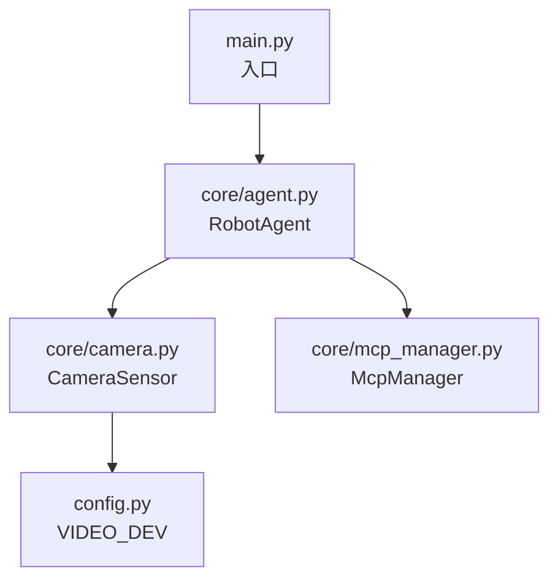
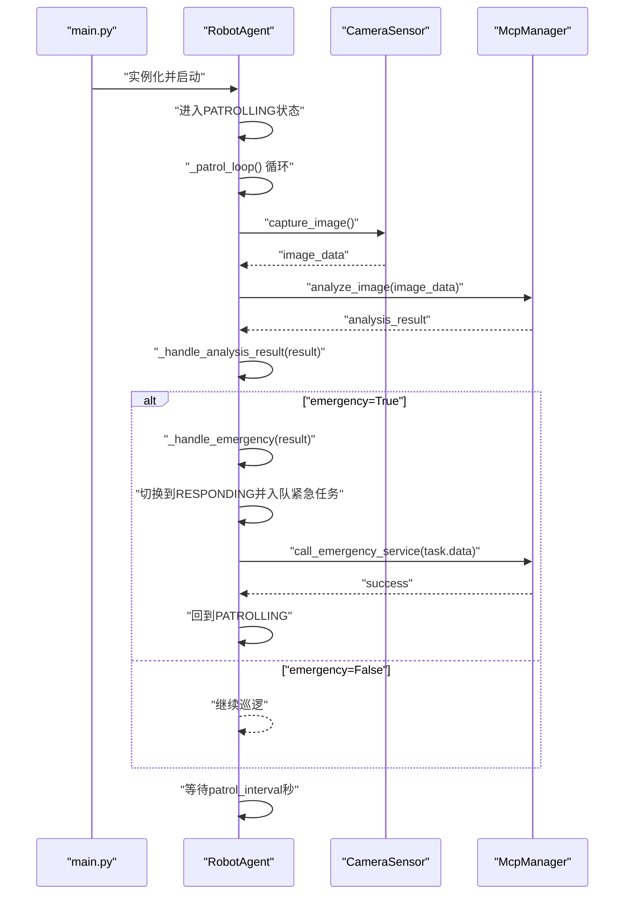
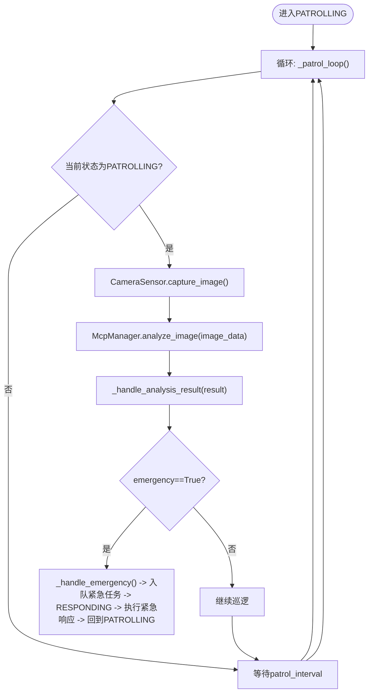
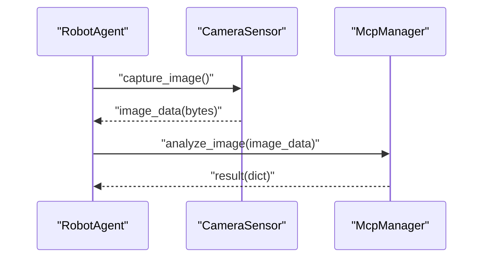
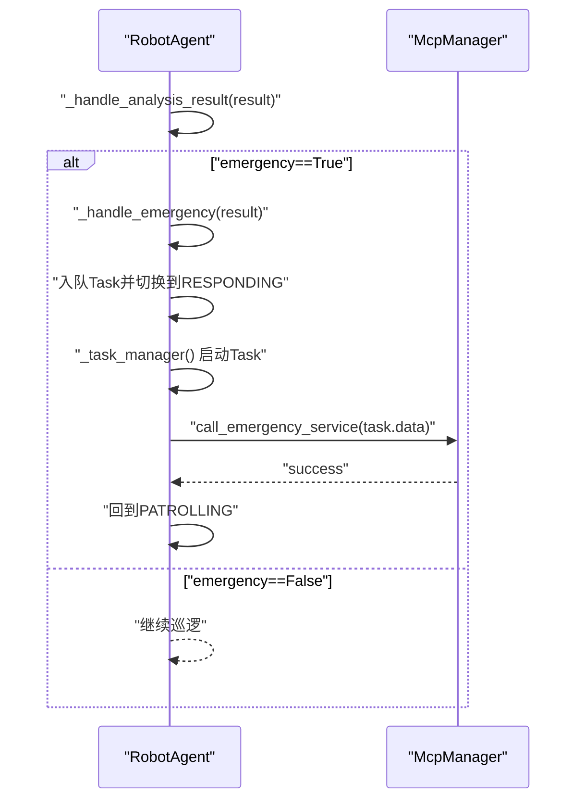
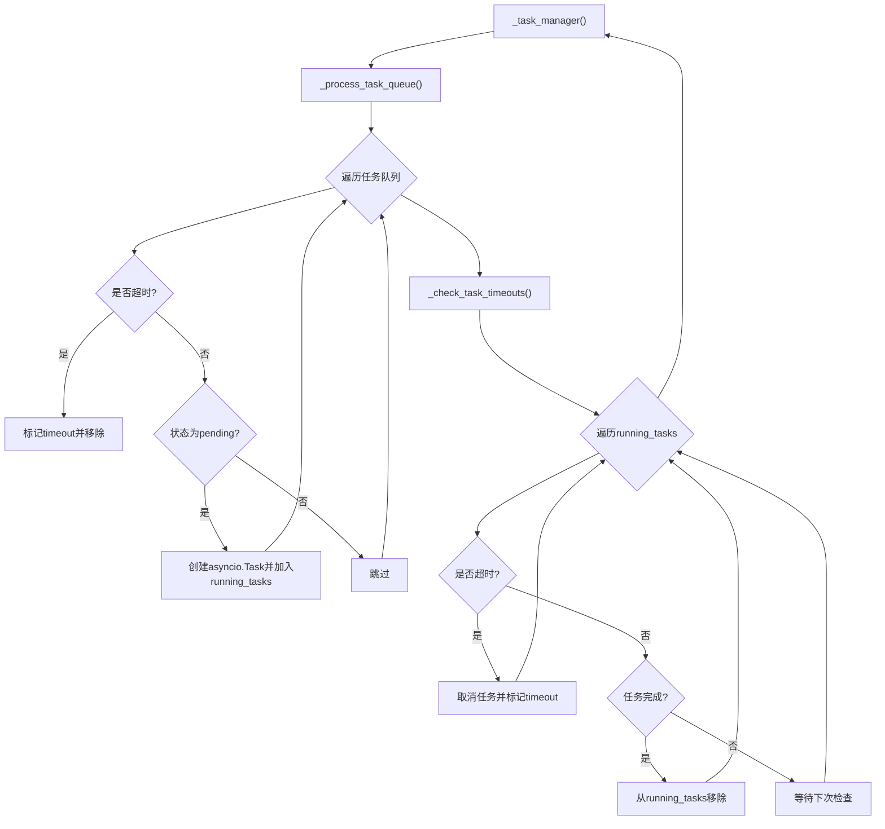
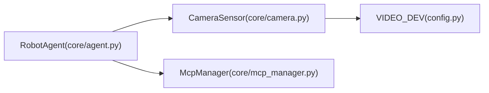

# 巡逻逻辑

<cite>
**本文引用的文件**
- [core/agent.py](file://core/agent.py)
- [core/camera.py](file://core/camera.py)
- [core/mcp_manager.py](file://core/mcp_manager.py)
- [config.py](file://config.py)
- [main.py](file://main.py)
- [test/test_camera.py](file://test/test_camera.py)
- [README.md](file://README.md)
</cite>

## 目录
1. [简介](#简介)
2. [项目结构](#项目结构)
3. [核心组件](#核心组件)
4. [架构总览](#架构总览)
5. [详细组件分析](#详细组件分析)
6. [依赖关系分析](#依赖关系分析)
7. [性能考量](#性能考量)
8. [故障排查指南](#故障排查指南)
9. [结论](#结论)

## 简介
本文件聚焦RobotAgent的巡逻逻辑，系统性阐述以下内容：
- _patrol_loop异步循环在PATROLLING状态下的执行流程：周期性调用CameraSensor.capture_image获取图像数据，并通过McpManager.analyze_image将图像发送至AI分析服务。
- _handle_analysis_result方法如何解析分析结果，并在检测到emergency为True时调用_handle_emergency触发紧急响应流程。
- 巡逻间隔patrol_interval参数的配置方式及其对系统性能的影响。
- 从图像采集、AI分析到结果处理的完整数据流。
- 巡逻循环中的异常处理机制，包括对asyncio.CancelledError的捕获以支持优雅关闭。
- 调试技巧与常见问题解决方案，如网络延迟导致的分析超时处理。

## 项目结构
该项目采用按功能分层的组织方式，核心逻辑集中在core目录下：
- core/agent.py：机器人代理主类，包含状态机、巡逻循环、任务管理等。
- core/camera.py：摄像头传感器封装，负责图像采集。
- core/mcp_manager.py：AI分析与紧急服务调用的封装。
- config.py：全局配置项（如视频设备号）。
- main.py：入口示例，演示如何实例化并启动RobotAgent。
- test/test_camera.py：摄像头模块的单元测试，验证初始化与采集成功/失败路径。
- README.md：项目说明与测试运行指引。

图表来源
- [main.py](file://main.py#L1-L6)
- [core/agent.py](file://core/agent.py#L28-L54)
- [core/camera.py](file://core/camera.py#L1-L30)
- [core/mcp_manager.py](file://core/mcp_manager.py#L1-L28)
- [config.py](file://config.py#L1-L1)

章节来源
- [README.md](file://README.md#L1-L18)

## 核心组件
- RobotAgent：负责状态管理、巡逻循环调度、任务队列与超时处理、紧急响应流程编排。
- CameraSensor：负责图像采集，使用异步线程避免阻塞事件循环。
- McpManager：负责AI图像分析与紧急服务调用，当前实现为模拟延迟与返回固定结构。
- 配置：VIDEO_DEV用于指定摄像头设备。

章节来源
- [core/agent.py](file://core/agent.py#L28-L54)
- [core/camera.py](file://core/camera.py#L1-L30)
- [core/mcp_manager.py](file://core/mcp_manager.py#L1-L28)
- [config.py](file://config.py#L1-L1)

## 架构总览
下图展示了从启动到巡逻循环、图像采集、AI分析、结果处理与紧急响应的整体交互。

图表来源
- [core/agent.py](file://core/agent.py#L55-L128)
- [core/agent.py](file://core/agent.py#L129-L181)
- [core/camera.py](file://core/camera.py#L17-L30)
- [core/mcp_manager.py](file://core/mcp_manager.py#L10-L28)

## 详细组件分析

### 巡逻循环与状态机
- 状态机：IDLE/PATROLLING/RESPONDING/ALERT四种状态，由set_state驱动切换。
- 启动/停止：start()进入PATROLLING；stop()进入IDLE并取消所有异步任务。
- 巡逻循环：_patrol_loop在PATROLLING状态下循环执行，每次先采集图像再进行AI分析，最后根据结果处理，然后sleep(patrol_interval)。

图表来源
- [core/agent.py](file://core/agent.py#L55-L128)
- [core/agent.py](file://core/agent.py#L129-L181)

章节来源
- [core/agent.py](file://core/agent.py#L55-L128)
- [core/agent.py](file://core/agent.py#L129-L181)

### 图像采集与AI分析
- CameraSensor.capture_image：使用asyncio.to_thread在独立线程中执行耗时的摄像头读取与编码，避免阻塞事件循环。
- McpManager.analyze_image：当前为模拟AI分析，返回包含emergency字段的结果字典，供上层判断是否触发紧急流程。

图表来源
- [core/camera.py](file://core/camera.py#L17-L30)
- [core/mcp_manager.py](file://core/mcp_manager.py#L10-L22)

章节来源
- [core/camera.py](file://core/camera.py#L17-L30)
- [core/mcp_manager.py](file://core/mcp_manager.py#L10-L22)

### 结果处理与紧急响应
- _handle_analysis_result：解析分析结果，若emergency为True则进入紧急流程。
- _handle_emergency：创建Task并入队，切换到RESPONDING状态，随后由任务管理器调度执行紧急响应。
- _execute_emergency_response：调用McpManager.call_emergency_service，完成后回到PATROLLING。

图表来源
- [core/agent.py](file://core/agent.py#L129-L181)
- [core/mcp_manager.py](file://core/mcp_manager.py#L24-L28)

章节来源
- [core/agent.py](file://core/agent.py#L129-L181)
- [core/mcp_manager.py](file://core/mcp_manager.py#L24-L28)

### 任务管理与超时控制
- 任务队列：Task对象包含id/name/callback/created_at/timeout/status等字段。
- _task_manager：周期性处理队列，启动pending任务并创建asyncio.Task；同时检查运行中任务是否超时并清理完成/超时任务。
- 超时策略：基于created_at与timeout比较，超时后取消任务并标记状态。

图表来源
- [core/agent.py](file://core/agent.py#L182-L261)

章节来源
- [core/agent.py](file://core/agent.py#L182-L261)

### 异常处理与优雅关闭
- 巡逻循环：捕获asyncio.CancelledError以支持优雅取消；其他异常被捕获并打印日志。
- 停止流程：stop()会取消_patrol_task、_task_manager_task以及所有running_tasks，确保资源回收。
- 任务管理器：同样捕获CancelledError并打印日志，避免异常冒泡。

章节来源
- [core/agent.py](file://core/agent.py#L108-L128)
- [core/agent.py](file://core/agent.py#L60-L75)
- [core/agent.py](file://core/agent.py#L182-L200)

## 依赖关系分析
- RobotAgent依赖CameraSensor与McpManager；CameraSensor依赖OpenCV与配置VIDEO_DEV；McpManager为AI分析与紧急服务的抽象。
- main.py演示了实例化RobotAgent的方式，但当前示例中传参名称与构造函数不一致，需注意修正。

图表来源
- [core/agent.py](file://core/agent.py#L28-L54)
- [core/camera.py](file://core/camera.py#L1-L30)
- [core/mcp_manager.py](file://core/mcp_manager.py#L1-L28)
- [config.py](file://config.py#L1-L1)

章节来源
- [core/agent.py](file://core/agent.py#L28-L54)
- [core/camera.py](file://core/camera.py#L1-L30)
- [core/mcp_manager.py](file://core/mcp_manager.py#L1-L28)
- [config.py](file://config.py#L1-L1)
- [main.py](file://main.py#L1-L6)

## 性能考量
- 巡逻间隔patrol_interval：
  - 影响巡视频率与CPU占用：间隔越短，循环越频繁，CPU占用越高；间隔越长，响应越慢，可能错过快速变化的场景。
  - 影响AI分析吞吐：若AI分析耗时较长，建议适当增大间隔以避免任务堆积。
- 图像采集：
  - 使用asyncio.to_thread避免阻塞事件循环，但仍受摄像头I/O与编码耗时影响。
- 任务管理：
  - _task_manager每秒检查一次队列与超时，避免过度占用CPU；可根据实际负载调整检查频率。
- 超时控制：
  - Task.timeout用于防止长时间挂起的任务占用资源；合理设置可避免系统资源泄露。

章节来源
- [core/agent.py](file://core/agent.py#L31-L40)
- [core/agent.py](file://core/agent.py#L182-L200)
- [core/agent.py](file://core/agent.py#L201-L261)

## 故障排查指南
- 摄像头无法打开/读取失败：
  - 现象：capture_image返回None或打印错误日志。
  - 排查：确认VIDEO_DEV配置正确；检查OpenCV是否安装；验证设备权限与连接状态。
  - 参考测试：test/test_camera.py覆盖了初始化、成功与失败路径。
- 分析超时或网络延迟：
  - 现象：AI分析耗时过长导致巡逻周期被拉长。
  - 解决：增大patrol_interval；优化AI分析耗时；或在McpManager中引入超时控制（当前实现未显式超时）。
- 优雅关闭无效：
  - 现象：stop()后仍有任务未终止。
  - 解决：确保stop()被调用且所有running_tasks均被取消；检查异常捕获是否吞掉关键错误。
- 紧急响应未触发：
  - 现象：分析结果emergency为True但未进入紧急流程。
  - 解决：检查_handle_analysis_result分支逻辑；确认_handle_emergency被调用并入队任务；核对_task_manager是否启动。

章节来源
- [test/test_camera.py](file://test/test_camera.py#L1-L43)
- [core/camera.py](file://core/camera.py#L17-L30)
- [core/agent.py](file://core/agent.py#L60-L75)
- [core/agent.py](file://core/agent.py#L129-L181)
- [core/agent.py](file://core/agent.py#L182-L261)

## 结论
本巡逻逻辑以异步事件循环为核心，通过CameraSensor与McpManager解耦图像采集与AI分析，借助任务队列与超时控制实现稳定的紧急响应机制。patrol_interval是影响系统性能与实时性的关键参数，应结合摄像头能力、AI分析耗时与业务需求综合设定。异常处理与优雅关闭机制保证了系统的健壮性，配合测试用例可进一步提升可靠性。