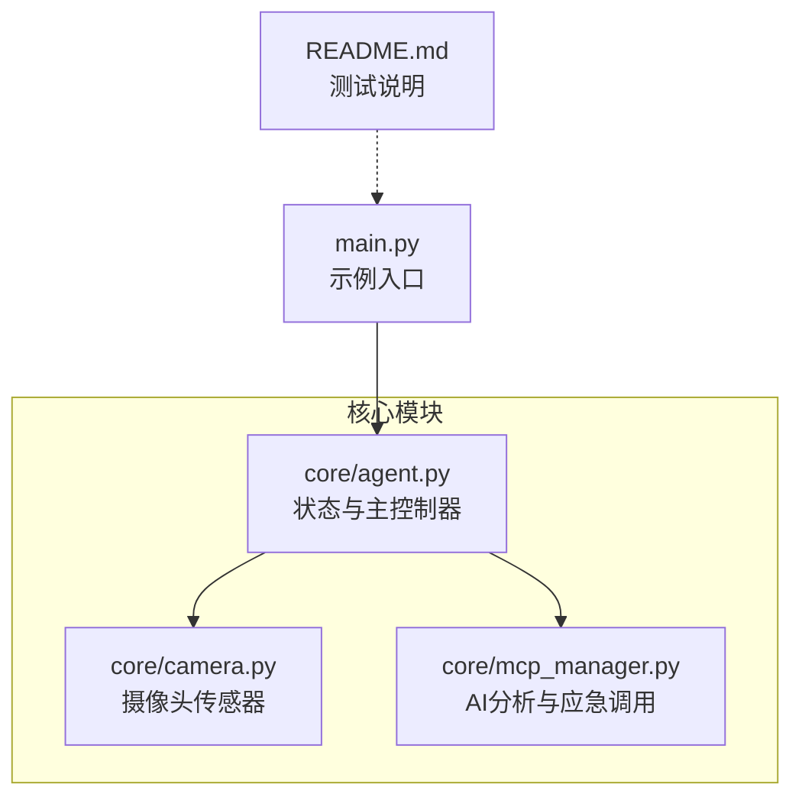
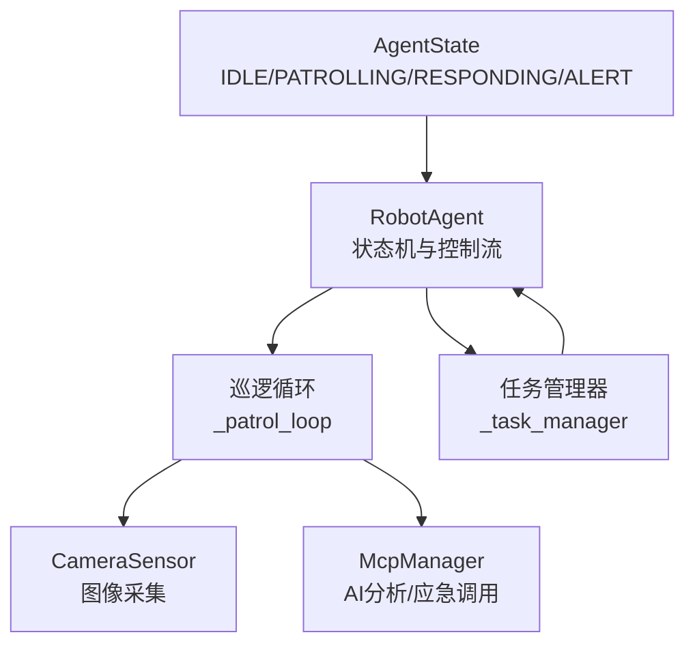
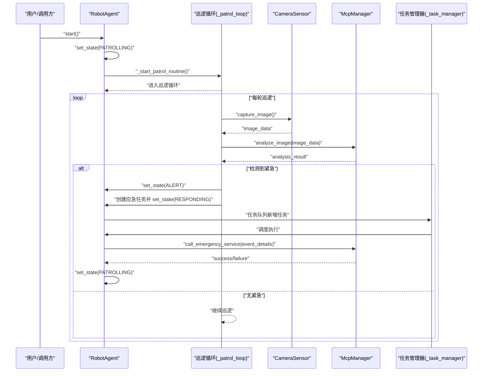
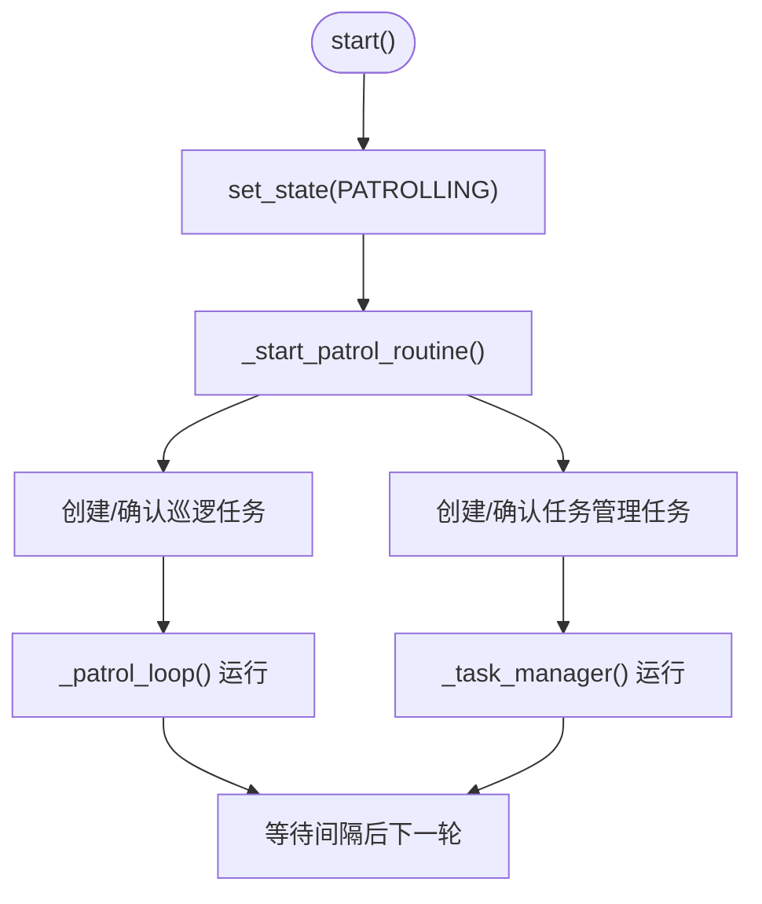
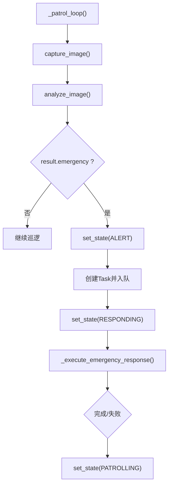
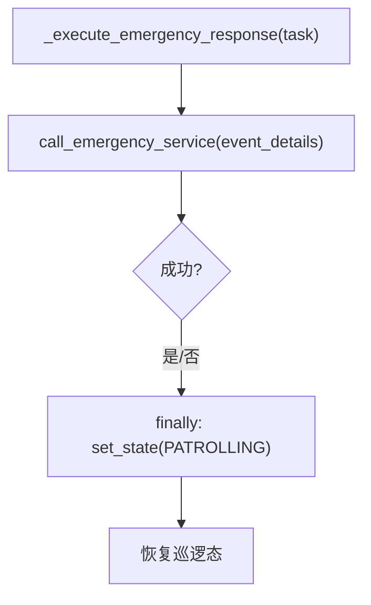
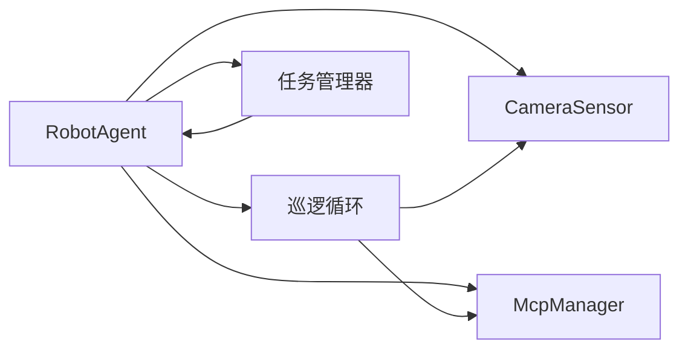

# 状态管理

<cite>
**本文引用的文件**
- [core/agent.py](file://core/agent.py)
- [core/camera.py](file://core/camera.py)
- [core/mcp_manager.py](file://core/mcp_manager.py)
- [main.py](file://main.py)
- [README.md](file://README.md)
- [test/test_camera.py](file://test/test_camera.py)
</cite>

## 目录
1. [简介](#简介)
2. [项目结构](#项目结构)
3. [核心组件](#核心组件)
4. [架构总览](#架构总览)
5. [详细组件分析](#详细组件分析)
6. [依赖关系分析](#依赖关系分析)
7. [性能考量](#性能考量)
8. [故障排查指南](#故障排查指南)
9. [结论](#结论)
10. [附录](#附录)

## 简介
本文件聚焦于RobotAgent的状态管理设计与实现，围绕AgentState枚举类（IDLE、PATROLLING、RESPONDING、ALERT）展开，系统性阐述状态语义、set_state触发的状态转换、调试输出策略、异常处理与恢复机制，并通过序列图与流程图直观展示从IDLE到PATROLLING的启动过程、从PATROLLING到ALERT的紧急触发，以及从RESPONDING回到PATROLLING的恢复闭环。同时总结状态模式在系统解耦与行为控制方面的优势，并给出可落地的应用场景示例。

## 项目结构
- 核心状态管理位于 core/agent.py，包含AgentState枚举、RobotAgent主类及状态转换逻辑。
- 传感器与AI分析由 core/camera.py 与 core/mcp_manager.py 提供，贯穿巡逻与应急响应流程。
- 示例入口 main.py 展示了如何实例化并启动Agent。
- README.md 提供测试运行说明。

图表来源
- [core/agent.py](file://core/agent.py#L1-L278)
- [core/camera.py](file://core/camera.py#L1-L57)
- [core/mcp_manager.py](file://core/mcp_manager.py#L1-L28)
- [main.py](file://main.py#L1-L7)
- [README.md](file://README.md#L1-L18)

章节来源
- [core/agent.py](file://core/agent.py#L1-L278)
- [core/camera.py](file://core/camera.py#L1-L57)
- [core/mcp_manager.py](file://core/mcp_manager.py#L1-L28)
- [main.py](file://main.py#L1-L7)
- [README.md](file://README.md#L1-L18)

## 核心组件
- AgentState 枚举：定义IDLE、PATROLLING、RESPONDING、ALERT四种状态，用于统一表达Agent生命周期与行为模式。
- RobotAgent：
  - 状态字段：当前状态由AgentState表示。
  - 巡逻与任务管理：通过异步任务维持巡逻循环与任务队列管理。
  - 状态转换：set_state根据目标状态启动/停止巡逻例程；在巡逻中检测到紧急事件时进入ALERT并转为RESPONDING执行应急任务，完成后回到PATROLLING。
- 派生组件：
  - CameraSensor：负责图像采集，为巡逻分析提供输入。
  - McpManager：负责图像分析与紧急服务调用，作为AI分析与外部联动的抽象接口。

章节来源
- [core/agent.py](file://core/agent.py#L11-L17)
- [core/agent.py](file://core/agent.py#L28-L106)
- [core/agent.py](file://core/agent.py#L108-L179)
- [core/agent.py](file://core/agent.py#L182-L266)
- [core/camera.py](file://core/camera.py#L1-L57)
- [core/mcp_manager.py](file://core/mcp_manager.py#L1-L28)

## 架构总览
下图展示了状态管理在系统中的位置与交互关系，强调RobotAgent作为状态机的中枢角色，以及与传感器、AI分析、任务管理的协作。

图表来源
- [core/agent.py](file://core/agent.py#L11-L17)
- [core/agent.py](file://core/agent.py#L76-L106)
- [core/agent.py](file://core/agent.py#L108-L179)
- [core/agent.py](file://core/agent.py#L182-L266)
- [core/camera.py](file://core/camera.py#L1-L57)
- [core/mcp_manager.py](file://core/mcp_manager.py#L1-L28)

## 详细组件分析

### AgentState枚举与状态语义
- IDLE：初始空闲态，不运行任何后台任务，等待启动。
- PATROLLING：巡逻态，周期性采集图像并进行AI分析，按分析结果决定继续巡逻或触发紧急流程。
- RESPONDING：响应态，专门用于执行紧急响应任务（如调用应急服务），完成后回到PATROLLING。
- ALERT：告警态，当巡逻中检测到紧急事件时进入，通常作为从PATROLLING到RESPONDING的过渡状态标记。

章节来源
- [core/agent.py](file://core/agent.py#L11-L17)

### set_state与状态转换触发
- set_state负责打印调试信息并更新内部状态。
- 当目标状态为PATROLLING时，启动巡逻例程与任务管理器；当目标状态为IDLE时，停止巡逻例程与任务管理器。
- 在巡逻态中，若AI分析返回紧急事件，则先置为ALERT，再创建应急任务并置为RESPONDING；应急任务完成后回到PATROLLING。

图表来源
- [core/agent.py](file://core/agent.py#L55-L64)
- [core/agent.py](file://core/agent.py#L76-L106)
- [core/agent.py](file://core/agent.py#L108-L179)
- [core/agent.py](file://core/agent.py#L182-L266)
- [core/camera.py](file://core/camera.py#L1-L57)
- [core/mcp_manager.py](file://core/mcp_manager.py#L1-L28)

章节来源
- [core/agent.py](file://core/agent.py#L55-L64)
- [core/agent.py](file://core/agent.py#L76-L106)
- [core/agent.py](file://core/agent.py#L108-L179)
- [core/agent.py](file://core/agent.py#L182-L266)

### 从IDLE到PATROLLING的启动过程
- start()调用set_state(AgentState.PATROLLING)，触发_start_patrol_routine()。
- _start_patrol_routine()仅在未存在或已完成的巡逻/任务管理任务时创建新的异步任务，避免重复启动。
- 巡逻循环进入后，开始周期性采集与分析，直到状态变为非PATROLLING为止。

图表来源
- [core/agent.py](file://core/agent.py#L55-L64)
- [core/agent.py](file://core/agent.py#L76-L106)
- [core/agent.py](file://core/agent.py#L108-L123)

章节来源
- [core/agent.py](file://core/agent.py#L55-L64)
- [core/agent.py](file://core/agent.py#L76-L106)
- [core/agent.py](file://core/agent.py#L108-L123)

### 从PATROLLING到ALERT的紧急事件触发
- 巡逻循环中，_handle_analysis_result()根据AI分析结果判断是否紧急。
- 若紧急，set_state(ALERT)标记告警态，随后创建Task并入队，再set_state(RESPONDING)进入响应态。

图表来源
- [core/agent.py](file://core/agent.py#L108-L179)
- [core/agent.py](file://core/agent.py#L140-L179)
- [core/mcp_manager.py](file://core/mcp_manager.py#L1-L28)

章节来源
- [core/agent.py](file://core/agent.py#L108-L179)
- [core/mcp_manager.py](file://core/mcp_manager.py#L1-L28)

### 从RESPONDING回到PATROLLING的恢复机制
- 应急任务完成后，无论成功或失败，finally分支都会调用set_state(PATROLLING)以回到巡逻态。
- 任务管理器会清理已完成或超时的任务，确保状态机与任务系统的一致性。

图表来源
- [core/agent.py](file://core/agent.py#L161-L181)
- [core/mcp_manager.py](file://core/mcp_manager.py#L24-L28)
- [core/agent.py](file://core/agent.py#L233-L261)

章节来源
- [core/agent.py](file://core/agent.py#L161-L181)
- [core/agent.py](file://core/agent.py#L233-L261)

### 调试信息与日志输出
- set_state在每次状态变更时输出“从X到Y”的调试信息，便于追踪状态流转。
- 巡逻循环、任务管理器、图像采集与AI分析均输出关键步骤日志，有助于定位问题。

章节来源
- [core/agent.py](file://core/agent.py#L76-L85)
- [core/agent.py](file://core/agent.py#L108-L128)
- [core/agent.py](file://core/agent.py#L182-L200)
- [core/camera.py](file://core/camera.py#L17-L30)
- [core/mcp_manager.py](file://core/mcp_manager.py#L10-L22)

### 异常处理策略与状态一致性
- 巡逻循环与任务管理器在遇到异常时会打印错误信息并保持运行，避免因单次异常导致整个Agent崩溃。
- set_state在IDLE时会显式取消所有运行中的任务，确保资源回收与状态一致性。
- 任务管理器在每轮迭代中检查超时并清理已完成/超时任务，防止悬挂任务影响后续状态切换。

章节来源
- [core/agent.py](file://core/agent.py#L60-L75)
- [core/agent.py](file://core/agent.py#L108-L128)
- [core/agent.py](file://core/agent.py#L182-L200)
- [core/agent.py](file://core/agent.py#L233-L261)

### 状态模式的优势与应用
- 解耦：状态逻辑集中在set_state与各状态专属方法中，避免分散在多处条件判断。
- 可扩展：新增状态只需扩展枚举并在set_state中接入相应启动/停止逻辑。
- 易维护：调试输出与异常处理策略统一，便于排障与回归测试。

应用场景示例
- 巡逻机器人：IDLE→PATROLLING→ALERT→RESPONDING→PATROLLING的完整闭环。
- 任务编排：任务队列与状态机协同，确保任务在正确状态下被调度与清理。
- 外部集成：通过McpManager抽象AI分析与应急调用，便于替换实现或对接不同服务。

章节来源
- [core/agent.py](file://core/agent.py#L76-L106)
- [core/agent.py](file://core/agent.py#L182-L266)
- [core/mcp_manager.py](file://core/mcp_manager.py#L1-L28)

## 依赖关系分析
- RobotAgent依赖CameraSensor与McpManager，分别提供图像输入与AI分析/应急调用能力。
- set_state与_start_patrol_routine/_stop_patrol_routine共同控制异步任务的生命周期。
- 任务管理器与巡逻循环相互独立但通过任务队列与状态机耦合。

图表来源
- [core/agent.py](file://core/agent.py#L28-L106)
- [core/agent.py](file://core/agent.py#L108-L266)
- [core/camera.py](file://core/camera.py#L1-L57)
- [core/mcp_manager.py](file://core/mcp_manager.py#L1-L28)

章节来源
- [core/agent.py](file://core/agent.py#L28-L106)
- [core/agent.py](file://core/agent.py#L108-L266)
- [core/camera.py](file://core/camera.py#L1-L57)
- [core/mcp_manager.py](file://core/mcp_manager.py#L1-L28)

## 性能考量
- 巡逻间隔：通过patrol_interval控制轮询频率，平衡实时性与资源占用。
- 异步化：图像采集与AI分析采用异步任务，避免阻塞事件循环。
- 任务批处理：任务管理器每轮集中处理队列与超时检查，减少频繁调度开销。
- 资源回收：IDLE态显式取消所有任务，避免长时间运行导致的资源泄漏。

章节来源
- [core/agent.py](file://core/agent.py#L31-L40)
- [core/agent.py](file://core/agent.py#L60-L75)
- [core/agent.py](file://core/agent.py#L182-L200)

## 故障排查指南
- 状态未切换：检查set_state是否被调用，确认调试输出是否出现“State changed”信息。
- 巡逻未启动：确认start()调用后是否执行_set_patrol_routine()，查看“Patrol routine started”等日志。
- 任务未执行：检查任务队列与任务管理器日志，确认任务状态是否从pending变为running并最终完成/超时。
- 异常中断：关注巡逻循环与任务管理器的异常日志，必要时增加更详细的异常堆栈输出。
- 测试验证：参考测试用例验证摄像头初始化与图像捕获的边界条件。

章节来源
- [core/agent.py](file://core/agent.py#L76-L85)
- [core/agent.py](file://core/agent.py#L108-L128)
- [core/agent.py](file://core/agent.py#L182-L200)
- [test/test_camera.py](file://test/test_camera.py#L1-L43)

## 结论
该状态管理体系以AgentState为核心，通过set_state统一触发状态转换，并辅以_start_patrol_routine/_stop_patrol_routine与任务管理器，实现了从IDLE到PATROLLING的平滑启动、从PATROLLING到ALERT再到RESPONDING的紧急闭环，以及从RESPONDING回到PATROLLING的稳定恢复。调试输出与异常处理策略保障了可观测性与鲁棒性。状态模式在此架构中有效提升了系统的解耦与可维护性，适用于巡检机器人、任务编排与外部服务集成等多种场景。

## 附录
- 入口示例：main.py展示了如何实例化并运行RobotAgent。
- 测试说明：README.md提供了pytest运行方式与单测示例。

章节来源
- [main.py](file://main.py#L1-L7)
- [README.md](file://README.md#L1-L18)