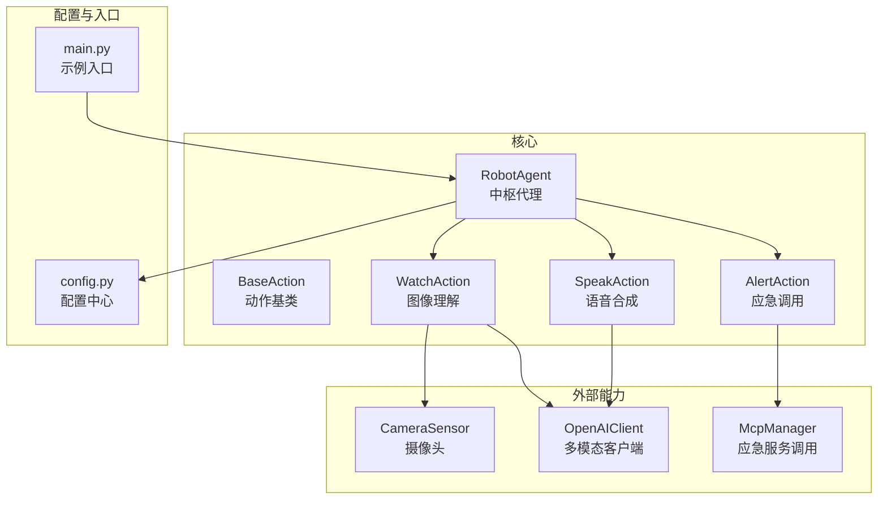
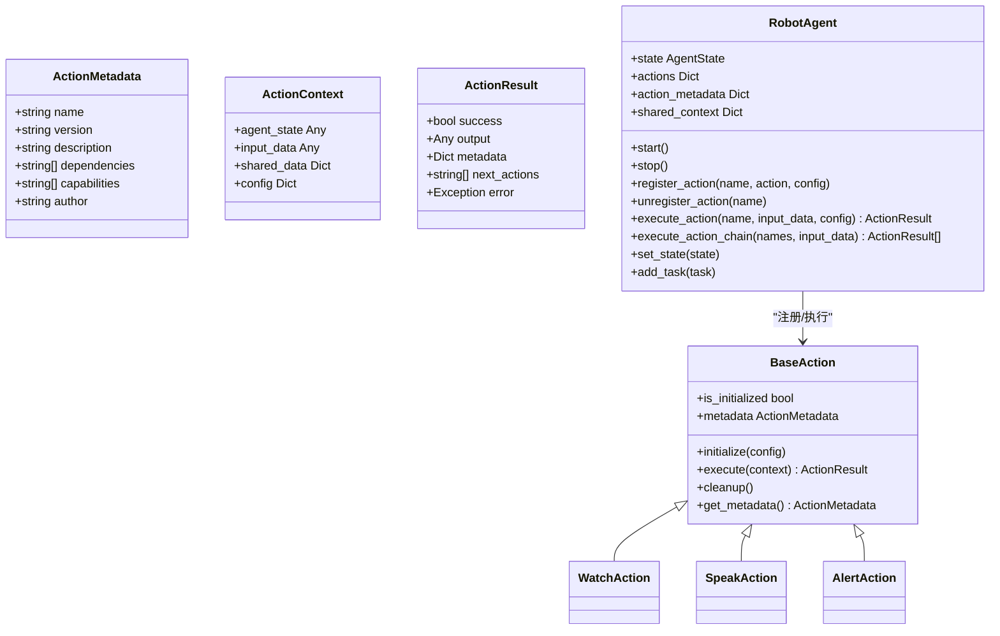
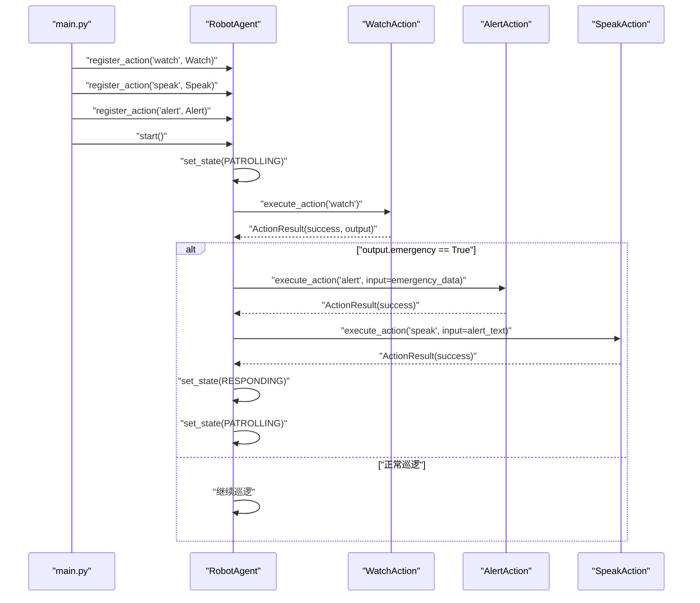
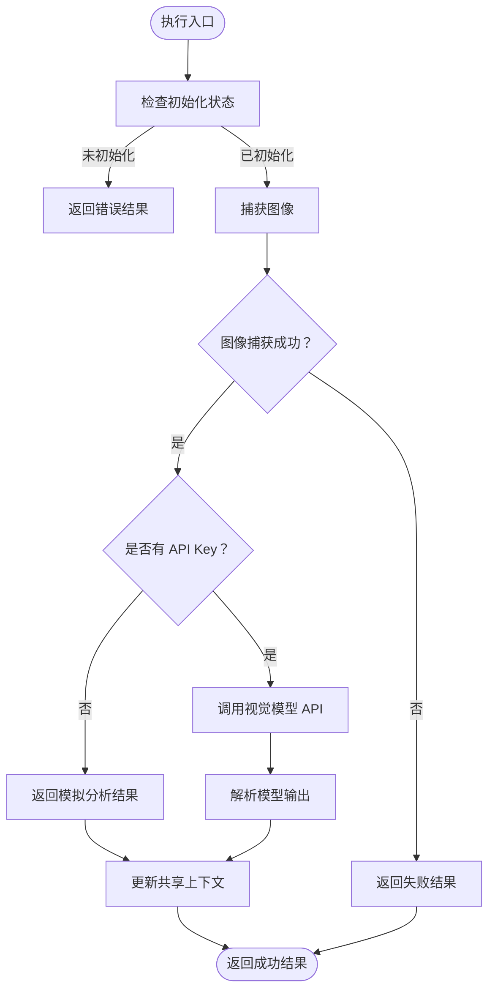
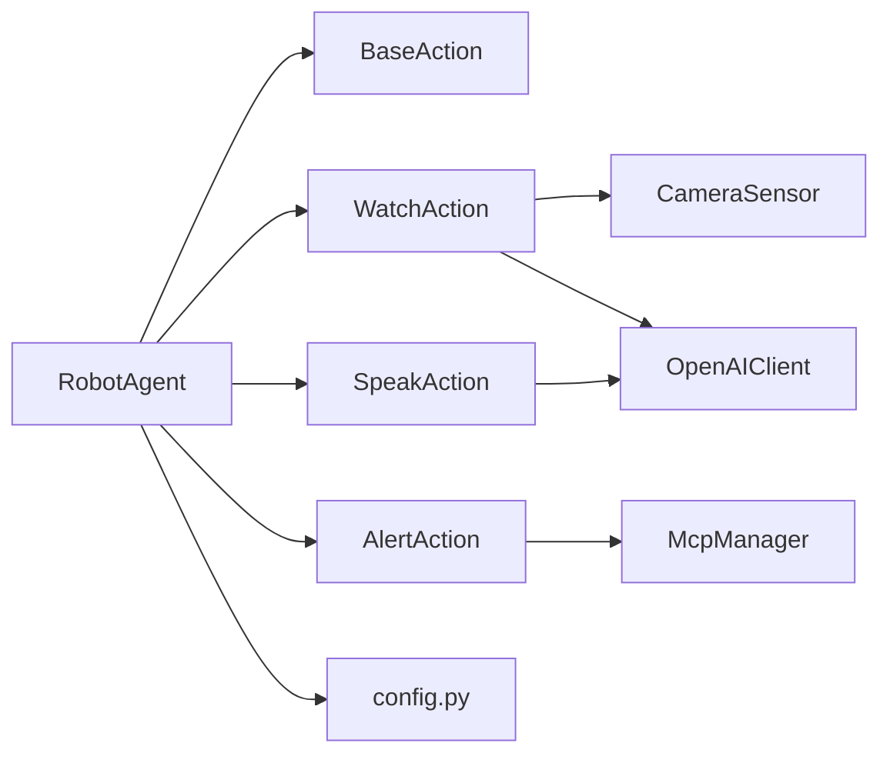

# 动作插件框架

<cite>
**本文引用的文件**
- [README.md](file://README.md)
- [USAGE.md](file://USAGE.md)
- [main.py](file://main.py)
- [config.py](file://config.py)
- [core/action/base.py](file://core/action/base.py)
- [core/action/__init__.py](file://core/action/__init__.py)
- [core/action/watch_action.py](file://core/action/watch_action.py)
- [core/action/speak_action.py](file://core/action/speak_action.py)
- [core/action/alert_action.py](file://core/action/alert_action.py)
- [core/agent.py](file://core/agent.py)
- [core/camera.py](file://core/camera.py)
- [core/client/openai_client.py](file://core/client/openai_client.py)
- [core/mcp_manager.py](file://core/mcp_manager.py)
- [test/test_actions.py](file://test/test_actions.py)
- [test/test_camera.py](file://test/test_camera.py)
</cite>

## 目录
1. [简介](#简介)
2. [项目结构](#项目结构)
3. [核心组件](#核心组件)
4. [架构总览](#架构总览)
5. [组件详解](#组件详解)
6. [依赖关系分析](#依赖关系分析)
7. [性能与可靠性](#性能与可靠性)
8. [故障排查](#故障排查)
9. [结论](#结论)
10. [附录](#附录)

## 简介
本项目是一个基于“动作插件”（Action）机制的机器人智能体框架。通过将具体能力（如图像理解、语音合成、应急调用）封装为可插拔的动作模块，并由中枢代理（RobotAgent）统一调度，实现了高内聚、低耦合、可扩展的架构设计。系统支持 Mock 模式与真实 API 模式，便于开发与部署；同时提供完整的测试覆盖，确保各模块稳定运行。

## 项目结构
- 核心动作基座与内置动作：位于 core/action，包含抽象基类与三个具体动作（watch、speak、alert）。
- 代理中枢：位于 core/agent.py，负责状态管理、动作注册与执行、任务队列与巡逻循环。
- 外部能力适配层：
  - 摄像头传感器：core/camera.py，提供图像采集能力。
  - 多模态模型客户端：core/client/openai_client.py，统一封装视觉理解、语音合成、语音识别等接口。
  - MCP 管理器：core/mcp_manager.py，用于调用外部应急服务（预留）。
- 配置中心：config.py，集中管理硬件与模型配置。
- 入口与示例：main.py 展示如何注册与运行内置动作。
- 文档与测试：README.md、USAGE.md、test/* 提供使用说明与测试用例。

图表来源
- [core/agent.py](file://core/agent.py#L38-L120)
- [core/action/base.py](file://core/action/base.py#L38-L93)
- [core/action/watch_action.py](file://core/action/watch_action.py#L15-L53)
- [core/action/speak_action.py](file://core/action/speak_action.py#L14-L39)
- [core/action/alert_action.py](file://core/action/alert_action.py#L13-L34)
- [core/camera.py](file://core/camera.py#L1-L57)
- [core/client/openai_client.py](file://core/client/openai_client.py#L17-L49)
- [core/mcp_manager.py](file://core/mcp_manager.py#L7-L28)
- [config.py](file://config.py#L1-L17)
- [main.py](file://main.py#L1-L39)

章节来源
- [README.md](file://README.md#L1-L25)
- [USAGE.md](file://USAGE.md#L1-L60)
- [main.py](file://main.py#L1-L39)
- [config.py](file://config.py#L1-L17)

## 核心组件
- 动作基类与数据结构
  - ActionMetadata：描述动作名称、版本、能力、依赖等元信息。
  - ActionContext：执行上下文，包含代理状态、输入数据、共享数据、动态配置。
  - ActionResult：执行结果，包含成功标志、输出、元数据、后续动作、错误信息。
  - BaseAction：抽象基类，定义 initialize、execute、cleanup、get_metadata 四个生命周期方法。
- 代理中枢 RobotAgent
  - 状态管理：IDLE、PATROLLING、RESPONDING、ALERT。
  - 动作注册与执行：register_action、unregister_action、execute_action、execute_action_chain。
  - 巡逻循环：在 PATROLLING 状态下周期性触发 watch，根据结果切换至 ALERT 并执行 alert/speak，再回到 PATROLLING。
  - 任务管理：任务队列、运行中任务、超时取消与清理。
- 内置动作
  - WatchAction：图像采集与视觉理解，支持 Mock 模式与真实 API。
  - SpeakAction：文本转语音，支持 Mock 模式与真实 API。
  - AlertAction：紧急情况调用外部应急服务，使用 McpManager。
- 外部能力
  - CameraSensor：异步图像采集，避免阻塞。
  - OpenAIClient：统一封装 chat/vision/tts/asr 接口，支持重试与超时。
  - McpManager：模拟应急服务调用（预留实现）。

章节来源
- [core/action/base.py](file://core/action/base.py#L8-L93)
- [core/agent.py](file://core/agent.py#L21-L120)
- [core/action/watch_action.py](file://core/action/watch_action.py#L15-L53)
- [core/action/speak_action.py](file://core/action/speak_action.py#L14-L39)
- [core/action/alert_action.py](file://core/action/alert_action.py#L13-L34)
- [core/camera.py](file://core/camera.py#L1-L57)
- [core/client/openai_client.py](file://core/client/openai_client.py#L17-L49)
- [core/mcp_manager.py](file://core/mcp_manager.py#L7-L28)

## 架构总览
该系统采用“中枢代理 + 动作插槽”的架构模式：
- RobotAgent 作为中枢，统一管理动作注册、执行、状态与任务。
- BaseAction 定义标准接口，具体动作实现各自能力。
- 外部能力通过客户端与传感器模块提供，动作内部通过上下文共享数据。
- 配置中心集中管理硬件与模型参数，贯穿各模块。

图表来源
- [core/action/base.py](file://core/action/base.py#L38-L93)
- [core/agent.py](file://core/agent.py#L38-L120)
- [core/action/watch_action.py](file://core/action/watch_action.py#L15-L53)
- [core/action/speak_action.py](file://core/action/speak_action.py#L14-L39)
- [core/action/alert_action.py](file://core/action/alert_action.py#L13-L34)

## 组件详解

### RobotAgent：中枢代理
- 职责
  - 管理代理状态与巡逻循环。
  - 统一注册/注销/执行动作，支持动作链。
  - 管理任务队列与运行中任务，处理超时与取消。
  - 提供共享上下文，供动作间传递数据。
- 关键流程
  - 巡逻循环：在 PATROLLING 状态下周期执行 watch，根据输出决定是否进入 ALERT 并依次执行 alert 与 speak。
  - 动作链：按序执行多个动作，前一个动作的输出作为下一个动作的输入，遇到失败则中断。
  - 任务管理：定时处理队列、检查超时、清理已完成任务。

图表来源
- [main.py](file://main.py#L5-L35)
- [core/agent.py](file://core/agent.py#L238-L300)
- [core/action/watch_action.py](file://core/action/watch_action.py#L95-L181)
- [core/action/alert_action.py](file://core/action/alert_action.py#L54-L113)
- [core/action/speak_action.py](file://core/action/speak_action.py#L78-L155)

章节来源
- [core/agent.py](file://core/agent.py#L21-L120)
- [core/agent.py](file://core/agent.py#L139-L205)
- [core/agent.py](file://core/agent.py#L238-L300)
- [core/agent.py](file://core/agent.py#L301-L380)

### BaseAction 与数据结构
- ActionMetadata：标准化动作元信息，便于 Agent 侧展示与管理。
- ActionContext：统一承载代理状态、输入、共享数据与动态配置，保证动作解耦。
- ActionResult：标准化返回结构，支持错误传播与后续动作建议。
- BaseAction：定义统一生命周期，确保资源初始化与清理一致。

章节来源
- [core/action/base.py](file://core/action/base.py#L8-L93)

### WatchAction：图像理解
- 能力
  - 通过 CameraSensor 捕获图像，调用 OpenAIClient.vision_completion 进行视觉理解。
  - 支持 Mock 模式（无 API Key 时），返回模拟分析结果。
  - 将分析结果写入共享上下文，供后续动作使用。
- 关键点
  - 异步初始化与清理，避免阻塞事件循环。
  - 对输出字段进行健壮性补全，保证下游动作可用。
  - 记录执行耗时与模型信息，便于监控与诊断。

图表来源
- [core/action/watch_action.py](file://core/action/watch_action.py#L95-L181)
- [core/camera.py](file://core/camera.py#L17-L57)
- [core/client/openai_client.py](file://core/client/openai_client.py#L89-L157)

章节来源
- [core/action/watch_action.py](file://core/action/watch_action.py#L15-L53)
- [core/action/watch_action.py](file://core/action/watch_action.py#L54-L94)
- [core/action/watch_action.py](file://core/action/watch_action.py#L95-L181)
- [core/camera.py](file://core/camera.py#L1-L57)
- [core/client/openai_client.py](file://core/client/openai_client.py#L89-L157)

### SpeakAction：语音合成
- 能力
  - 将文本转为音频，支持 Mock 模式与真实 API。
  - 可配置音色与语速，支持自动播放（占位实现）。
- 关键点
  - 优先使用上下文中的 last_vision_result 作为默认文本。
  - 输出包含音频字节与时长，便于后续播放或存储。

章节来源
- [core/action/speak_action.py](file://core/action/speak_action.py#L14-L39)
- [core/action/speak_action.py](file://core/action/speak_action.py#L40-L77)
- [core/action/speak_action.py](file://core/action/speak_action.py#L78-L155)
- [core/action/speak_action.py](file://core/action/speak_action.py#L156-L191)

### AlertAction：应急调用
- 能力
  - 在紧急情况下调用 McpManager.call_emergency_service。
  - 从上下文或共享数据中提取事件详情。
- 关键点
  - 通过 ActionResult 返回调用结果与元数据。
  - 清理资源，确保动作生命周期完整。

章节来源
- [core/action/alert_action.py](file://core/action/alert_action.py#L13-L34)
- [core/action/alert_action.py](file://core/action/alert_action.py#L35-L53)
- [core/action/alert_action.py](file://core/action/alert_action.py#L54-L113)
- [core/mcp_manager.py](file://core/mcp_manager.py#L24-L28)

### OpenAIClient：多模态客户端
- 能力
  - 统一封装 chat、vision、tts、asr 接口。
  - 支持超时与重试策略。
- 关键点
  - 视觉理解时将图像编码为 base64，构造多模态消息。
  - TTS/ASR 为示例实现，若 API 不可用则返回安全的空值，避免崩溃。

章节来源
- [core/client/openai_client.py](file://core/client/openai_client.py#L17-L49)
- [core/client/openai_client.py](file://core/client/openai_client.py#L50-L88)
- [core/client/openai_client.py](file://core/client/openai_client.py#L89-L157)
- [core/client/openai_client.py](file://core/client/openai_client.py#L158-L202)
- [core/client/openai_client.py](file://core/client/openai_client.py#L203-L241)

### CameraSensor：摄像头传感器
- 能力
  - 异步捕获图像，避免阻塞事件循环。
  - 使用 OpenCV 读取帧并编码为 JPEG 字节流。
- 关键点
  - 通过 asyncio.to_thread 在独立线程中执行摄像头操作。
  - 错误处理与资源释放（析构时释放摄像头句柄）。

章节来源
- [core/camera.py](file://core/camera.py#L1-L57)

## 依赖关系分析
- 模块耦合
  - RobotAgent 与 BaseAction：强依赖（注册/执行/链式调用）。
  - 具体动作与外部能力：弱耦合（通过客户端与传感器模块）。
  - 配置中心：全局可见，贯穿各模块。
- 外部依赖
  - OpenCV：图像采集与编码。
  - 异步 OpenAI 客户端：多模态模型调用。
  - 环境变量：OPENAI_API_KEY、OPENAI_BASE_URL。
- 循环依赖
  - 未发现循环导入；动作与代理通过接口解耦。

图表来源
- [core/agent.py](file://core/agent.py#L38-L120)
- [core/action/watch_action.py](file://core/action/watch_action.py#L15-L53)
- [core/action/speak_action.py](file://core/action/speak_action.py#L14-L39)
- [core/action/alert_action.py](file://core/action/alert_action.py#L13-L34)
- [core/camera.py](file://core/camera.py#L1-L57)
- [core/client/openai_client.py](file://core/client/openai_client.py#L17-L49)
- [core/mcp_manager.py](file://core/mcp_manager.py#L7-L28)
- [config.py](file://config.py#L1-L17)

章节来源
- [core/agent.py](file://core/agent.py#L38-L120)
- [core/action/__init__.py](file://core/action/__init__.py#L1-L26)

## 性能与可靠性
- 异步与并发
  - 摄像头采集与模型调用均在异步环境中执行，避免阻塞事件循环。
  - RobotAgent 的巡逻循环与任务管理器分别在独立任务中运行，互不干扰。
- 资源管理
  - 动作在 cleanup 中释放摄像头与客户端连接，防止资源泄漏。
  - 代理在 stop 时统一注销动作并取消所有运行中的任务。
- 错误处理
  - 动作执行过程中捕获异常并返回 ActionResult，便于上层决策。
  - OpenAIClient 提供超时与重试策略，增强鲁棒性。
- Mock 模式
  - 无 API Key 时自动降级为 Mock 模式，保障开发与测试可用性。

章节来源
- [core/camera.py](file://core/camera.py#L17-L57)
- [core/client/openai_client.py](file://core/client/openai_client.py#L17-L49)
- [core/agent.py](file://core/agent.py#L75-L95)
- [core/action/watch_action.py](file://core/action/watch_action.py#L182-L196)
- [core/action/speak_action.py](file://core/action/speak_action.py#L181-L191)
- [core/action/alert_action.py](file://core/action/alert_action.py#L114-L121)

## 故障排查
- 摄像头无法打开
  - 检查设备路径与权限，修改 config.py 中的 VIDEO_DEV。
  - 使用测试用例验证摄像头初始化与捕获流程。
- API 调用失败
  - 确认 OPENAI_API_KEY 与 OPENAI_BASE_URL 配置正确。
  - 若网络受限，可先使用 Mock 模式验证动作链路。
- Action 执行超时
  - 调整 config.py 中的 ACTION_TIMEOUT，或优化动作内部逻辑。
- 动作未注册
  - 确认已在 main.py 或 Agent 中注册相应动作，并检查名称一致。

章节来源
- [USAGE.md](file://USAGE.md#L174-L196)
- [test/test_camera.py](file://test/test_camera.py#L1-L43)
- [test/test_actions.py](file://test/test_actions.py#L191-L281)
- [config.py](file://config.py#L1-L17)

## 结论
该动作插件框架通过清晰的抽象与严格的生命周期管理，实现了对多模态能力的模块化封装与统一调度。RobotAgent 作为中枢，既保证了系统的稳定性，又提供了良好的扩展性。配合 Mock 模式与完善的测试，开发者可以快速迭代新增动作，并在生产环境中安全地接入真实 API。

## 附录
- 快速开始
  - 配置 OPENAI_API_KEY 与 OPENAI_BASE_URL（可选）。
  - 运行示例入口，观察动作注册与巡逻循环。
- 自定义动作
  - 继承 BaseAction，实现 initialize/execute/cleanup/get_metadata。
  - 在 core/action/__init__.py 中导出并在 Agent 中注册使用。
- 测试参考
  - 使用 pytest 运行 test/test_actions.py 与 test/test_camera.py 验证功能。

章节来源
- [USAGE.md](file://USAGE.md#L1-L60)
- [USAGE.md](file://USAGE.md#L145-L232)
- [README.md](file://README.md#L1-L25)
- [test/test_actions.py](file://test/test_actions.py#L1-L120)
- [test/test_camera.py](file://test/test_camera.py#L1-L43)