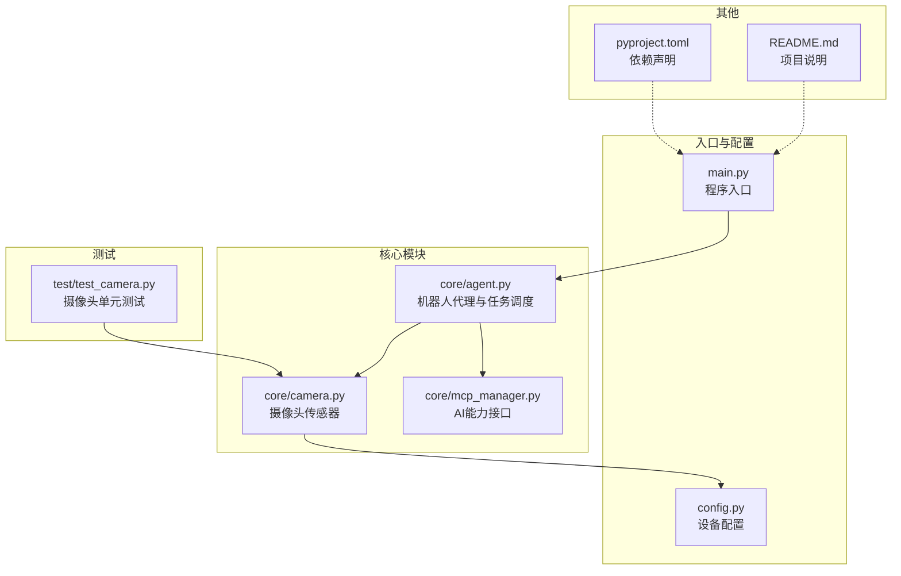
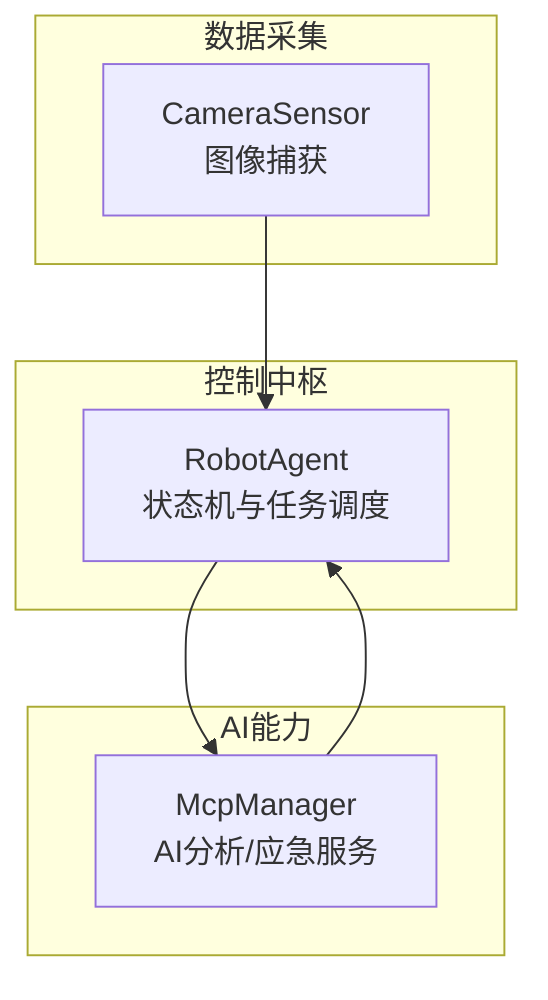
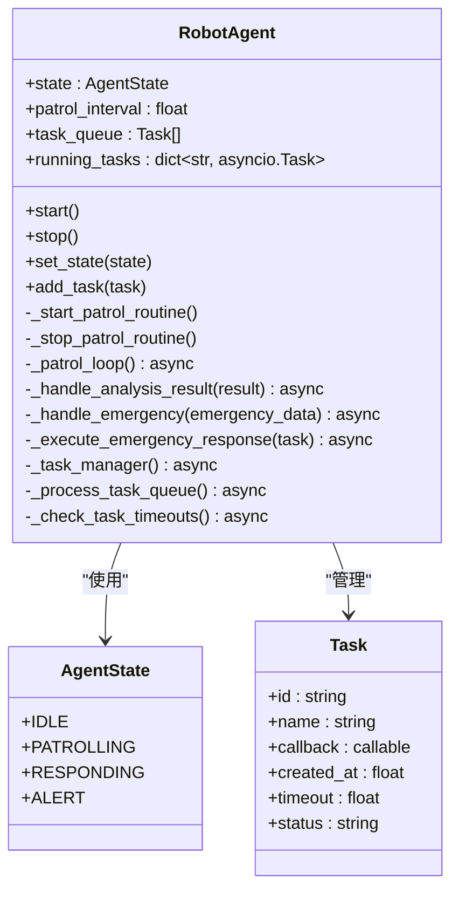
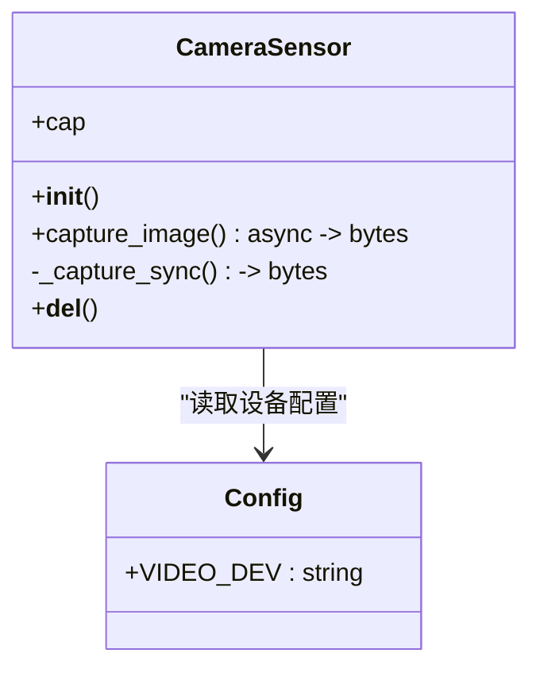
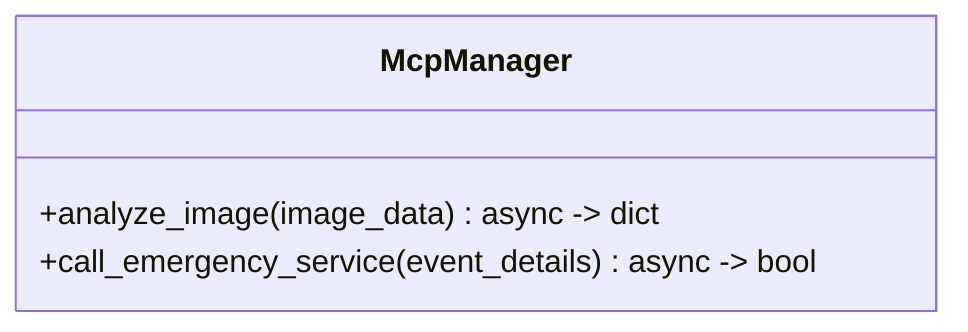
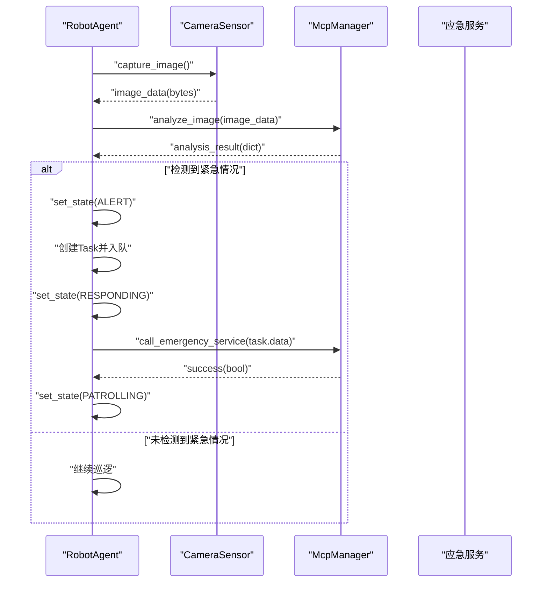
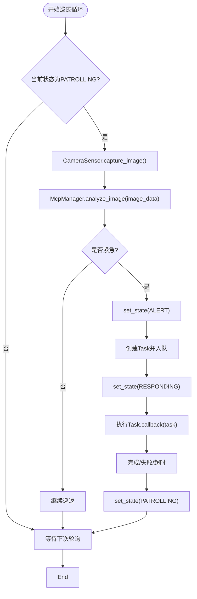
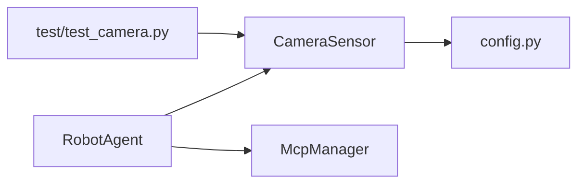

# 核心架构

<cite>
**本文引用的文件**
- [core/agent.py](file://core/agent.py)
- [core/camera.py](file://core/camera.py)
- [core/mcp_manager.py](file://core/mcp_manager.py)
- [main.py](file://main.py)
- [config.py](file://config.py)
- [test/test_camera.py](file://test/test_camera.py)
- [README.md](file://README.md)
- [pyproject.toml](file://pyproject.toml)
</cite>

## 目录
1. [引言](#引言)
2. [项目结构](#项目结构)
3. [核心组件](#核心组件)
4. [架构总览](#架构总览)
5. [详细组件分析](#详细组件分析)
6. [依赖分析](#依赖分析)
7. [性能考虑](#性能考虑)
8. [故障排查指南](#故障排查指南)
9. [结论](#结论)
10. [附录](#附录)

## 引言
本文件面向robot-agent系统的核心架构文档，聚焦三大核心组件及其交互关系：
- RobotAgent：作为控制中枢，负责状态管理（IDLE、PATROLLING、RESPONDING、ALERT）与任务调度；
- CameraSensor：作为数据采集端，负责与摄像头硬件交互并捕获图像数据；
- McpManager：作为AI能力接口，负责将图像发送给AI模型进行分析，并在需要时触发应急服务。

系统采用异步编程模型（asyncio）支撑非阻塞的巡逻循环与任务处理；通过状态模式（AgentState枚举）与观察者模式（任务回调）实现清晰的状态流转与任务执行。本文将绘制组件间的数据流图，并说明核心类RobotAgent在初始化过程中如何建立CameraSensor与McpManager的依赖关系。

## 项目结构
项目采用按功能分层的组织方式，核心逻辑集中在core目录下，入口脚本位于根目录，配置与测试分别独立于核心代码之外。

图表来源
- [core/agent.py](file://core/agent.py#L1-L278)
- [core/camera.py](file://core/camera.py#L1-L57)
- [core/mcp_manager.py](file://core/mcp_manager.py#L1-L28)
- [main.py](file://main.py#L1-L7)
- [config.py](file://config.py#L1-L1)
- [test/test_camera.py](file://test/test_camera.py#L1-L43)
- [README.md](file://README.md#L1-L18)
- [pyproject.toml](file://pyproject.toml#L1-L14)

章节来源
- [README.md](file://README.md#L1-L18)
- [pyproject.toml](file://pyproject.toml#L1-L14)

## 核心组件
- RobotAgent：定义状态枚举、任务数据结构与状态机；维护CameraSensor与McpManager实例；提供巡逻循环、任务队列与超时管理；在状态切换时启动/停止巡逻与任务管理协程。
- CameraSensor：封装OpenCV摄像头访问，提供异步捕获图像的能力，内部通过线程池避免阻塞事件循环。
- McpManager：封装AI分析与应急服务调用，提供异步接口以支持非阻塞的分析与服务调用。

章节来源
- [core/agent.py](file://core/agent.py#L1-L278)
- [core/camera.py](file://core/camera.py#L1-L57)
- [core/mcp_manager.py](file://core/mcp_manager.py#L1-L28)

## 架构总览
系统采用“控制中枢 + 数据采集 + AI能力”的分层架构。RobotAgent作为协调者，驱动CameraSensor采集图像并通过McpManager进行AI分析，根据分析结果进入不同状态并调度任务。AI分析结果可能触发紧急响应流程，最终调用应急服务。

图表来源
- [core/agent.py](file://core/agent.py#L1-L278)
- [core/camera.py](file://core/camera.py#L1-L57)
- [core/mcp_manager.py](file://core/mcp_manager.py#L1-L28)

## 详细组件分析

### RobotAgent 类与状态机
RobotAgent通过状态枚举与状态切换方法实现状态机，支持IDLE、PATROLLING、RESPONDING、ALERT四种状态。在PATROLLING状态下，RobotAgent持续执行巡逻循环，周期性地调用CameraSensor捕获图像并交由McpManager进行分析，依据分析结果决定是否进入ALERT并创建紧急响应任务，随后切换至RESPONDING并执行任务队列。

图表来源
- [core/agent.py](file://core/agent.py#L1-L278)

章节来源
- [core/agent.py](file://core/agent.py#L1-L278)

### CameraSensor 图像采集
CameraSensor封装了OpenCV摄像头的初始化、帧读取与JPEG编码过程，并通过异步线程池避免阻塞事件循环。其异步捕获接口返回图像字节数据，供RobotAgent在巡逻循环中使用。

图表来源
- [core/camera.py](file://core/camera.py#L1-L57)
- [config.py](file://config.py#L1-L1)

章节来源
- [core/camera.py](file://core/camera.py#L1-L57)
- [config.py](file://config.py#L1-L1)

### McpManager AI能力接口
McpManager提供两类异步接口：图像分析与应急服务调用。分析接口返回包含检测结果与是否紧急的字典；应急服务接口用于触发外部应急流程。两者均通过短暂的异步等待模拟AI推理与外部服务调用的耗时。

图表来源
- [core/mcp_manager.py](file://core/mcp_manager.py#L1-L28)

章节来源
- [core/mcp_manager.py](file://core/mcp_manager.py#L1-L28)

### 数据流与处理序列
- 摄像头 → CameraSensor → RobotAgent → McpManager → AI服务
- AI分析结果 → RobotAgent → 任务队列 → 应急服务

图表来源
- [core/agent.py](file://core/agent.py#L108-L179)
- [core/camera.py](file://core/camera.py#L17-L29)
- [core/mcp_manager.py](file://core/mcp_manager.py#L10-L28)

### 巡逻循环与任务管理流程
- 巡逻循环：在PATROLLING状态下，RobotAgent周期性捕获图像并分析，根据结果切换状态或继续巡逻。
- 任务管理：RobotAgent维护任务队列与运行中任务映射，定时处理队列、检查超时并清理完成/超时任务。

图表来源
- [core/agent.py](file://core/agent.py#L108-L179)
- [core/agent.py](file://core/agent.py#L182-L261)

## 依赖分析
- RobotAgent依赖CameraSensor与McpManager，形成控制中枢对数据采集与AI能力的耦合。
- CameraSensor依赖OpenCV与配置文件，负责硬件交互与图像编码。
- McpManager提供抽象的AI分析与应急服务调用接口，便于替换具体实现。
- 测试模块对CameraSensor进行异步单元测试，验证初始化与捕获成功/失败场景。

图表来源
- [core/agent.py](file://core/agent.py#L1-L278)
- [core/camera.py](file://core/camera.py#L1-L57)
- [core/mcp_manager.py](file://core/mcp_manager.py#L1-L28)
- [config.py](file://config.py#L1-L1)
- [test/test_camera.py](file://test/test_camera.py#L1-L43)

章节来源
- [core/agent.py](file://core/agent.py#L1-L278)
- [core/camera.py](file://core/camera.py#L1-L57)
- [core/mcp_manager.py](file://core/mcp_manager.py#L1-L28)
- [config.py](file://config.py#L1-L1)
- [test/test_camera.py](file://test/test_camera.py#L1-L43)

## 性能考虑
- 使用异步I/O与线程池：CameraSensor通过异步线程池执行OpenCV的阻塞操作，避免阻塞事件循环，保证巡逻循环的非阻塞性。
- 任务超时与并发控制：RobotAgent对任务队列与运行中任务进行超时检查与清理，防止长时间挂起的任务占用资源。
- 状态切换与协程生命周期：在状态切换时启动/停止巡逻与任务管理协程，确保资源合理分配与回收。
- AI调用延迟：McpManager的分析与应急服务调用通过短暂异步等待模拟真实延迟，避免同步阻塞。

章节来源
- [core/camera.py](file://core/camera.py#L17-L29)
- [core/agent.py](file://core/agent.py#L182-L261)
- [core/mcp_manager.py](file://core/mcp_manager.py#L10-L28)

## 故障排查指南
- 摄像头无法打开或读取失败：检查设备路径配置与OpenCV可用性；参考测试用例中的模拟场景定位问题。
- 拍照返回空数据：确认摄像头初始化与帧读取是否成功；查看异常日志输出。
- 巡逻循环不工作：确认RobotAgent处于PATROLLING状态且巡逻协程未被取消；检查状态切换逻辑。
- 任务超时或未完成：检查任务超时阈值与回调执行情况；查看任务状态更新与清理逻辑。
- 应急服务调用失败：确认McpManager的应急服务接口返回值与异常处理逻辑。

章节来源
- [test/test_camera.py](file://test/test_camera.py#L1-L43)
- [core/camera.py](file://core/camera.py#L31-L57)
- [core/agent.py](file://core/agent.py#L182-L261)
- [core/mcp_manager.py](file://core/mcp_manager.py#L24-L28)

## 结论
robot-agent系统通过清晰的职责划分与异步架构实现了高效的巡检与应急响应能力。RobotAgent作为控制中枢，结合CameraSensor与McpManager，构建了从图像采集到AI分析再到应急处置的完整闭环。状态模式与任务队列机制使系统具备良好的可扩展性与可维护性。

## 附录
- 入口脚本与运行方式：入口脚本位于根目录，使用异步运行器启动主流程；请参考项目说明与依赖声明。
- 依赖声明：项目使用Python 3.12+，依赖asyncio、numpy、opencv-python、pytest与pytest-asyncio等库。

章节来源
- [main.py](file://main.py#L1-L7)
- [README.md](file://README.md#L1-L18)
- [pyproject.toml](file://pyproject.toml#L1-L14)