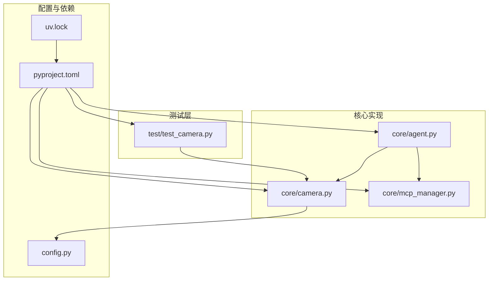
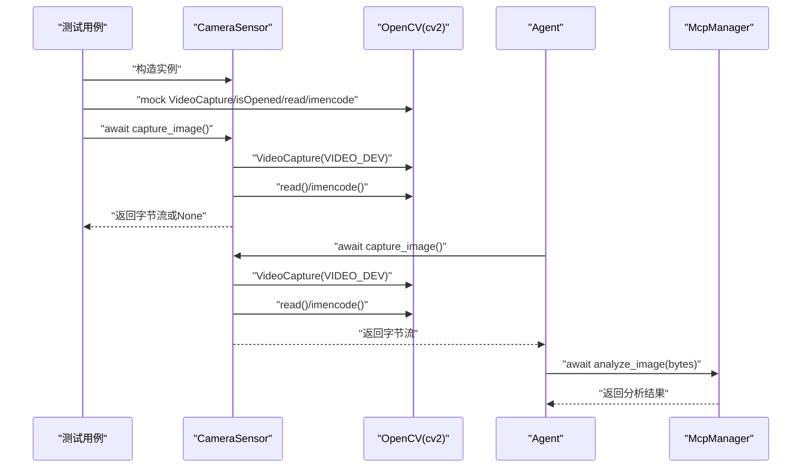
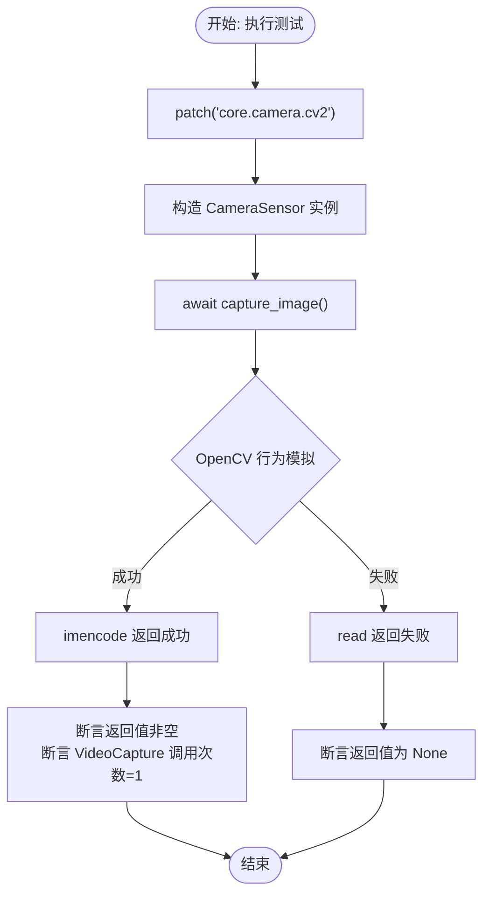
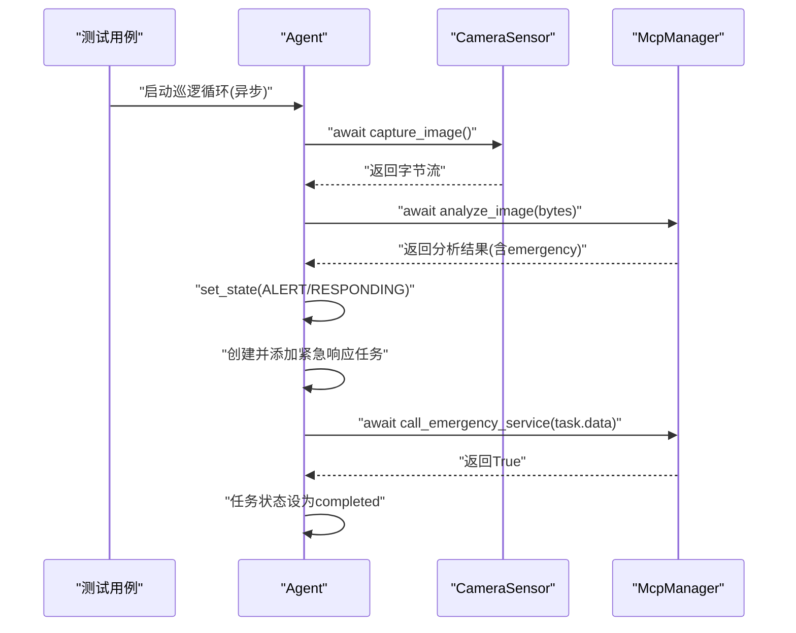
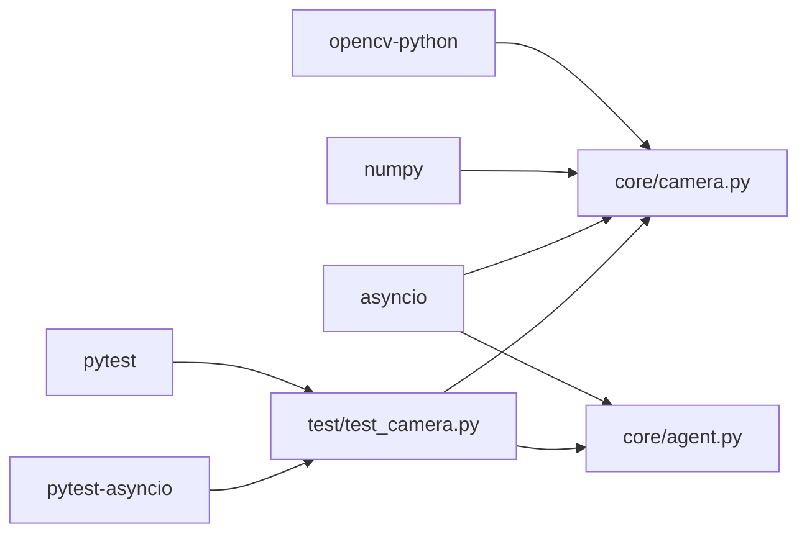

# 测试指南

<cite>
**本文引用的文件**
- [README.md](file://README.md)
- [test/test_camera.py](file://test/test_camera.py)
- [core/camera.py](file://core/camera.py)
- [core/mcp_manager.py](file://core/mcp_manager.py)
- [core/agent.py](file://core/agent.py)
- [config.py](file://config.py)
- [pyproject.toml](file://pyproject.toml)
- [uv.lock](file://uv.lock)
</cite>

## 目录
1. [简介](#简介)
2. [项目结构](#项目结构)
3. [核心组件](#核心组件)
4. [架构总览](#架构总览)
5. [详细组件分析](#详细组件分析)
6. [依赖分析](#依赖分析)
7. [性能考虑](#性能考虑)
8. [故障排查指南](#故障排查指南)
9. [结论](#结论)
10. [附录](#附录)

## 简介
本指南面向 robot-agent 项目的测试实践，目标是帮助开发者：
- 使用 uv run pytest 快速运行全部单元测试；
- 深入理解 test/test_camera.py 对 CameraSensor 的测试设计与断言策略；
- 掌握 pytest 异步测试模式与 mock 技术；
- 基于现有测试范式编写新的测试用例，覆盖摄像头硬件交互与 AI 服务调用逻辑；
- 明确测试在保障摄像头采集与 AI 分析正确性方面的重要作用。

## 项目结构
项目采用按功能模块组织的目录结构，测试位于 test 目录下，核心业务逻辑分布在 core 目录中。关键文件如下：
- README.md：提供测试运行说明与示例命令；
- test/test_camera.py：针对摄像头传感器的单元测试；
- core/camera.py：摄像头采集与图像编码的核心实现；
- core/mcp_manager.py：AI 分析与紧急服务调用的模拟实现；
- core/agent.py：机器人代理的状态机与任务调度，串联摄像头与 AI；
- config.py：摄像头设备号等配置；
- pyproject.toml：项目依赖与工具链声明；
- uv.lock：锁定依赖版本，确保可复现的测试环境。

图表来源
- [test/test_camera.py](file://test/test_camera.py#L1-L43)
- [core/camera.py](file://core/camera.py#L1-L57)
- [core/mcp_manager.py](file://core/mcp_manager.py#L1-L28)
- [core/agent.py](file://core/agent.py#L1-L170)
- [config.py](file://config.py#L1-L1)
- [pyproject.toml](file://pyproject.toml#L1-L14)
- [uv.lock](file://uv.lock#L1-L192)

章节来源
- [README.md](file://README.md#L1-L18)
- [pyproject.toml](file://pyproject.toml#L1-L14)

## 核心组件
- 摄像头传感器 CameraSensor：负责初始化摄像头、异步捕获图像帧并编码为 JPEG 字节流；通过 asyncio.to_thread 避免阻塞事件循环。
- MCP 管理器 McpManager：模拟 AI 图像分析与紧急服务调用，返回结构化结果并支持异步等待。
- 机器人代理 Agent：维护状态机（空闲、巡逻、响应、告警），在巡逻循环中调用摄像头采集与 AI 分析，并根据结果切换状态与派发任务。
- 配置 VIDEO_DEV：指定摄像头设备号，影响摄像头打开行为。

章节来源
- [core/camera.py](file://core/camera.py#L1-L57)
- [core/mcp_manager.py](file://core/mcp_manager.py#L1-L28)
- [core/agent.py](file://core/agent.py#L1-L170)
- [config.py](file://config.py#L1-L1)

## 架构总览
下图展示了摄像头采集与 AI 分析在代理中的协作流程，以及测试如何通过 mock OpenCV 来隔离硬件依赖。

图表来源
- [test/test_camera.py](file://test/test_camera.py#L1-L43)
- [core/camera.py](file://core/camera.py#L1-L57)
- [core/agent.py](file://core/agent.py#L100-L140)
- [core/mcp_manager.py](file://core/mcp_manager.py#L1-L28)

## 详细组件分析

### 摄像头传感器 CameraSensor 的测试
- 测试目标
  - 验证摄像头初始化阶段 cap 是否为 None；
  - 验证成功捕获图像时返回非空字节流且仅调用一次 VideoCapture；
  - 验证捕获失败时返回 None。
- 测试策略
  - 使用 @patch('core.camera.cv2') 将 OpenCV 的 VideoCapture、isOpened、read、imencode 等方法替换为 Mock；
  - 使用 @pytest.mark.asyncio 支持异步测试；
  - 使用 asyncio.to_thread 包装同步捕获逻辑，避免阻塞事件循环。
- 断言要点
  - 成功路径断言返回值非空并验证 VideoCapture 被调用一次；
  - 失败路径断言返回值为空。

图表来源
- [test/test_camera.py](file://test/test_camera.py#L1-L43)
- [core/camera.py](file://core/camera.py#L1-L57)

章节来源
- [test/test_camera.py](file://test/test_camera.py#L1-L43)
- [core/camera.py](file://core/camera.py#L1-L57)

### 代理状态转换与 AI 调用的测试建议
- 目标
  - 验证代理在巡逻循环中正确调用摄像头与 AI；
  - 验证紧急检测触发后状态从巡逻切换至告警与响应；
  - 验证紧急响应任务创建与完成状态更新。
- 测试策略
  - 使用 pytest-asyncio 运行异步测试；
  - 使用 unittest.mock.patch 替换 McpManager 的 analyze_image 与 call_emergency_service，注入可控结果；
  - 使用 monkeypatch 或自定义工厂函数注入 Mocked McpManager；
  - 验证状态枚举变化与任务队列行为。
- 关键断言
  - 状态从 PATROLLING 变为 ALERT 再变为 RESPONDING；
  - 任务队列包含一条紧急响应任务且状态为 completed；
  - analyze_image 与 call_emergency_service 的调用次数与参数符合预期。

图表来源
- [core/agent.py](file://core/agent.py#L100-L170)
- [core/mcp_manager.py](file://core/mcp_manager.py#L1-L28)
- [core/camera.py](file://core/camera.py#L1-L57)

章节来源
- [core/agent.py](file://core/agent.py#L1-L170)
- [core/mcp_manager.py](file://core/mcp_manager.py#L1-L28)

## 依赖分析
- 工具链依赖
  - pytest 与 pytest-asyncio：提供异步测试支持与丰富的断言能力；
  - opencv-python：摄像头采集与图像编码；
  - numpy：图像处理基础库；
  - asyncio：异步运行时与线程池封装。
- 版本锁定
  - uv.lock 锁定依赖版本，确保不同环境的一致性与可复现性。

图表来源
- [pyproject.toml](file://pyproject.toml#L1-L14)
- [uv.lock](file://uv.lock#L1-L192)
- [test/test_camera.py](file://test/test_camera.py#L1-L43)
- [core/camera.py](file://core/camera.py#L1-L57)
- [core/agent.py](file://core/agent.py#L1-L170)

章节来源
- [pyproject.toml](file://pyproject.toml#L1-L14)
- [uv.lock](file://uv.lock#L1-L192)

## 性能考虑
- 异步与线程池
  - CameraSensor 使用 asyncio.to_thread 将同步捕获逻辑放入线程池，避免阻塞事件循环，提升并发吞吐；
  - 在测试中应避免过度并发导致的 mock 调用顺序不确定性，必要时使用同步上下文或显式控制。
- 图像编码成本
  - imencode 会占用 CPU，测试中可通过合理设置编码质量与尺寸参数减少开销；
  - 在 CI 环境中建议关闭实时打印或重定向日志以降低 I/O 开销。
- 状态机与任务调度
  - 代理的巡逻间隔与任务超时会影响测试耗时，建议在测试中缩短间隔并使用快进或时间模拟技术（如 freezegun）以加速测试。

## 故障排查指南
- 常见问题
  - OpenCV 设备不可用：检查 VIDEO_DEV 配置与设备是否存在；在测试中通过 patch 模拟设备打开成功；
  - 捕获帧失败：确认 read 返回值与异常分支；在测试中通过 patch 控制返回值；
  - 异步测试未生效：确认使用了 @pytest.mark.asyncio 并正确 await；
  - 依赖缺失：确保安装了 pytest、pytest-asyncio、opencv-python、numpy、asyncio。
- 定位手段
  - 使用 -v 输出详细信息，定位具体断言失败点；
  - 使用 -s 输出 print 日志，观察摄像头与 AI 的中间状态；
  - 逐步缩小 mock 范围，先验证单个路径再组合多路径。
- 修复建议
  - 对摄像头路径：优先保证 VideoCapture 与 isOpened 的返回值一致；
  - 对 AI 路径：确保 analyze_image 返回稳定的结构化结果，call_emergency_service 返回布尔值；
  - 对代理路径：验证状态切换与任务队列的原子性，避免竞态条件。

章节来源
- [test/test_camera.py](file://test/test_camera.py#L1-L43)
- [core/camera.py](file://core/camera.py#L1-L57)
- [core/agent.py](file://core/agent.py#L100-L170)
- [config.py](file://config.py#L1-L1)

## 结论
本指南系统梳理了 robot-agent 的测试实践，重点围绕摄像头采集与 AI 服务调用两条主线展开。通过 pytest 与 pytest-asyncio 的异步支持，结合对 OpenCV 的 mock，能够在不依赖真实硬件的情况下稳定验证核心逻辑。建议后续扩展测试覆盖面，补充代理状态转换、任务调度与错误恢复路径的测试，持续提升系统的可靠性与可维护性。

## 附录

### 如何运行测试
- 运行全部单元测试
  - 使用命令：uv run pytest
  - 查看详细输出：uv run pytest -v
- 运行特定测试用例
  - 示例命令：uv run pytest test/test_camera.py::test_camera_initialization -s
  - 其他常用命令参考 README 中的示例

章节来源
- [README.md](file://README.md#L1-L18)

### 编写新测试用例的指导原则
- 针对 CameraSensor
  - 使用 @pytest.mark.asyncio；
  - 使用 @patch('core.camera.cv2') 模拟 VideoCapture、isOpened、read、imencode；
  - 分别验证成功与失败路径，断言返回值与调用次数。
- 针对 McpManager
  - 使用 @patch('core.mcp_manager.McpManager') 注入可控返回值；
  - 验证 analyze_image 的输入输出格式与 call_emergency_service 的返回布尔值。
- 针对 Agent
  - 使用 monkeypatch 注入 Mocked McpManager；
  - 验证状态枚举变化与任务队列行为；
  - 使用异步断言与超时控制，避免无限等待。

章节来源
- [test/test_camera.py](file://test/test_camera.py#L1-L43)
- [core/camera.py](file://core/camera.py#L1-L57)
- [core/mcp_manager.py](file://core/mcp_manager.py#L1-L28)
- [core/agent.py](file://core/agent.py#L1-L170)