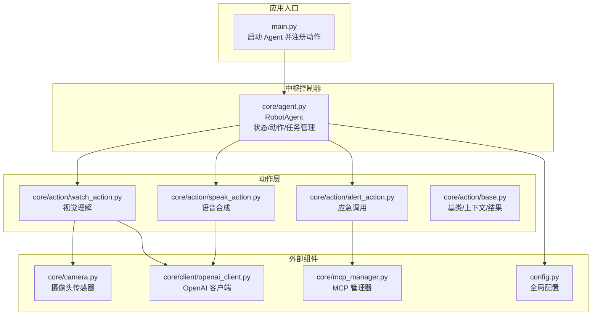
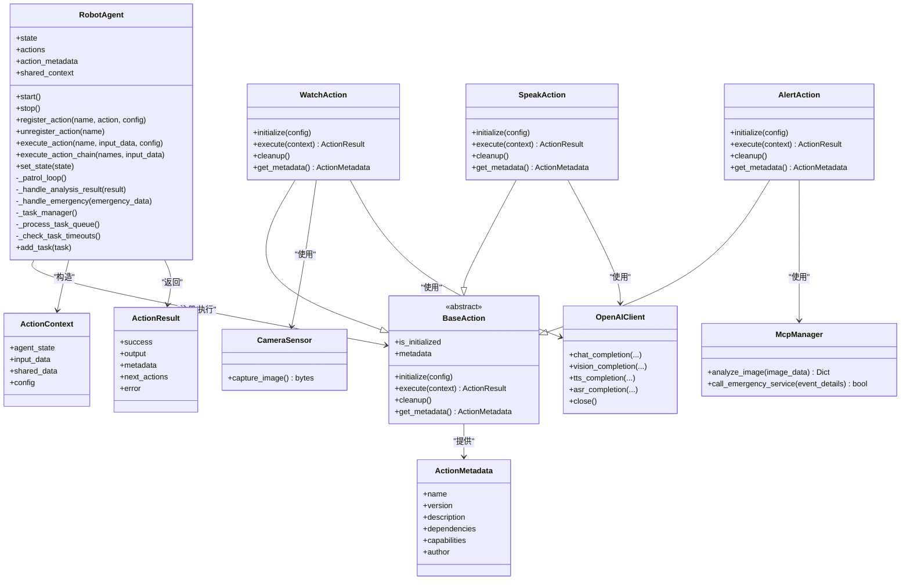
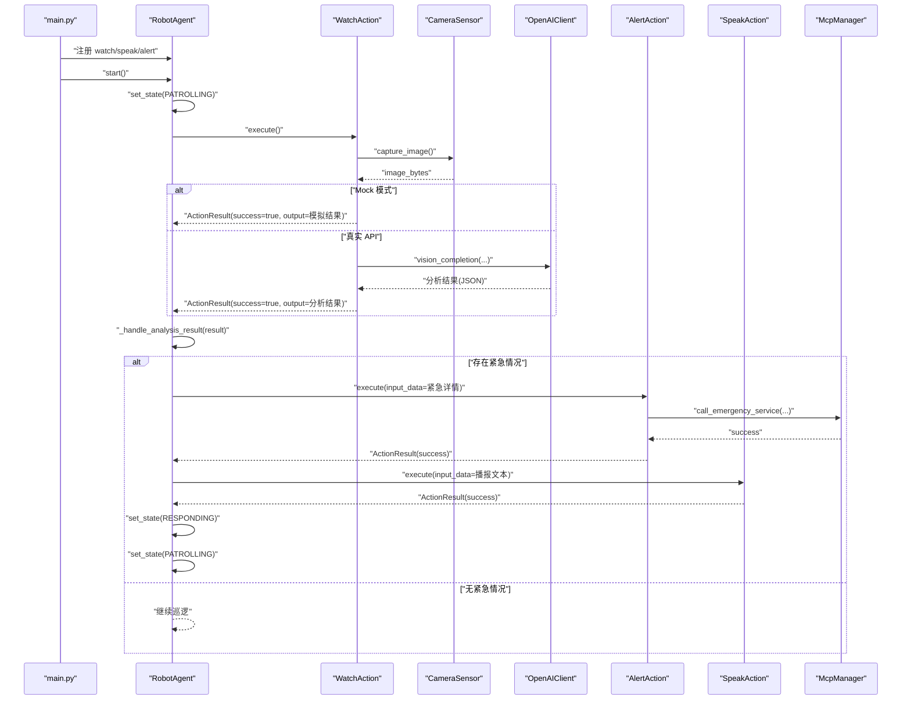
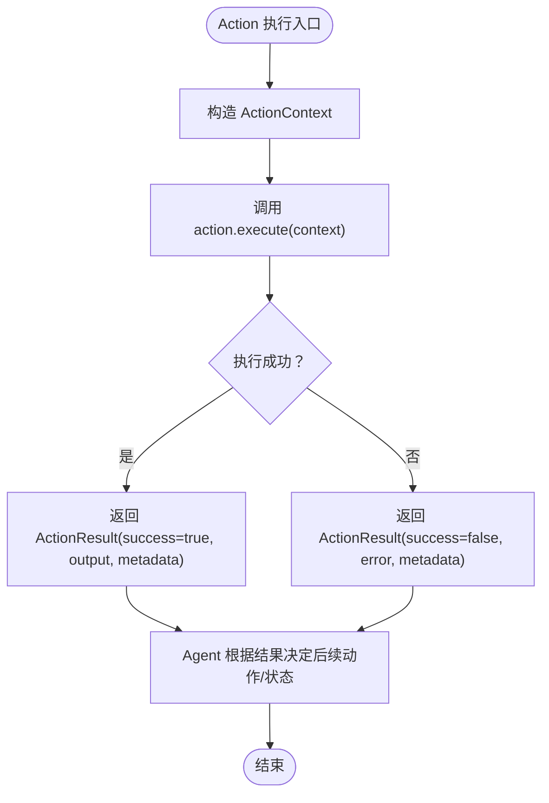
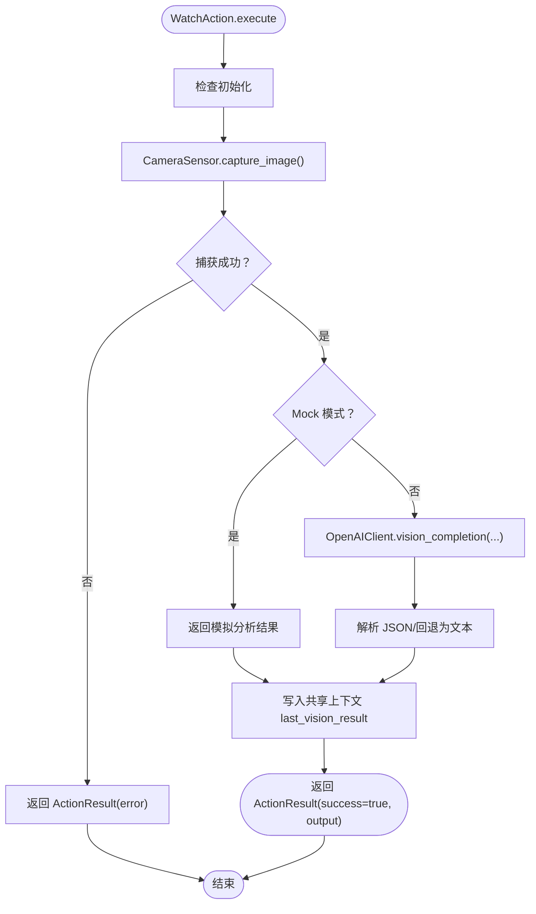
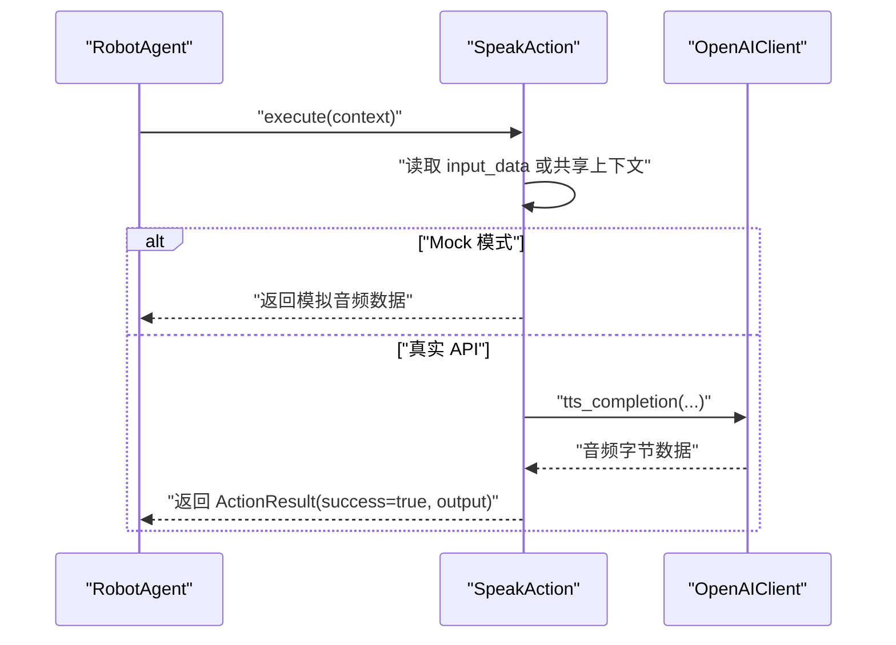
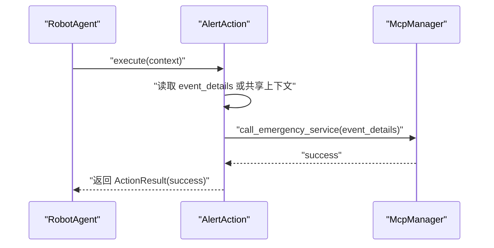
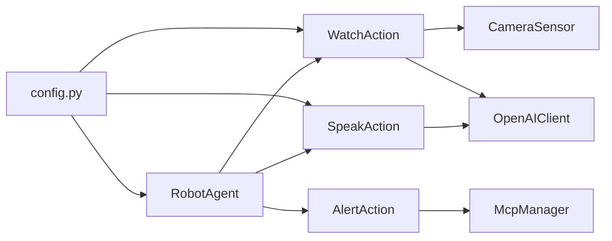

# 视觉感知动作

<cite>
**本文引用的文件**
- [README.md](file://README.md)
- [USAGE.md](file://USAGE.md)
- [main.py](file://main.py)
- [config.py](file://config.py)
- [core/agent.py](file://core/agent.py)
- [core/action/base.py](file://core/action/base.py)
- [core/action/watch_action.py](file://core/action/watch_action.py)
- [core/action/speak_action.py](file://core/action/speak_action.py)
- [core/action/alert_action.py](file://core/action/alert_action.py)
- [core/camera.py](file://core/camera.py)
- [core/client/openai_client.py](file://core/client/openai_client.py)
- [core/mcp_manager.py](file://core/mcp_manager.py)
- [test/test_actions.py](file://test/test_actions.py)
- [test/test_camera.py](file://test/test_camera.py)
- [test/test_camera_integration.py](file://test/test_camera_integration.py)
</cite>

## 目录
1. [简介](#简介)
2. [项目结构](#项目结构)
3. [核心组件](#核心组件)
4. [架构总览](#架构总览)
5. [组件详解](#组件详解)
6. [依赖关系分析](#依赖关系分析)
7. [性能与可靠性](#性能与可靠性)
8. [故障排查](#故障排查)
9. [结论](#结论)
10. [附录](#附录)

## 简介
本项目是一个基于“动作（Action）插槽机制”的巡检机器人中枢控制器，围绕“视觉感知”能力构建，支持在巡逻周期内自动抓取图像、调用视觉模型进行分析，并在检测到异常时触发语音播报与应急调用流程。系统采用异步架构，具备良好的可扩展性，可通过注册不同的 Action 实现能力扩展。

- 支持的内置动作：
  - 视觉理解：捕获图像并进行场景分析，输出是否存在紧急情况、置信度与描述等。
  - 语音合成：将文本转换为语音（可选自动播放）。
  - 应急调用：在检测到紧急情况时调用应急服务。

- 运行与测试：
  - 使用 pytest 运行单元测试与集成测试。
  - 支持 Mock 模式与生产模式（需配置 API 密钥）。

**章节来源**
- [README.md](file://README.md#L1-L25)
- [USAGE.md](file://USAGE.md#L1-L232)

## 项目结构
项目采用“分层+功能模块化”的组织方式：
- 核心中枢：Agent 负责状态管理、动作注册与执行、任务调度与巡逻循环。
- 动作层：每个 Action 封装独立的能力（如视觉理解、语音合成、应急调用），通过统一的基类接口接入。
- 外设与客户端：摄像头传感器、OpenAI 客户端、MCP 管理器等。
- 配置与入口：全局配置、主程序入口、测试用例。

**图表来源**
- [main.py](file://main.py#L1-L39)
- [core/agent.py](file://core/agent.py#L1-L404)
- [core/action/watch_action.py](file://core/action/watch_action.py#L1-L196)
- [core/action/speak_action.py](file://core/action/speak_action.py#L1-L191)
- [core/action/alert_action.py](file://core/action/alert_action.py#L1-L121)
- [core/action/base.py](file://core/action/base.py#L1-L93)
- [core/camera.py](file://core/camera.py#L1-L57)
- [core/client/openai_client.py](file://core/client/openai_client.py#L1-L247)
- [core/mcp_manager.py](file://core/mcp_manager.py#L1-L28)
- [config.py](file://config.py#L1-L17)

**章节来源**
- [main.py](file://main.py#L1-L39)
- [core/agent.py](file://core/agent.py#L1-L120)
- [core/action/base.py](file://core/action/base.py#L1-L93)
- [config.py](file://config.py#L1-L17)

## 核心组件
- RobotAgent：中枢控制器，负责状态机、动作注册与执行、任务队列与巡逻循环。
- BaseAction 及其派生类：定义动作的统一接口与上下文/结果数据结构；具体动作包括 WatchAction、SpeakAction、AlertAction。
- CameraSensor：摄像头采集图像的适配层，使用 OpenCV 异步捕获。
- OpenAIClient：统一的 OpenAI 兼容客户端，支持聊天、视觉理解、TTS、ASR。
- McpManager：应急服务调用器（模拟实现）。
- 配置模块：集中管理摄像头设备、API 密钥、模型名称与巡逻间隔等。

**章节来源**
- [core/agent.py](file://core/agent.py#L1-L200)
- [core/action/base.py](file://core/action/base.py#L1-L93)
- [core/action/watch_action.py](file://core/action/watch_action.py#L1-L196)
- [core/action/speak_action.py](file://core/action/speak_action.py#L1-L191)
- [core/action/alert_action.py](file://core/action/alert_action.py#L1-L121)
- [core/camera.py](file://core/camera.py#L1-L57)
- [core/client/openai_client.py](file://core/client/openai_client.py#L1-L247)
- [core/mcp_manager.py](file://core/mcp_manager.py#L1-L28)
- [config.py](file://config.py#L1-L17)

## 架构总览
系统采用“中枢控制器 + 动作插槽 + 外设/客户端”的分层架构：
- 中枢控制器（Agent）通过动作注册表管理动作生命周期与执行顺序。
- 动作通过上下文 ActionContext 接收 Agent 状态、输入数据、共享数据与动态配置。
- 动作执行结果 ActionResult 统一承载成功与否、输出、元数据与后续动作建议。
- 外设与客户端以最小耦合的方式被动作调用，支持 Mock 模式与真实 API。

**图表来源**
- [core/agent.py](file://core/agent.py#L1-L404)
- [core/action/base.py](file://core/action/base.py#L1-L93)
- [core/action/watch_action.py](file://core/action/watch_action.py#L1-L196)
- [core/action/speak_action.py](file://core/action/speak_action.py#L1-L191)
- [core/action/alert_action.py](file://core/action/alert_action.py#L1-L121)
- [core/camera.py](file://core/camera.py#L1-L57)
- [core/client/openai_client.py](file://core/client/openai_client.py#L1-L247)
- [core/mcp_manager.py](file://core/mcp_manager.py#L1-L28)

## 组件详解

### RobotAgent（中枢控制器）
- 职责
  - 状态管理：IDLE/PATROLLING/RESPONDING/ALERT。
  - 动作管理：注册、注销、执行与链式执行。
  - 巡逻循环：周期性执行“视觉理解”动作，并根据结果切换状态与执行后续动作。
  - 任务管理：维护任务队列、运行中任务、超时处理。
- 关键流程
  - 巡逻循环：在 PATROLLING 状态下定期执行 watch 动作，若返回紧急情况则进入 ALERT 并依次执行 alert 与 speak，再回到 PATROLLING。
  - 任务管理：定时处理队列、检查超时并清理已完成任务。
- 错误处理
  - 动作执行失败返回 ActionResult 并记录错误。
  - 巡逻循环与任务管理对异常进行捕获并打印日志。

**图表来源**
- [main.py](file://main.py#L1-L39)
- [core/agent.py](file://core/agent.py#L200-L380)
- [core/action/watch_action.py](file://core/action/watch_action.py#L95-L181)
- [core/action/alert_action.py](file://core/action/alert_action.py#L54-L113)
- [core/action/speak_action.py](file://core/action/speak_action.py#L78-L155)
- [core/camera.py](file://core/camera.py#L17-L57)
- [core/client/openai_client.py](file://core/client/openai_client.py#L89-L157)
- [core/mcp_manager.py](file://core/mcp_manager.py#L24-L28)

**章节来源**
- [core/agent.py](file://core/agent.py#L1-L404)

### BaseAction 与数据结构
- ActionMetadata：描述动作名称、版本、能力、依赖等。
- ActionContext：传递 Agent 状态、输入数据、共享数据与动态配置。
- ActionResult：统一返回结构，包含成功标志、输出、元数据与后续动作建议。
- BaseAction：抽象基类，要求实现 initialize、execute、cleanup、get_metadata。

**图表来源**
- [core/action/base.py](file://core/action/base.py#L1-L93)
- [core/agent.py](file://core/agent.py#L139-L178)

**章节来源**
- [core/action/base.py](file://core/action/base.py#L1-L93)

### WatchAction（视觉理解）
- 功能：捕获图像，调用视觉模型进行分析，返回对象检测、紧急情况、置信度与描述。
- Mock 模式：当未提供 API 密钥时，直接返回模拟结果。
- 共享数据：将最近一次视觉结果写入共享上下文，供后续动作使用。
- 配置：支持覆盖模型名、提示词模板、最大 token 数与温度。

**图表来源**
- [core/action/watch_action.py](file://core/action/watch_action.py#L95-L181)
- [core/camera.py](file://core/camera.py#L17-L57)
- [core/client/openai_client.py](file://core/client/openai_client.py#L89-L157)

**章节来源**
- [core/action/watch_action.py](file://core/action/watch_action.py#L1-L196)
- [core/camera.py](file://core/camera.py#L1-L57)
- [core/client/openai_client.py](file://core/client/openai_client.py#L1-L247)

### SpeakAction（语音合成）
- 功能：将文本转换为语音（可选自动播放），返回音频数据与元信息。
- Mock 模式：返回模拟音频数据与估算时长。
- 输入优先级：优先使用上下文 input_data，否则从共享上下文读取最近视觉描述。

**图表来源**
- [core/action/speak_action.py](file://core/action/speak_action.py#L78-L155)
- [core/client/openai_client.py](file://core/client/openai_client.py#L158-L201)

**章节来源**
- [core/action/speak_action.py](file://core/action/speak_action.py#L1-L191)

### AlertAction（应急调用）
- 功能：在检测到紧急情况时调用应急服务，返回调用结果。
- 数据来源：优先使用上下文 input_data，否则从共享上下文读取最近视觉分析结果。

**图表来源**
- [core/action/alert_action.py](file://core/action/alert_action.py#L54-L113)
- [core/mcp_manager.py](file://core/mcp_manager.py#L24-L28)

**章节来源**
- [core/action/alert_action.py](file://core/action/alert_action.py#L1-L121)
- [core/mcp_manager.py](file://core/mcp_manager.py#L1-L28)

### CameraSensor（摄像头）
- 功能：异步捕获图像，使用 OpenCV 读取帧并编码为 JPEG 字节流。
- 资源管理：析构时释放摄像头资源。

**章节来源**
- [core/camera.py](file://core/camera.py#L1-L57)

### OpenAIClient（OpenAI 客户端）
- 功能：统一封装聊天、视觉理解、TTS、ASR 接口，支持超时与重试。
- 视觉理解：将图像编码为 base64，拼接提示词后调用模型，尝试解析 JSON 结果。
- TTS/ASR：示例实现，若 API 不可用则返回空数据以保证稳定性。

**章节来源**
- [core/client/openai_client.py](file://core/client/openai_client.py#L1-L247)

### McpManager（MCP 管理器）
- 功能：模拟图像分析与应急服务调用，便于在 Mock 模式下验证流程。

**章节来源**
- [core/mcp_manager.py](file://core/mcp_manager.py#L1-L28)

## 依赖关系分析
- Agent 对动作的依赖：通过动作注册表集中管理，动作之间通过共享上下文解耦。
- 动作对外部组件的依赖：CameraSensor、OpenAIClient、McpManager。
- 配置依赖：config.py 提供摄像头设备、API 密钥、模型名称与巡逻间隔等。

**图表来源**
- [config.py](file://config.py#L1-L17)
- [core/agent.py](file://core/agent.py#L1-L120)
- [core/action/watch_action.py](file://core/action/watch_action.py#L54-L94)
- [core/action/speak_action.py](file://core/action/speak_action.py#L40-L77)
- [core/action/alert_action.py](file://core/action/alert_action.py#L35-L53)
- [core/camera.py](file://core/camera.py#L1-L57)
- [core/client/openai_client.py](file://core/client/openai_client.py#L1-L88)
- [core/mcp_manager.py](file://core/mcp_manager.py#L1-L28)

**章节来源**
- [core/agent.py](file://core/agent.py#L1-L120)
- [core/action/watch_action.py](file://core/action/watch_action.py#L54-L94)
- [core/action/speak_action.py](file://core/action/speak_action.py#L40-L77)
- [core/action/alert_action.py](file://core/action/alert_action.py#L35-L53)
- [config.py](file://config.py#L1-L17)

## 性能与可靠性
- 异步与线程隔离
  - 摄像头捕获在独立线程执行，避免阻塞事件循环。
  - 动作执行与外部 API 调用均采用异步方式。
- 超时与任务管理
  - Agent 内置任务队列与超时检查，防止长时间运行的任务占用资源。
- Mock 模式
  - 未配置 API 密钥时自动进入 Mock 模式，保障开发与测试可用性。
- 日志与可观测性
  - 动作与 Agent 在关键节点打印日志，便于定位问题。

**章节来源**
- [core/camera.py](file://core/camera.py#L17-L30)
- [core/agent.py](file://core/agent.py#L301-L380)
- [USAGE.md](file://USAGE.md#L145-L159)

## 故障排查
- 摄像头无法打开
  - 检查设备路径与权限，必要时修改配置项。
  - 参考集成测试中的硬件验证步骤。
- API 调用失败
  - 核对 API 密钥与基础 URL，确认网络连通与配额。
  - 可先使用 Mock 模式验证动作链路。
- 动作执行超时
  - 调整全局超时配置或优化动作内部逻辑。
- 单元测试与集成测试
  - 使用提供的测试用例验证动作与摄像头功能。
  - 集成测试需设置环境变量以启用真实硬件测试。

**章节来源**
- [USAGE.md](file://USAGE.md#L173-L226)
- [test/test_camera.py](file://test/test_camera.py#L1-L43)
- [test/test_camera_integration.py](file://test/test_camera_integration.py#L1-L63)
- [test/test_actions.py](file://test/test_actions.py#L1-L281)

## 结论
本项目以“动作插槽机制”为核心，实现了可扩展、可测试、可演进的视觉感知机器人系统。通过统一的上下文与结果数据结构，动作之间保持低耦合；通过 Mock 模式与异步设计，兼顾开发效率与运行稳定性。未来可在以下方面进一步增强：
- 将 MCP 服务封装为标准动作，提升应急流程的可配置性。
- 引入动作执行监控与指标上报，完善可观测性。
- 增强错误恢复策略与重试机制，提高鲁棒性。

[无需来源：总结性内容]

## 附录
- 快速开始与使用指南请参考使用文档。
- 测试命令与集成测试说明见 README 与 USAGE。

**章节来源**
- [README.md](file://README.md#L1-L25)
- [USAGE.md](file://USAGE.md#L1-L232)