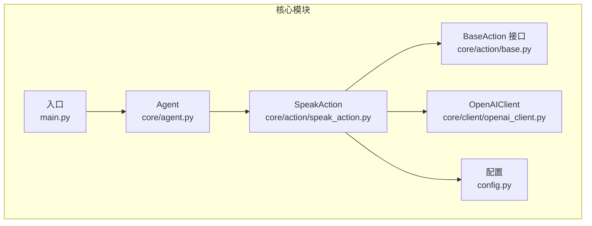
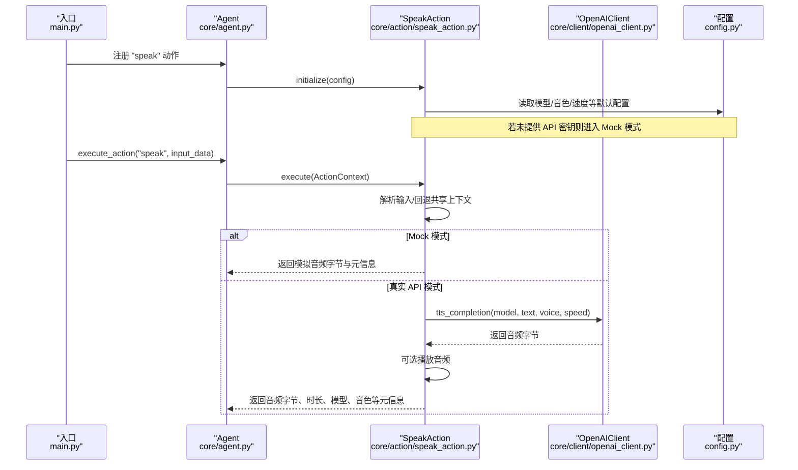
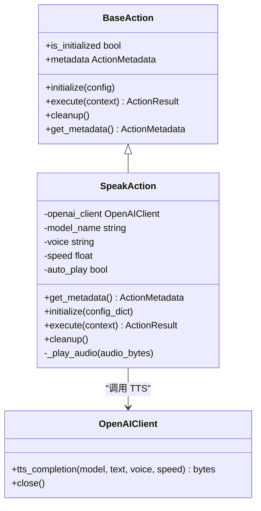
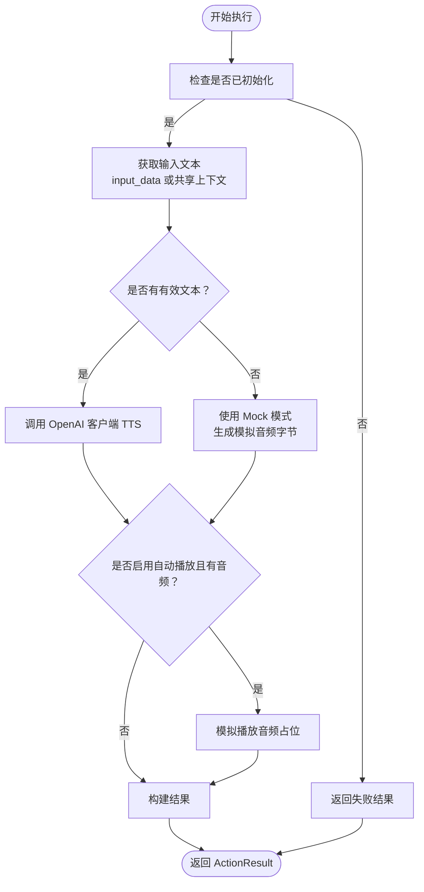
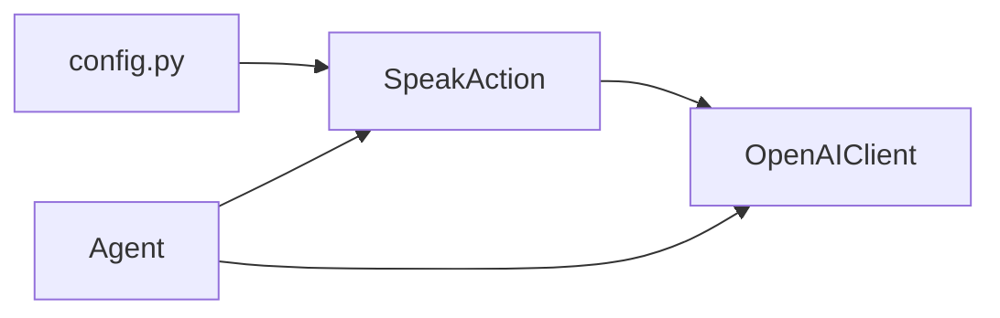

# 语音合成动作

<cite>
**本文引用的文件**
- [speak_action.py](file://core/action/speak_action.py)
- [base.py](file://core/action/base.py)
- [openai_client.py](file://core/client/openai_client.py)
- [agent.py](file://core/agent.py)
- [config.py](file://config.py)
- [main.py](file://main.py)
- [USAGE.md](file://USAGE.md)
- [test_actions.py](file://test/test_actions.py)
</cite>

## 目录
1. [简介](#简介)
2. [项目结构](#项目结构)
3. [核心组件](#核心组件)
4. [架构总览](#架构总览)
5. [详细组件分析](#详细组件分析)
6. [依赖关系分析](#依赖关系分析)
7. [性能考虑](#性能考虑)
8. [故障排查指南](#故障排查指南)
9. [结论](#结论)
10. [附录](#附录)

## 简介
本文件聚焦“语音合成动作”（SpeakAction），系统性阐述其在机器人 Agent 中的职责、实现方式、与 Agent 的协作流程、以及与 OpenAI 客户端的集成。文档同时给出架构图、序列图、流程图等可视化说明，并提供可操作的排错建议与最佳实践。

## 项目结构
SpeakAction 位于 core/action 目录下，遵循统一的 Action 抽象基类接口；它通过 OpenAIClient 调用多模态交互模型（如 qwen-omni-flash）进行文本转语音（TTS），并在必要时自动播放音频；Agent 通过注册与调度 Action，形成可扩展的中枢管理器架构。

图表来源
- [agent.py](file://core/agent.py#L96-L178)
- [speak_action.py](file://core/action/speak_action.py#L14-L38)
- [base.py](file://core/action/base.py#L38-L93)
- [openai_client.py](file://core/client/openai_client.py#L158-L202)
- [config.py](file://config.py#L1-L17)
- [main.py](file://main.py#L1-L39)

章节来源
- [main.py](file://main.py#L1-L39)
- [agent.py](file://core/agent.py#L96-L178)
- [speak_action.py](file://core/action/speak_action.py#L14-L38)
- [base.py](file://core/action/base.py#L38-L93)
- [openai_client.py](file://core/client/openai_client.py#L158-L202)
- [config.py](file://config.py#L1-L17)

## 核心组件
- SpeakAction：负责将文本转换为语音并可选地播放音频；支持 Mock 模式与真实 API 模式；具备元信息、初始化、执行、清理生命周期。
- OpenAIClient：封装对 Qwen 多模态模型的调用，提供 TTS、ASR、视觉理解等能力；SpeakAction 通过其 tts_completion 方法实现语音合成。
- Agent：通过 register_action 注册 SpeakAction，通过 execute_action 或 execute_action_chain 调用；维护共享上下文，便于跨 Action 数据传递。
- 配置：提供模型名称、API 密钥、基础 URL、巡逻间隔等全局配置，影响 SpeakAction 的行为与 OpenAI 客户端初始化。

章节来源
- [speak_action.py](file://core/action/speak_action.py#L14-L38)
- [openai_client.py](file://core/client/openai_client.py#L158-L202)
- [agent.py](file://core/agent.py#L96-L178)
- [config.py](file://config.py#L1-L17)

## 架构总览
SpeakAction 作为 Agent 的一个插槽（slot），由 Agent 注册并调度。其执行流程包括：获取输入文本（优先使用上下文输入，否则回退到共享上下文中的视觉分析结果）、调用 OpenAI 客户端进行 TTS、可选播放音频、返回包含音频字节、时长、模型与音色等元信息的结果。

图表来源
- [main.py](file://main.py#L9-L16)
- [agent.py](file://core/agent.py#L139-L178)
- [speak_action.py](file://core/action/speak_action.py#L78-L155)
- [openai_client.py](file://core/client/openai_client.py#L158-L202)
- [config.py](file://config.py#L1-L17)

## 详细组件分析

### SpeakAction 类与生命周期
- 元信息：包含名称、版本、描述、依赖（如 openai_api、audio_device）、能力（如 tts、audio_playback）等。
- 初始化：从配置字典或全局配置读取 API 密钥与基础 URL；若无密钥则进入 Mock 模式；同时读取模型名、音色、语速、自动播放等参数。
- 执行：校验初始化状态；解析输入文本（优先 ActionContext.input_data，否则从共享上下文 last_vision_result 中提取）；调用 OpenAI 客户端的 TTS；可选播放音频；返回包含音频字节、时长、文本、模型与音色等元信息的结果。
- 清理：关闭 OpenAI 客户端连接并重置状态。

图表来源
- [base.py](file://core/action/base.py#L38-L93)
- [speak_action.py](file://core/action/speak_action.py#L14-L38)
- [openai_client.py](file://core/client/openai_client.py#L158-L202)

章节来源
- [speak_action.py](file://core/action/speak_action.py#L14-L38)
- [speak_action.py](file://core/action/speak_action.py#L78-L155)
- [speak_action.py](file://core/action/speak_action.py#L181-L191)

### OpenAIClient 的 TTS 能力
- SpeakAction 通过 OpenAIClient.tts_completion(model, text, voice, speed) 获取音频字节。
- 若底层 API 不可用，OpenAIClient 返回空字节，SpeakAction 会降级为 Mock 模式并返回模拟音频数据。
- 客户端支持超时与重试策略，提升稳定性。

章节来源
- [openai_client.py](file://core/client/openai_client.py#L158-L202)

### Agent 对 SpeakAction 的注册与调度
- Agent.register_action(name, action, config_dict) 完成初始化与元信息登记。
- Agent.execute_action(name, input_data, config_dict) 构造 ActionContext 并调用 action.execute。
- Agent.execute_action_chain([...]) 支持链式执行，前一个 Action 的输出可作为下一个 Action 的输入。
- Agent 维护 shared_context，供 Action 间共享数据（例如 last_vision_result）。

章节来源
- [agent.py](file://core/agent.py#L96-L178)
- [agent.py](file://core/agent.py#L179-L205)

### 执行流程与 Mock 模式
- 输入解析：优先使用 ActionContext.input_data；若为空，则尝试从 shared_context["last_vision_result"] 中提取 description。
- Mock 模式：当未提供 API 密钥时，SpeakAction 返回模拟音频字节与估算时长，便于开发与测试。
- 真实 API 模式：调用 OpenAI 客户端的 TTS 接口，返回真实音频字节；根据采样率估算时长。
- 自动播放：若 auto_play 为真且存在音频字节，SpeakAction 会尝试播放音频（当前为占位实现，未来可接入具体音频库）。

图表来源
- [speak_action.py](file://core/action/speak_action.py#L78-L155)
- [openai_client.py](file://core/client/openai_client.py#L158-L202)

## 依赖关系分析
- SpeakAction 依赖 OpenAIClient 进行 TTS；OpenAIClient 依赖 AsyncOpenAI 客户端与配置中的 API 密钥与基础 URL。
- Agent 通过统一的 Action 接口管理 SpeakAction，提供注册、执行、链式执行与共享上下文。
- 配置文件决定模型名称、音色、语速、自动播放等行为参数。

图表来源
- [config.py](file://config.py#L1-L17)
- [speak_action.py](file://core/action/speak_action.py#L20-L28)
- [openai_client.py](file://core/client/openai_client.py#L17-L49)
- [agent.py](file://core/agent.py#L96-L178)

章节来源
- [config.py](file://config.py#L1-L17)
- [speak_action.py](file://core/action/speak_action.py#L20-L28)
- [openai_client.py](file://core/client/openai_client.py#L17-L49)
- [agent.py](file://core/agent.py#L96-L178)

## 性能考虑
- Mock 模式适合开发与测试，避免网络开销；生产模式下建议合理设置 ACTION_TIMEOUT，避免阻塞。
- TTS 时长估算基于采样率假设，实际音频长度以返回字节数为准。
- 自动播放音频会引入额外 I/O 开销，建议在需要时开启；当前播放实现为占位，建议结合平台音频库实现稳定播放。
- OpenAIClient 支持超时与重试，有助于在网络波动时提升鲁棒性。

## 故障排查指南
- 未配置 API 密钥导致无法调用真实 TTS：确认环境变量 OPENAI_API_KEY 与 OPENAI_BASE_URL 设置；若仅需开发测试，可保持 Mock 模式。
- 执行 SpeakAction 失败：检查 Action 是否已注册、是否已初始化、上下文 input_data 是否有效；查看返回的错误信息。
- 自动播放未生效：当前播放逻辑为占位实现，尚未接入具体音频库；可在 _play_audio 中实现实际播放。
- 链式执行中断：Agent 在 Action 链中遇到失败会停止后续执行；请逐个检查各 Action 的返回结果。

章节来源
- [USAGE.md](file://USAGE.md#L118-L159)
- [speak_action.py](file://core/action/speak_action.py#L156-L180)
- [agent.py](file://core/agent.py#L179-L205)
- [test_actions.py](file://test/test_actions.py#L113-L149)

## 结论
SpeakAction 通过统一的 Action 接口与 Agent 协同工作，既能在 Mock 模式下快速验证，也能在真实 API 模式下提供高质量的语音合成能力。配合 Agent 的注册、调度与共享上下文机制，可实现从图像理解到语音播报的完整闭环。建议在生产环境中完善音频播放实现、优化超时与重试策略，并充分利用共享上下文实现多 Action 协作。

## 附录
- 快速开始与使用示例参见使用指南；测试用例覆盖了 SpeakAction 的元信息、初始化、执行与清理等关键路径。

章节来源
- [USAGE.md](file://USAGE.md#L1-L117)
- [test_actions.py](file://test/test_actions.py#L113-L149)