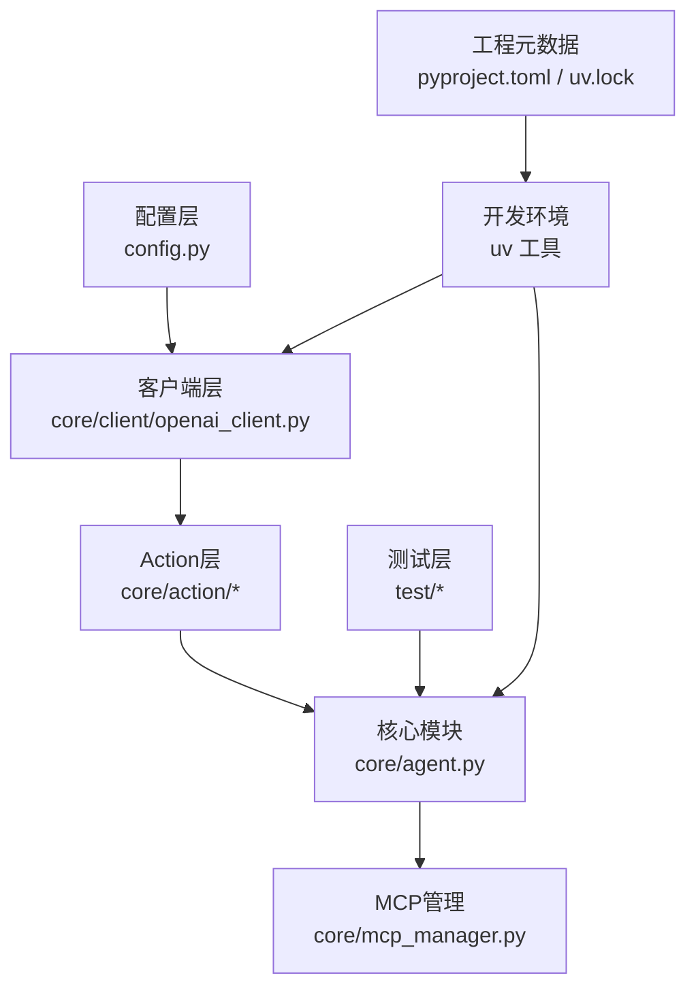
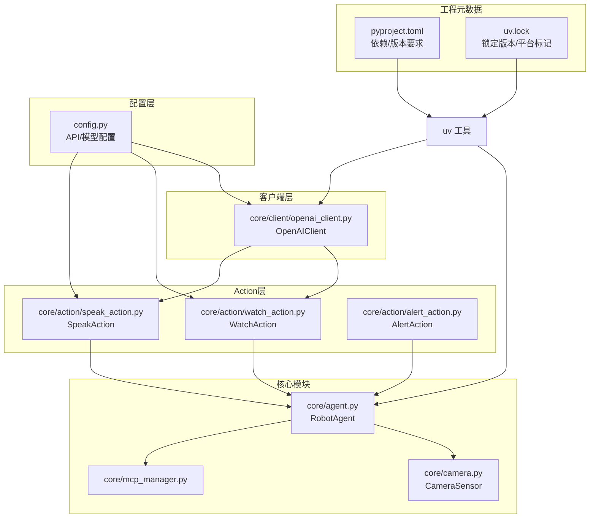
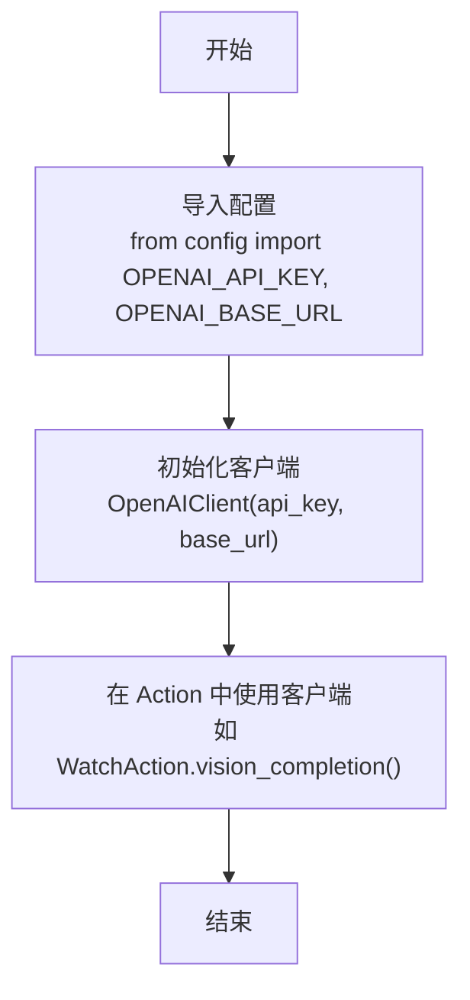
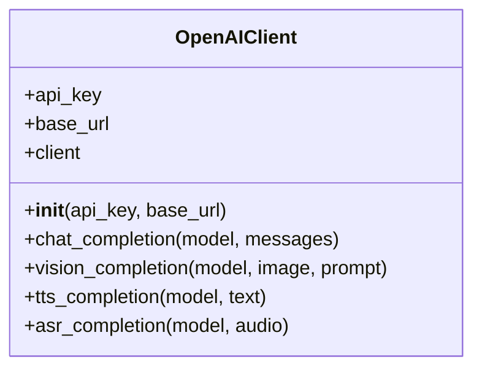
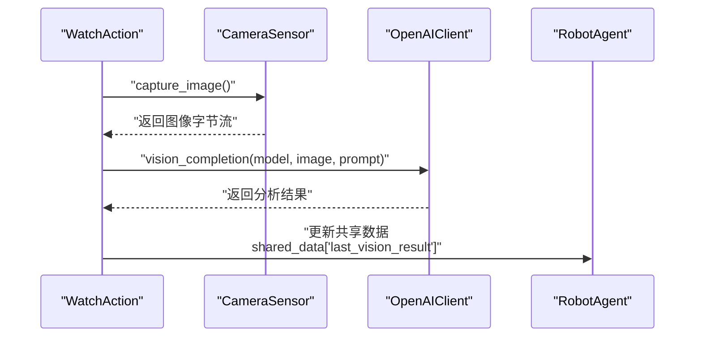
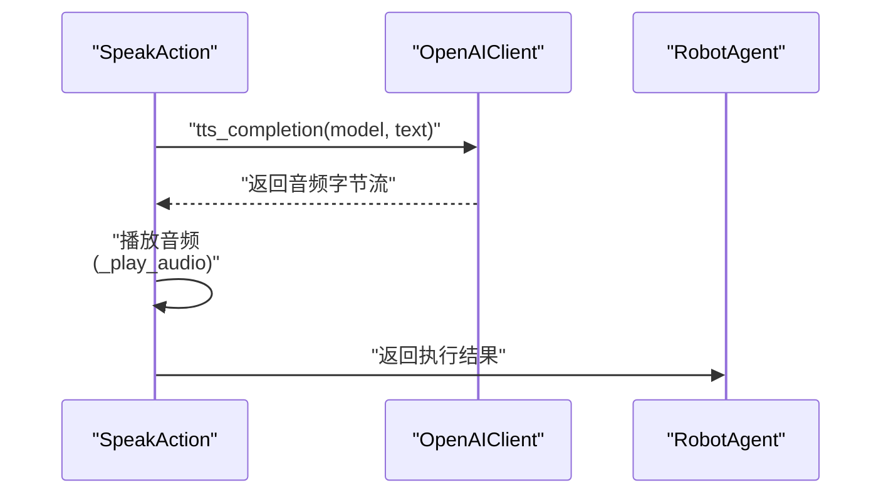
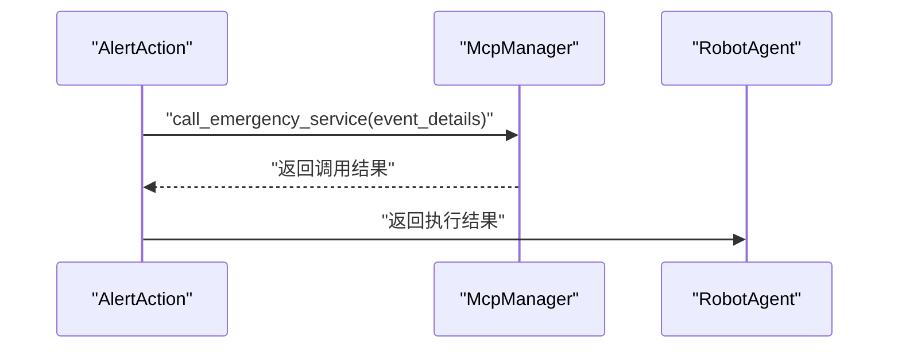
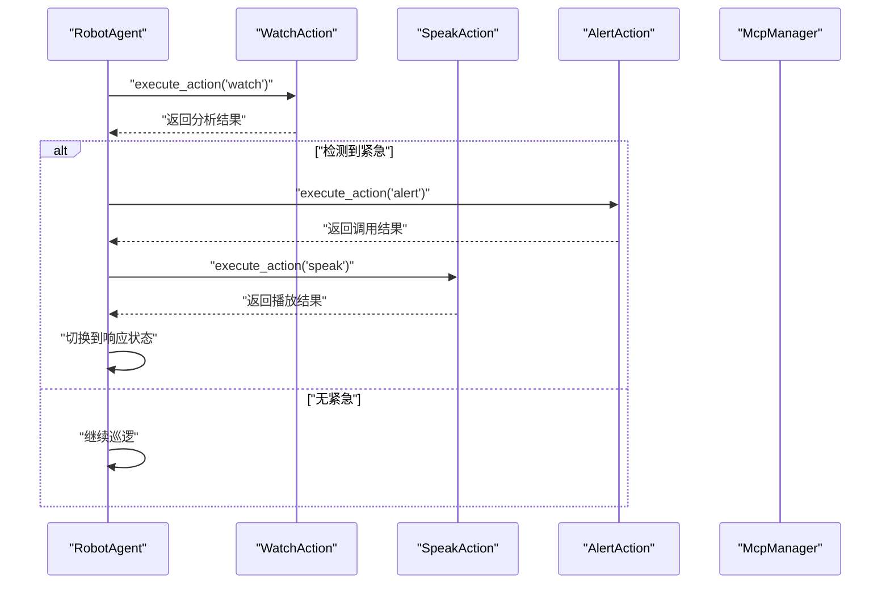
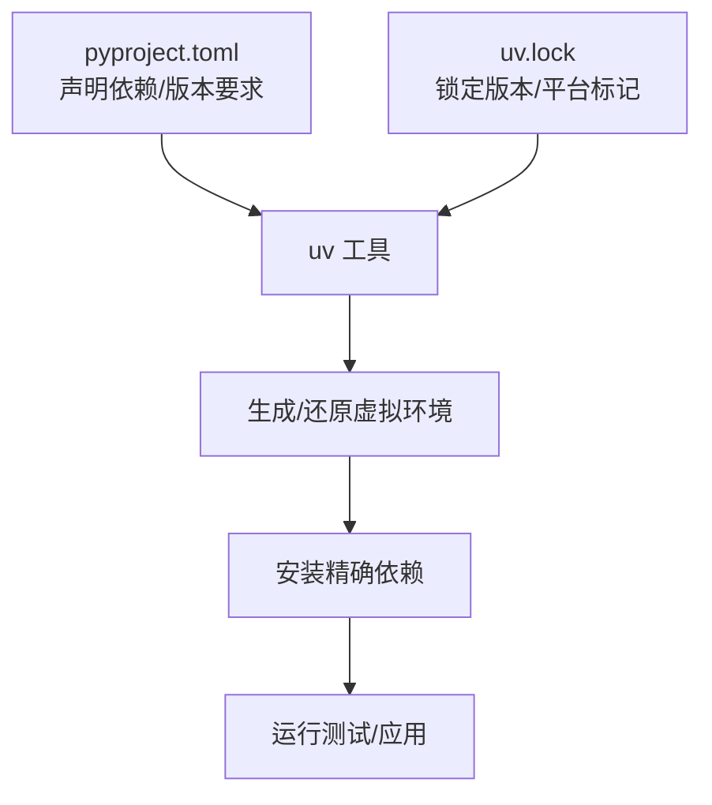
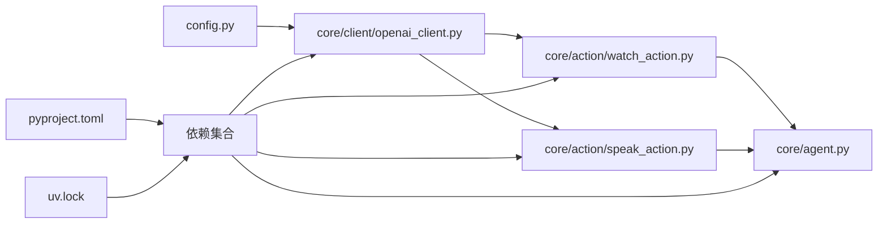

# 配置说明

<cite>
**本文引用的文件**
- [config.py](file://config.py)
- [pyproject.toml](file://pyproject.toml)
- [uv.lock](file://uv.lock)
- [core/client/openai_client.py](file://core/client/openai_client.py)
- [core/action/watch_action.py](file://core/action/watch_action.py)
- [core/action/speak_action.py](file://core/action/speak_action.py)
- [core/agent.py](file://core/agent.py)
- [core/mcp_manager.py](file://core/mcp_manager.py)
</cite>

## 更新摘要
**变更内容**
- 新增了对 `config.py` 中 OpenAI API 相关配置项的详细说明，包括 `OPENAI_API_KEY`、`OPENAI_BASE_URL`、`QWEN_VL_MODEL` 和 `QWEN_OMNI_MODEL`。
- 新增了 `OpenAIClient` 类的架构说明，解释了其作为统一 API 客户端的作用。
- 新增了 `WatchAction` 和 `SpeakAction` 如何使用这些配置项的详细分析。
- 更新了架构总览图，以反映新的 API 客户端和 Action 模块之间的关系。
- 新增了配置项与具体功能模块的映射关系图。

## 目录
1. [简介](#简介)
2. [项目结构](#项目结构)
3. [核心组件](#核心组件)
4. [架构总览](#架构总览)
5. [详细组件分析](#详细组件分析)
6. [依赖关系分析](#依赖关系分析)
7. [性能与可维护性建议](#性能与可维护性建议)
8. [故障排查指南](#故障排查指南)
9. [结论](#结论)
10. [附录](#附录)

## 简介
本文件聚焦于项目的配置说明，重点解释以下内容：
- `config.py` 的作用：集中管理外部设备、常量以及**OpenAI API 接入配置**。
- **新增配置项**：`OPENAI_API_KEY`、`OPENAI_BASE_URL`、`QWEN_VL_MODEL`、`QWEN_OMNI_MODEL` 的含义与使用，支持 OpenAI API 接入和模型选择。
- `pyproject.toml` 的双重作用：声明项目依赖与 Python 版本要求；并结合 `uv.lock` 实现精确还原开发环境。
- 配置文件分离的优势：便于在不同部署环境灵活调整，提升可移植性与一致性。

## 项目结构
该项目采用“功能分层+配置独立”的组织方式：
- **配置层**：`config.py` 提供单一职责的常量与 API 配置。
- **核心业务层**：`core` 目录下包含摄像头、代理、MCP 管理等模块。
- **客户端层**：`core/client` 目录下包含 `openai_client.py`，负责统一的 API 调用。
- **Action 层**：`core/action` 目录下包含 `watch_action.py`、`speak_action.py` 等，实现具体功能。
- **测试层**：`test` 目录提供单元测试。
- **工程元数据**：`pyproject.toml` 声明依赖与版本要求；`uv.lock` 记录锁定的精确版本与平台信息。

图表来源
- [config.py](file://config.py#L1-L17)
- [core/client/openai_client.py](file://core/client/openai_client.py#L1-L247)
- [core/action/watch_action.py](file://core/action/watch_action.py#L1-L196)
- [core/action/speak_action.py](file://core/action/speak_action.py#L1-L191)
- [core/agent.py](file://core/agent.py#L1-L404)
- [core/mcp_manager.py](file://core/mcp_manager.py#L1-L28)
- [pyproject.toml](file://pyproject.toml#L1-L15)
- [uv.lock](file://uv.lock#L1-L202)

章节来源
- [config.py](file://config.py#L1-L17)
- [core/client/openai_client.py](file://core/client/openai_client.py#L1-L247)
- [core/action/watch_action.py](file://core/action/watch_action.py#L1-L196)
- [core/action/speak_action.py](file://core/action/speak_action.py#L1-L191)
- [core/agent.py](file://core/agent.py#L1-L404)
- [core/mcp_manager.py](file://core/mcp_manager.py#L1-L28)
- [pyproject.toml](file://pyproject.toml#L1-L15)
- [uv.lock](file://uv.lock#L1-L202)

## 核心组件
- **配置常量**：`VIDEO_DEV` 定义摄像头设备路径；**新增 `OPENAI_API_KEY`、`OPENAI_BASE_URL`、`QWEN_VL_MODEL`、`QWEN_OMNI_MODEL`** 用于 OpenAI API 接入和模型选择。
- **OpenAI 客户端**：`OpenAIClient` 类封装了对 OpenAI API 的统一调用，支持文本、图像、语音等多种功能。
- **摄像头模块** `CameraSensor`：负责打开摄像头、捕获帧、编码为 JPEG 字节流。
- **Action 模块**：`WatchAction` 负责图像理解，`SpeakAction` 负责语音合成，`AlertAction` 负责应急调用。
- **代理模块** `RobotAgent`：调度摄像头采集与分析流程，驱动巡逻与应急响应。
- **工程元数据**：`pyproject.toml` 声明依赖与 Python 版本；`uv.lock` 锁定依赖版本与平台标记。

章节来源
- [config.py](file://config.py#L1-L17)
- [core/client/openai_client.py](file://core/client/openai_client.py#L1-L247)
- [core/action/watch_action.py](file://core/action/watch_action.py#L1-L196)
- [core/action/speak_action.py](file://core/action/speak_action.py#L1-L191)
- [core/agent.py](file://core/agent.py#L1-L404)
- [pyproject.toml](file://pyproject.toml#L1-L15)
- [uv.lock](file://uv.lock#L1-L202)

## 架构总览
下图展示了配置、API 客户端、核心模块之间的交互关系，以及依赖声明与环境还原的关系：

图表来源
- [config.py](file://config.py#L1-L17)
- [core/client/openai_client.py](file://core/client/openai_client.py#L1-L247)
- [core/action/watch_action.py](file://core/action/watch_action.py#L1-L196)
- [core/action/speak_action.py](file://core/action/speak_action.py#L1-L191)
- [core/agent.py](file://core/agent.py#L1-L404)
- [pyproject.toml](file://pyproject.toml#L1-L15)
- [uv.lock](file://uv.lock#L1-L202)

## 详细组件分析

### 配置常量的扩展与使用
- **作用**：`config.py` 文件集中管理所有外部配置，避免硬编码，提升可维护性与可移植性。
- **新增配置项**：
  - `OPENAI_API_KEY`: OpenAI API 密钥，用于身份验证。
  - `OPENAI_BASE_URL`: API 基础 URL，支持自定义 API 端点（如阿里云百炼平台）。
  - `QWEN_VL_MODEL`: 视觉理解模型名称，供 `WatchAction` 使用。
  - `QWEN_OMNI_MODEL`: 多模态交互模型名称，供 `SpeakAction` 使用。
- **使用位置**：`OpenAIClient` 在初始化时读取 `OPENAI_API_KEY` 和 `OPENAI_BASE_URL`；`WatchAction` 和 `SpeakAction` 在初始化时读取对应的模型名称。
- **影响范围**：任何依赖 OpenAI API 的模块都会间接受其影响。

图表来源
- [config.py](file://config.py#L1-L17)
- [core/client/openai_client.py](file://core/client/openai_client.py#L1-L247)
- [core/action/watch_action.py](file://core/action/watch_action.py#L1-L196)
- [core/action/speak_action.py](file://core/action/speak_action.py#L1-L191)

章节来源
- [config.py](file://config.py#L1-L17)
- [core/client/openai_client.py](file://core/client/openai_client.py#L1-L247)
- [core/action/watch_action.py](file://core/action/watch_action.py#L1-L196)
- [core/action/speak_action.py](file://core/action/speak_action.py#L1-L191)

### OpenAIClient 统一 API 客户端
- **作用**：封装对 OpenAI 兼容 API 的调用，提供统一的接口用于文本、图像、语音处理。
- **实现要点**：
  - **初始化**：接收 `api_key` 和 `base_url`，创建 `AsyncOpenAI` 客户端实例。
  - **功能方法**：
    - `chat_completion`: 文本对话/推理。
    - `vision_completion`: 图像理解，将图像编码为 base64 后发送。
    - `tts_completion`: 文本转语音。
    - `asr_completion`: 语音转文本。
- **与配置的关系**：`WatchAction` 和 `SpeakAction` 在初始化时会创建 `OpenAIClient` 实例，并使用 `config.py` 中的 `OPENAI_API_KEY` 和 `OPENAI_BASE_URL`。

图表来源
- [core/client/openai_client.py](file://core/client/openai_client.py#L1-L247)

章节来源
- [core/client/openai_client.py](file://core/client/openai_client.py#L1-L247)

### WatchAction 图像理解模块
- **作用**：从摄像头捕获图像，并调用视觉模型进行分析。
- **实现要点**：
  - **初始化**：创建 `CameraSensor` 和 `OpenAIClient` 实例。`OpenAIClient` 的初始化参数来自 `config.OPENAI_API_KEY` 和 `config.OPENAI_BASE_URL`。
  - **模型选择**：使用 `config.QWEN_VL_MODEL` 作为默认的视觉模型。
  - **执行流程**：捕获图像 -> 调用 `OpenAIClient.vision_completion` -> 分析结果 -> 更新共享数据。
- **与配置的关系**：直接依赖 `config.py` 中的 `OPENAI_API_KEY`、`OPENAI_BASE_URL` 和 `QWEN_VL_MODEL`。

图表来源
- [core/action/watch_action.py](file://core/action/watch_action.py#L1-L196)
- [core/client/openai_client.py](file://core/client/openai_client.py#L1-L247)
- [core/agent.py](file://core/agent.py#L1-L404)

章节来源
- [core/action/watch_action.py](file://core/action/watch_action.py#L1-L196)
- [core/client/openai_client.py](file://core/client/openai_client.py#L1-L247)
- [core/agent.py](file://core/agent.py#L1-L404)

### SpeakAction 语音合成模块
- **作用**：将文本转换为语音并播放。
- **实现要点**：
  - **初始化**：创建 `OpenAIClient` 实例，使用 `config.OPENAI_API_KEY` 和 `config.OPENAI_BASE_URL` 进行初始化。
  - **模型选择**：使用 `config.QWEN_OMNI_MODEL` 作为默认的语音模型。
  - **执行流程**：获取文本 -> 调用 `OpenAIClient.tts_completion` -> 播放音频（占位实现）。
- **与配置的关系**：直接依赖 `config.py` 中的 `OPENAI_API_KEY`、`OPENAI_BASE_URL` 和 `QWEN_OMNI_MODEL`。

图表来源
- [core/action/speak_action.py](file://core/action/speak_action.py#L1-L191)
- [core/client/openai_client.py](file://core/client/openai_client.py#L1-L247)
- [core/agent.py](file://core/agent.py#L1-L404)

章节来源
- [core/action/speak_action.py](file://core/action/speak_action.py#L1-L191)
- [core/client/openai_client.py](file://core/client/openai_client.py#L1-L247)
- [core/agent.py](file://core/agent.py#L1-L404)

### AlertAction 应急调用模块
- **作用**：在检测到紧急情况时，调用应急服务。
- **实现要点**：
  - **初始化**：创建 `McpManager` 实例。
  - **执行流程**：获取紧急事件详情 -> 调用 `McpManager.call_emergency_service` -> 返回调用结果。
- **与配置的关系**：虽然不直接使用 `config.py` 中的 API 配置，但其触发依赖于 `WatchAction` 的分析结果，而 `WatchAction` 又依赖于 API 配置。

图表来源
- [core/action/alert_action.py](file://core/action/alert_action.py#L1-L121)
- [core/mcp_manager.py](file://core/mcp_manager.py#L1-L28)
- [core/agent.py](file://core/agent.py#L1-L404)

章节来源
- [core/action/alert_action.py](file://core/action/alert_action.py#L1-L121)
- [core/mcp_manager.py](file://core/mcp_manager.py#L1-L28)
- [core/agent.py](file://core/agent.py#L1-L404)

### 代理模块 RobotAgent 的调度逻辑
- **状态机**：支持空闲、巡逻、响应、告警等状态，状态切换触发相应任务。
- **巡逻循环**：周期性调用 `WatchAction` 采集图像并进行分析。
- **应急响应**：当 `WatchAction` 检测到紧急情况时，`RobotAgent` 会调用 `AlertAction` 和 `SpeakAction` 进行响应。
- **任务管理**：统一管理任务队列、运行中任务与超时处理。

图表来源
- [core/agent.py](file://core/agent.py#L1-L404)
- [core/action/watch_action.py](file://core/action/watch_action.py#L1-L196)
- [core/action/speak_action.py](file://core/action/speak_action.py#L1-L191)
- [core/action/alert_action.py](file://core/action/alert_action.py#L1-L121)

章节来源
- [core/agent.py](file://core/agent.py#L1-L404)
- [core/action/watch_action.py](file://core/action/watch_action.py#L1-L196)
- [core/action/speak_action.py](file://core/action/speak_action.py#L1-L191)
- [core/action/alert_action.py](file://core/action/alert_action.py#L1-L121)

### 工程元数据与环境还原
- `pyproject.toml` 的作用
  - 声明项目依赖：包括 `opencv-python`、`numpy`、`pytest`、`openai` 等。
  - 指定 Python 版本要求：确保在满足版本条件的环境中构建与运行。
- `uv.lock` 的作用
  - 记录精确的包版本、哈希与平台标记，保证跨环境一致的依赖树。
- 使用 `uv` 工具还原环境
  - 通过 `pyproject.toml` 和 `uv.lock` 精确安装依赖，避免版本漂移带来的不一致问题。
  - README 中提供了使用 `uv` 运行测试的示例命令，体现与 `uv` 生态的集成。

图表来源
- [pyproject.toml](file://pyproject.toml#L1-L15)
- [uv.lock](file://uv.lock#L1-L202)
- [README.md](file://README.md#L1-L18)

章节来源
- [pyproject.toml](file://pyproject.toml#L1-L15)
- [uv.lock](file://uv.lock#L1-L202)
- [README.md](file://README.md#L1-L18)

## 依赖关系分析
- **配置层对客户端的依赖**：`OpenAIClient` 直接使用 `config.py` 中的 `OPENAI_API_KEY` 和 `OPENAI_BASE_URL`。
- **Action 模块对客户端的依赖**：`WatchAction` 和 `SpeakAction` 依赖 `OpenAIClient` 来调用 API。
- **Action 模块对配置的依赖**：`WatchAction` 和 `SpeakAction` 直接导入 `config.py` 以获取模型名称。
- **代理模块对 Action 模块的依赖**：在巡逻循环中调用 `WatchAction` 采集图像。
- **工程依赖**：`pyproject.toml` 声明 `opencv-python`、`numpy`、`pytest`、`openai` 等；`uv.lock` 锁定具体版本与平台。
- **运行时依赖链**：`opencv-python` 依赖 `numpy`；`openai` 依赖 `httpx` 等异步 HTTP 库。

图表来源
- [config.py](file://config.py#L1-L17)
- [core/client/openai_client.py](file://core/client/openai_client.py#L1-L247)
- [core/action/watch_action.py](file://core/action/watch_action.py#L1-L196)
- [core/action/speak_action.py](file://core/action/speak_action.py#L1-L191)
- [core/agent.py](file://core/agent.py#L1-L404)
- [pyproject.toml](file://pyproject.toml#L1-L15)
- [uv.lock](file://uv.lock#L1-L202)

章节来源
- [config.py](file://config.py#L1-L17)
- [core/client/openai_client.py](file://core/client/openai_client.py#L1-L247)
- [core/action/watch_action.py](file://core/action/watch_action.py#L1-L196)
- [core/action/speak_action.py](file://core/action/speak_action.py#L1-L191)
- [core/agent.py](file://core/agent.py#L1-L404)
- [pyproject.toml](file://pyproject.toml#L1-L15)
- [uv.lock](file://uv.lock#L1-L202)

## 性能与可维护性建议
- **配置分离的优势**
  - 将设备路径、API 密钥、模型选择等外部配置集中在一个文件中，便于在不同硬件或操作系统上快速调整，无需改动业务代码。
  - 降低耦合度，提高可移植性与可测试性。
- **新增配置项的修改建议**
  - `OPENAI_API_KEY`: 在生产环境中应通过环境变量设置，避免在代码中暴露密钥。
  - `OPENAI_BASE_URL`: 支持切换到不同的 API 提供商（如阿里云、Azure OpenAI）。
  - `QWEN_VL_MODEL` / `QWEN_OMNI_MODEL`: 可根据需求和成本选择不同性能的模型。
- **依赖锁定与版本管理**
  - 使用 `uv` 结合 `pyproject.toml` 与 `uv.lock` 还原环境，确保团队成员与 CI 环境的一致性。
  - 当升级依赖时，建议先在隔离环境中验证兼容性，再更新锁文件。

[本节为通用建议，不直接分析具体文件，故无章节来源]

## 故障排查指南
- **API 调用失败**
  - **症状**：`WatchAction` 或 `SpeakAction` 执行失败，日志显示 API 错误。
  - **排查要点**：
    - 确认 `OPENAI_API_KEY` 是否正确且有效。
    - 检查 `OPENAI_BASE_URL` 是否指向正确的 API 端点。
    - 确认网络连接是否正常，API 服务是否可用。
- **摄像头无法打开**
  - **症状**：初始化摄像头失败或无法读取帧。
  - **排查要点**：
    - 确认 `VIDEO_DEV` 是否指向正确的设备路径。
    - 检查设备是否被其他进程占用。
    - 在目标平台上验证设备是否存在且权限允许访问。
- **图像采集返回空**
  - **症状**：采集接口返回空值。
  - **排查要点**：
    - 检查摄像头是否成功打开与读取帧。
    - 确认编码参数与格式符合预期。
- **环境不一致导致的异常**
  - **症状**：不同机器或 CI 报错，提示依赖版本不匹配。
  - **排查要点**：
    - 使用 `uv` 严格依据 `pyproject.toml` 与 `uv.lock` 还原环境。
    - 确保 Python 版本满足 `pyproject.toml` 中的要求。

章节来源
- [core/action/watch_action.py](file://core/action/watch_action.py#L1-L196)
- [core/action/speak_action.py](file://core/action/speak_action.py#L1-L191)
- [pyproject.toml](file://pyproject.toml#L1-L15)
- [uv.lock](file://uv.lock#L1-L202)

## 结论
- `config.py` 将摄像头设备路径、OpenAI API 配置、模型选择等外部配置集中化管理，使核心模块与代理模块的耦合度降低，便于在多环境部署时灵活调整。
- `pyproject.toml` 与 `uv.lock` 共同保障了依赖的精确还原，提升了开发与运维的一致性与可靠性。
- 建议在不同硬件与操作系统环境下，优先通过修改 `config.py` 中的各项配置来适配，而非修改业务代码，从而最大化复用与可维护性。

[本节为总结性内容，不直接分析具体文件，故无章节来源]

## 附录

### 如何根据操作系统与硬件环境修改配置
- **Linux**
  - 使用 `v4l2-ctl` 或 `ls /dev/video*` 查看可用设备。
  - 将 `VIDEO_DEV` 设置为对应的 `/dev/videoX` 或 v4l2 设备路径。
- **Windows**
  - 可尝试使用数字索引或设备名称，具体取决于系统与驱动。
- **macOS**
  - 可能需要通过虚拟设备或第三方驱动暴露为 v4l2 兼容设备。
- **API 配置**
  - `OPENAI_API_KEY`: 从 API 提供商处获取密钥，并通过环境变量或直接在 `config.py` 中设置。
  - `OPENAI_BASE_URL`: 根据所使用的 API 服务提供商（如阿里云、Azure）设置对应的 URL。

章节来源
- [config.py](file://config.py#L1-L17)
- [core/action/watch_action.py](file://core/action/watch_action.py#L1-L196)
- [core/action/speak_action.py](file://core/action/speak_action.py#L1-L191)

### 使用 uv 工具还原开发环境
- **基本流程**
  - 依据 `pyproject.toml` 与 `uv.lock` 精确安装依赖。
  - 使用 `uv` 运行测试或应用，确保环境一致。
- **示例命令参考**
  - README 中提供了使用 `uv` 运行 `pytest` 的示例，体现与 `uv` 的集成方式。

章节来源
- [pyproject.toml](file://pyproject.toml#L1-L15)
- [uv.lock](file://uv.lock#L1-L202)
- [README.md](file://README.md#L1-L18)