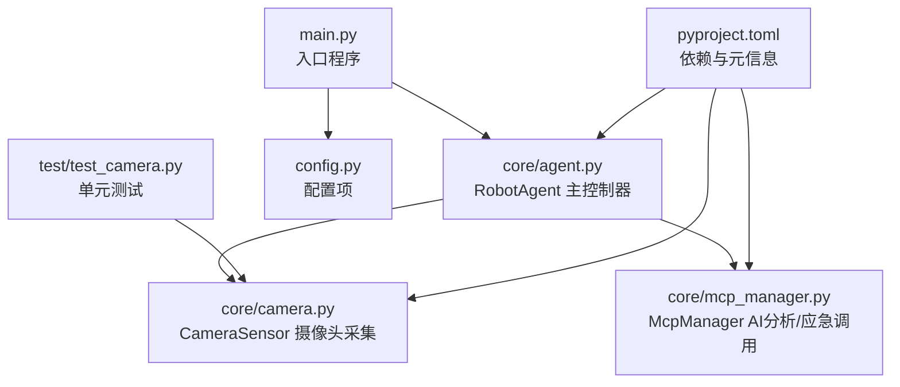
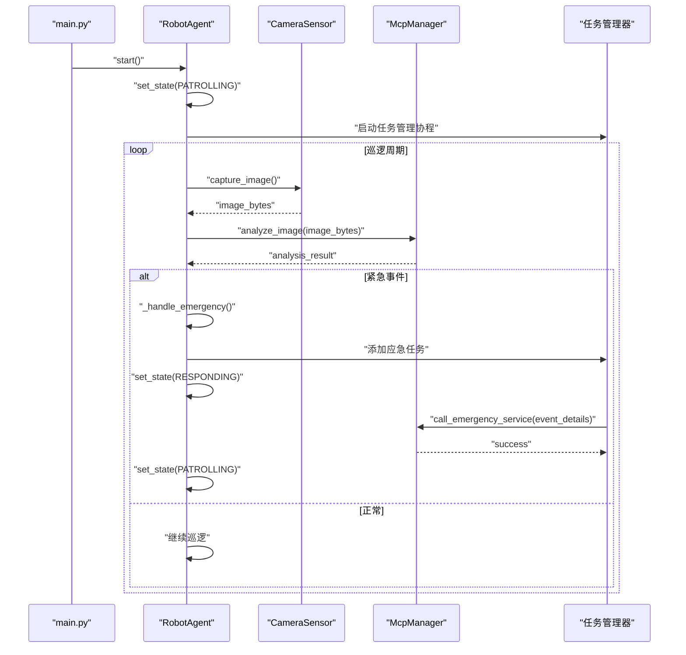
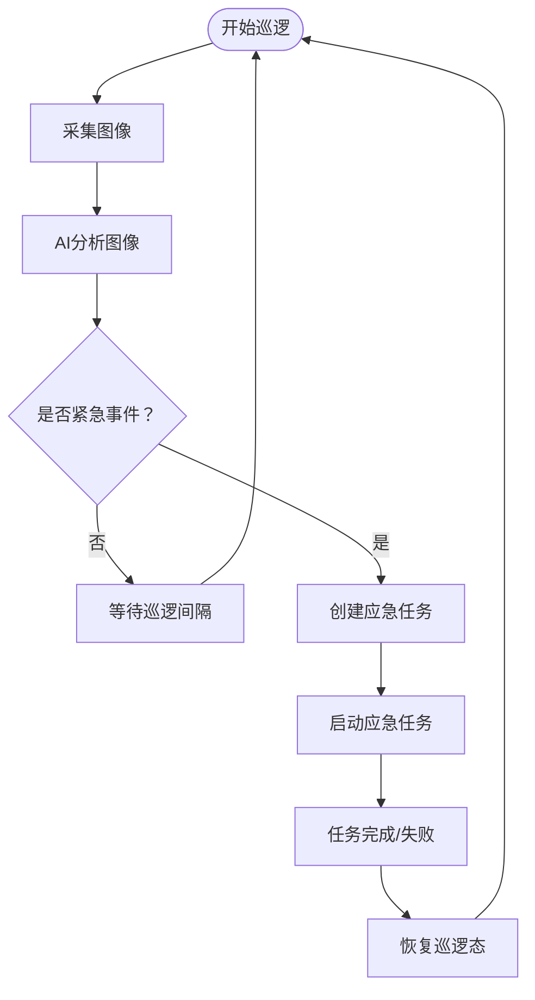
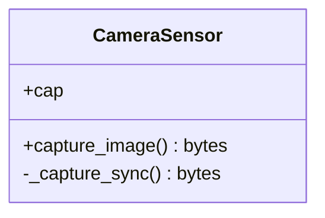
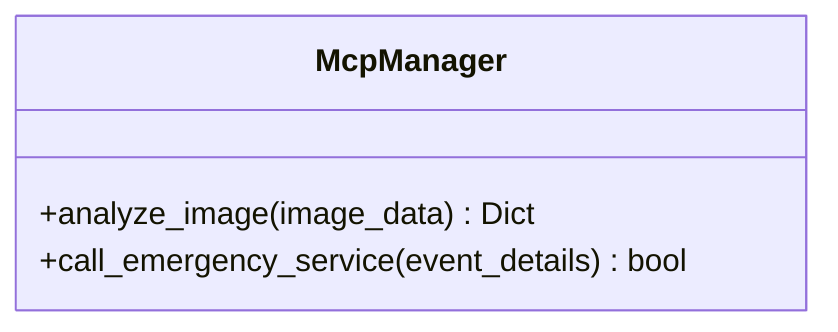
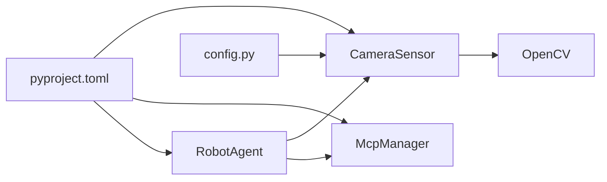

# 项目概述

<cite>
**本文引用的文件**
- [README.md](file://README.md)
- [main.py](file://main.py)
- [config.py](file://config.py)
- [pyproject.toml](file://pyproject.toml)
- [core/agent.py](file://core/agent.py)
- [core/camera.py](file://core/camera.py)
- [core/mcp_manager.py](file://core/mcp_manager.py)
- [test/test_camera.py](file://test/test_camera.py)
</cite>

## 目录
1. [引言](#引言)
2. [项目结构](#项目结构)
3. [核心组件](#核心组件)
4. [架构总览](#架构总览)
5. [详细组件分析](#详细组件分析)
6. [依赖关系分析](#依赖关系分析)
7. [性能考虑](#性能考虑)
8. [故障排查指南](#故障排查指南)
9. [结论](#结论)
10. [附录](#附录)

## 引言
robot-agent 是一个面向巡检机器人的智能代理系统，旨在通过摄像头周期性采集环境图像，并利用AI模型对图像进行实时分析，从而实现自动化巡逻与紧急事件响应。该系统可广泛应用于智能安防、工业巡检与服务机器人等场景，帮助降低人工成本、提升巡检效率与安全性。

项目以异步编程（asyncio）为核心，采用模块化设计，将状态管理、任务调度、摄像头采集与AI分析/应急响应解耦，形成高内聚、低耦合的组件体系。通过明确的状态机与任务队列机制，系统能够在巡逻态、响应态与告警态之间平滑切换，并对任务超时与异常进行统一处理。

## 项目结构
项目采用按功能域划分的模块化组织方式：
- 核心业务逻辑位于 core 目录，包含代理主控、摄像头传感器与MCP分析器。
- 测试位于 test 目录，使用 pytest 与 pytest-asyncio 进行异步单元测试。
- 入口程序 main.py 提供示例运行流程。
- 配置文件 config.py 提供摄像头设备号等基础配置。
- 项目元信息与依赖声明位于 pyproject.toml。

图表来源
- [main.py](file://main.py#L1-L7)
- [core/agent.py](file://core/agent.py#L1-L278)
- [core/camera.py](file://core/camera.py#L1-L57)
- [core/mcp_manager.py](file://core/mcp_manager.py#L1-L28)
- [config.py](file://config.py#L1-L1)
- [test/test_camera.py](file://test/test_camera.py#L1-L43)
- [pyproject.toml](file://pyproject.toml#L1-L14)

章节来源
- [README.md](file://README.md#L1-L18)
- [main.py](file://main.py#L1-L7)
- [pyproject.toml](file://pyproject.toml#L1-L14)

## 核心组件
- AgentState：定义代理的状态集合（空闲、巡逻、响应、告警），用于驱动不同阶段的行为。
- RobotAgent：代理主控制器，负责状态切换、巡逻循环、任务队列管理与紧急事件处理。
- CameraSensor：封装摄像头采集逻辑，使用异步线程避免阻塞，返回图像字节数据。
- McpManager：封装AI分析与应急调用接口，提供图像分析与紧急服务调用能力。

章节来源
- [core/agent.py](file://core/agent.py#L11-L17)
- [core/agent.py](file://core/agent.py#L28-L181)
- [core/camera.py](file://core/camera.py#L1-L57)
- [core/mcp_manager.py](file://core/mcp_manager.py#L1-L28)

## 架构总览
系统采用“状态机 + 任务队列”的异步架构：
- 状态机：在巡逻态下周期采集图像并分析；检测到紧急事件后进入告警态，再转为响应态执行应急任务，完成后回到巡逻态。
- 任务队列：统一管理待执行与运行中的任务，支持超时检测与清理。
- 摄像头采集：在独立线程中执行IO密集型操作，避免阻塞事件循环。
- AI分析与应急：通过McpManager抽象对外部AI服务的调用，便于替换与扩展。

图表来源
- [main.py](file://main.py#L1-L7)
- [core/agent.py](file://core/agent.py#L108-L179)
- [core/camera.py](file://core/camera.py#L17-L29)
- [core/mcp_manager.py](file://core/mcp_manager.py#L10-L28)

## 详细组件分析

### RobotAgent（代理主控制器）
- 职责
  - 管理代理状态（IDLE/PATROLLING/RESPONDING/ALERT）。
  - 周期性触发巡逻循环，采集图像并调用AI分析。
  - 处理紧急事件：创建应急任务、切换状态、回调完成后的状态恢复。
  - 统一的任务队列管理：入队、启动、超时检测与清理。
- 关键流程
  - 巡逻循环：在PATROLLING状态下持续采集与分析，等待间隔后再次执行。
  - 任务管理：遍历队列启动待执行任务，监控运行中任务的超时并清理完成/超时任务。
  - 紧急响应：当AI返回紧急标志时，创建应急任务并进入RESPONDING态，完成后回到PATROLLING态。
- 错误处理
  - 巡逻循环与任务管理均捕获异常并打印日志，避免崩溃。
  - 支持取消当前协程，确保优雅停机。

图表来源
- [core/agent.py](file://core/agent.py#L108-L179)
- [core/agent.py](file://core/agent.py#L182-L261)

章节来源
- [core/agent.py](file://core/agent.py#L28-L181)
- [core/agent.py](file://core/agent.py#L182-L261)

### CameraSensor（摄像头采集）
- 职责
  - 通过OpenCV打开指定设备，读取帧并编码为JPEG字节流。
  - 使用异步线程执行IO密集型操作，避免阻塞事件循环。
- 关键点
  - 设备号来自配置文件，便于在不同环境中切换。
  - 失败路径返回None，上层根据返回值决定重试或降级策略。
- 测试覆盖
  - 使用pytest与pytest-asyncio，mock OpenCV行为验证初始化、成功与失败路径。

图表来源
- [core/camera.py](file://core/camera.py#L1-L57)
- [config.py](file://config.py#L1-L1)

章节来源
- [core/camera.py](file://core/camera.py#L1-L57)
- [test/test_camera.py](file://test/test_camera.py#L1-L43)

### McpManager（AI分析与应急调用）
- 职责
  - analyze_image：模拟AI分析，返回动作建议、检测对象列表、是否紧急及置信度。
  - call_emergency_service：模拟调用外部应急服务，返回成功/失败。
- 扩展性
  - 当前为模拟实现，便于替换为真实MCP Server调用器或集成具体AI推理服务。

图表来源
- [core/mcp_manager.py](file://core/mcp_manager.py#L1-L28)

章节来源
- [core/mcp_manager.py](file://core/mcp_manager.py#L1-L28)

### AgentState（状态枚举）
- 定义了代理的四种状态：空闲、巡逻、响应、告警。
- 状态变化由代理主控制器驱动，贯穿整个巡逻与应急流程。

章节来源
- [core/agent.py](file://core/agent.py#L11-L17)

## 依赖关系分析
- 运行时依赖
  - Python >= 3.12
  - asyncio、numpy、opencv-python、pytest、pytest-asyncio
- 组件间依赖
  - RobotAgent 依赖 CameraSensor 与 McpManager。
  - CameraSensor 依赖 OpenCV 与配置项。
  - McpManager 为纯异步逻辑，不直接依赖其他模块。

图表来源
- [core/agent.py](file://core/agent.py#L28-L44)
- [core/camera.py](file://core/camera.py#L1-L16)
- [core/mcp_manager.py](file://core/mcp_manager.py#L1-L10)
- [config.py](file://config.py#L1-L1)
- [pyproject.toml](file://pyproject.toml#L1-L14)

章节来源
- [pyproject.toml](file://pyproject.toml#L1-L14)
- [core/agent.py](file://core/agent.py#L28-L44)
- [core/camera.py](file://core/camera.py#L1-L16)
- [core/mcp_manager.py](file://core/mcp_manager.py#L1-L10)

## 性能考虑
- 异步I/O与线程池
  - 摄像头采集在独立线程执行，避免阻塞事件循环，提高并发吞吐。
- 任务超时与清理
  - 任务管理器定期检查超时并清理已完成/超时任务，防止资源泄漏。
- 巡逻间隔与CPU占用
  - 巡逻循环与任务管理器均包含短暂休眠，避免过度占用CPU。
- 图像质量与带宽
  - 图像编码参数可调，平衡质量与传输开销。

## 故障排查指南
- 摄像头无法打开
  - 检查设备号与权限，确认设备可用。
  - 观察初始化与读取帧失败的日志输出。
- 图像采集失败
  - 返回值为None时，确认设备状态与OpenCV版本兼容性。
- AI分析异常
  - 检查分析接口返回结构是否符合预期，必要时增加重试与降级策略。
- 任务未执行或超时
  - 检查任务队列与任务管理器日志，确认任务状态与超时阈值设置。
- 测试运行
  - 使用pytest与pytest-asyncio运行单测，定位问题范围。

章节来源
- [test/test_camera.py](file://test/test_camera.py#L1-L43)
- [README.md](file://README.md#L7-L18)

## 结论
robot-agent 以清晰的状态机与任务队列为核心，结合异步编程与模块化设计，实现了巡检机器人代理的自动化巡逻与应急响应能力。通过CameraSensor与McpManager的抽象，系统具备良好的扩展性与可维护性。配合pytest测试与明确的依赖声明，项目易于在不同环境中部署与演进。

## 附录
- 运行与测试
  - 使用pytest运行全部单测或指定测试用例，支持详细输出与分模块测试。
- 基本运行方式
  - 通过入口程序创建代理实例并启动，随后可在巡逻态下观察日志与行为。

章节来源
- [README.md](file://README.md#L7-L18)
- [main.py](file://main.py#L1-L7)